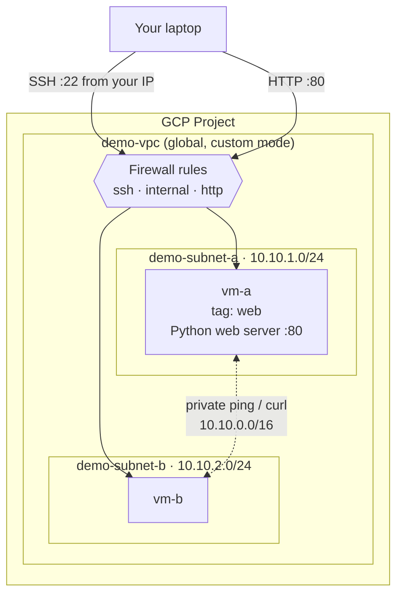

# GCP VPC & Firewall Basics — Your First Custom Network

```yaml
level: beginner
cloud: gcp
domain: networking
technology:
  - vpc
  - subnets
  - firewall
  - compute-engine
estimated_time: 60 min
estimated_cost: free-tier
deployment_type: console + gcloud
cleanup_required: true
status: ready
```

## What You'll Build

You'll install and authenticate the **gcloud CLI**, then build a **custom VPC network** on Google
Cloud from scratch: two subnets, three firewall rules, and two Compute Engine VMs. Finally you'll
**prove the network works** — SSH in, ping privately between VMs, serve a web page, and watch the
firewall block traffic you didn't allow. By the end you'll understand:

- What a **Project**, **VPC**, **subnet**, and **region/zone** are on Google Cloud
- The difference between **auto-mode** and **custom-mode** VPCs (and why a VPC is *global*)
- How GCP **firewall rules** work: default-deny ingress, priority, and **network tags**
- The critical difference between a VM's **internal** and **external** IP
- How to test connectivity and read what the firewall is (and isn't) allowing

This is the **beginner** project in the GCP networking series. It assumes no prior GCP knowledge —
Step 1 installs the CLI and creates your project.

---

## Architecture



---

## Services Used

| Service | Role in this Project |
|---------|---------------------|
| **VPC network** | Your private, global software-defined network |
| **Subnets** | Regional IP ranges inside the VPC where VMs get addresses |
| **Firewall rules** | Explicit allow rules over GCP's default-deny ingress |
| **Compute Engine** | The VMs (`e2-micro`) you launch and connect to |
| **Cloud IAM / gcloud** | Authentication and the project boundary |

---

## Key Concepts

| Concept | What it means |
|---------|---------------|
| **Project** | The billing + permission boundary that owns every resource (like an AWS account) |
| **VPC (global)** | A private network that spans all regions; only subnets are regional |
| **Auto vs. custom mode** | Auto creates subnets everywhere for you; custom = you control every range |
| **Firewall rule** | Ingress is denied by default; you allow specific ports/sources explicitly |
| **Network tag** | A label on a VM that firewall rules target (e.g. open :80 only on `web` VMs) |
| **Internal vs. external IP** | Private (VPC-only) vs. public (internet-reachable) addresses |

---

## Project Structure

```
gcp-vpc-firewall-basics/
├── README.md                        ← You are here
├── src/
│   └── hello_server.py              ← Tiny stdlib web server (no pip install)
├── steps/
│   ├── 01-install-gcloud.md         ← Install gcloud CLI, log in, create a project
│   ├── 02-create-vpc-subnets.md     ← Custom VPC + two subnets
│   ├── 03-firewall-rules.md         ← SSH / internal / HTTP rules + tags
│   ├── 04-launch-vms.md             ← Two e2-micro VMs
│   ├── 05-test-connectivity.md      ← SSH, ping, serve HTTP, watch the firewall
│   └── 06-cleanup.md                ← Delete everything in order
├── costs.md                         ← Cost breakdown & free tier
├── troubleshooting.md
└── challenges.md
```

---

## Prerequisites

| Requirement | Details |
|-------------|---------|
| Google account | Any Gmail / Google Workspace account |
| Billing | A billing account (free-trial credit is fine) — set up in Step 1 |
| gcloud CLI | Installed in **Step 1** — nothing needed beforehand |
| Region | All steps use **`us-east1`** / zone **`us-east1-b`** |

---

## What You'll Learn Step by Step

| Step | File | Goal |
|------|------|------|
| 1 | `01-install-gcloud.md` | Install & authenticate the gcloud CLI, create a project, enable APIs |
| 2 | `02-create-vpc-subnets.md` | Build a custom-mode VPC with two subnets |
| 3 | `03-firewall-rules.md` | Add SSH / internal / HTTP firewall rules with tags |
| 4 | `04-launch-vms.md` | Launch two `e2-micro` VMs, one per subnet |
| 5 | `05-test-connectivity.md` | SSH, ping privately, serve a web page, watch the firewall block |
| 6 | `06-cleanup.md` | Delete every resource in dependency order |

Start with **Step 1 →** [`steps/01-install-gcloud.md`](steps/01-install-gcloud.md)

---

## Estimated Time

45 – 75 minutes for a first-time learner (including the one-time CLI install).

## Estimated Cost

| Resource | Configuration | Cost | Notes |
|----------|--------------|------|-------|
| **Compute Engine** | 2 × `e2-micro`, us-east1 | **~$0** | One `e2-micro`/month is free-tier; the second is ~$0.008/hr |
| **VPC / subnets / firewall** | Networking control plane | **Free** | No charge for the network itself |
| **Egress** | A few web requests | **~$0** | 1 GB/month North-America egress is free |

**Typical session cost: $0.00 – $0.05** if you clean up the same day.

> ⚠️ VMs bill per second while **RUNNING**. Always finish [Step 6 — Cleanup](steps/06-cleanup.md).

For the full breakdown and free-tier details → see **[costs.md](costs.md)**.

---

## What's Next

- [GCP HTTP Load Balancer & Autoscaling](../../../intermediate/gcp/gcp-http-lb-autoscaling/README.md) — the **intermediate**
  project: private VMs behind Cloud NAT, a managed instance group that autoscales, and a global HTTP
  load balancer with health checks.
