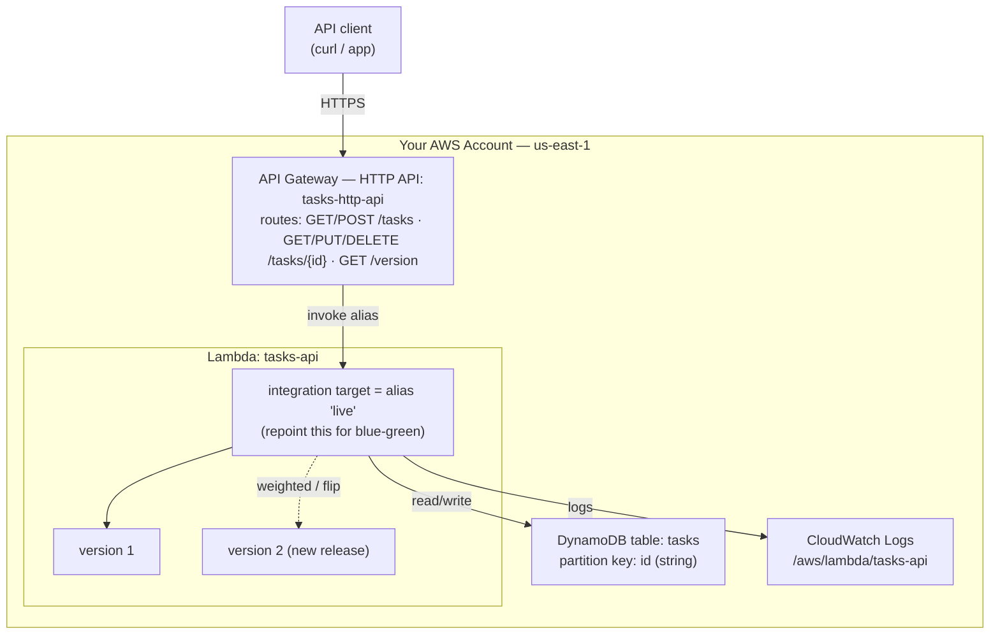

# API Gateway HTTP API + Lambda + DynamoDB — CRUD, Then Safe Deploys

```yaml
level: intermediate
cloud: aws
domain: serverless
technology:
  - api-gateway
  - lambda
  - dynamodb
  - iam
  - cloudwatch
estimated_time: 90 min
estimated_cost: free-tier
deployment_type: console + cli
cleanup_required: true
status: ready
```

## What You'll Build

A **Tasks API** — full CRUD over HTTP — on **API Gateway (HTTP API)** backed by **Lambda**
and a **DynamoDB** table. Where [Project 1](../aws-api-gateway-rest-lambda/README.md) used a REST
API with in-memory data, this one uses the newer, cheaper **HTTP API** and stores tasks for
real, so every HTTP verb maps to a real database operation.

Then — the point of the series — you ship new versions safely with three **native**
deployment strategies. The twist: **HTTP API has no native canary release** (that's a
REST-only feature). So here *every* strategy is done at the **Lambda alias** level, which is
the most portable technique and works behind any front door:

- **Rolling** — weighted alias shifts traffic 10% → 50% → 100% to the new version
- **Canary** — a small, steady weight on the new version while you watch its metrics
- **Blue-green** — two aliases, and you **repoint the HTTP API integration** from one to the other instantly

By the end you will understand:

- How an **HTTP API** routes verbs+paths (`GET/POST/PUT/DELETE /tasks`) to one Lambda
- The HTTP API **payload v2.0** event shape (method under `requestContext.http.method`)
- How a Lambda talks to **DynamoDB** with least-privilege IAM scoped to one table
- Why deployments here live entirely at the **alias** layer — and how that compares to
  Project 1's gateway-level canary
- How to do rolling, canary, and blue-green with nothing but Lambda primitives

> **Beginner → Intermediate.** Steps 1–4 build the CRUD API (intro level if you've done
> Project 1 or [lambda-basics](../../../beginner/aws/aws-lambda-basics/README.md)). Steps 5–7 are the
> intermediate deployment strategies. Recommended: do
> [api-gateway-rest-lambda](../aws-api-gateway-rest-lambda/README.md) first and compare.

---

## Architecture



**How to read it:** The HTTP API forwards each request to the Lambda **alias** `live`. The
alias is the single control point for deployments: weight it across two versions (rolling /
canary) or repoint the integration to a different alias (blue-green). The function reads and
writes the `tasks` table; its role can touch **only that table**.

---

## Why this is the HTTP-API counterpart to Project 1

| | Project 1 (REST API) | This project (HTTP API) |
|---|---|---|
| API type | REST | HTTP (payload v2.0) |
| State | In-memory (resets) | **DynamoDB (durable)** |
| Verbs | GET/POST | **GET/POST/PUT/DELETE** |
| Canary mechanism | Gateway-native canary release | **Lambda alias weight** (no gateway canary) |
| Blue-green mechanism | Flip a stage variable | **Repoint the integration** to another alias |
| Price | $3.50 / M requests | **$1.00 / M requests** |

Same three strategies, different machinery — that contrast is the lesson.

---

## Application

`src/app.py` is one Lambda handler that routes on method + path:

| Endpoint | Purpose |
|----------|---------|
| `GET /tasks` | List all tasks (response includes `"version"`) |
| `GET /tasks/{id}` | One task |
| `POST /tasks` | Create (`{"title":"...","done":false}`) |
| `PUT /tasks/{id}` | Update title and/or done |
| `DELETE /tasks/{id}` | Delete |
| `GET /version` | Returns `APP_VERSION` — your "which release is live?" probe |

Validate it on your laptop — no AWS required (DynamoDB is faked in the test):

```bash
cd src
python3 test_app.py      # 10 checks, no pytest required
```

---

## Project Structure

```
api-gateway-http-dynamodb-crud/
├── README.md                          ← You are here
├── src/
│   ├── app.py                         ← Lambda handler (CRUD + DynamoDB)
│   └── test_app.py                    ← local validation (in-memory fake table)
├── steps/
│   ├── 01-iam-role.md                 ← Role: Logs + DynamoDB on ONE table
│   ├── 02-dynamodb-table.md           ← Create the tasks table
│   ├── 03-lambda-function.md          ← Create + test the function
│   ├── 04-http-api.md                 ← HTTP API routes for all verbs
│   ├── 05-rolling-deployment.md       ← Weighted alias, step shift
│   ├── 06-canary-deployment.md        ← Steady canary weight + watch metrics
│   ├── 07-blue-green-deployment.md    ← Two aliases, repoint integration, instant rollback
│   └── 08-cleanup.md                  ← Tear everything down
├── costs.md
├── troubleshooting.md
└── challenges.md
```

---

## Prerequisites

| Requirement | Details |
|-------------|---------|
| AWS account | Console + CLI access for Lambda, API Gateway, DynamoDB, IAM, CloudWatch |
| AWS CLI | `aws --version` → 2.x, configured for **us-east-1** |
| Python 3.12+ | To run `test_app.py` locally |
| Region | All steps use **us-east-1** |
| Recommended first | [api-gateway-rest-lambda](../aws-api-gateway-rest-lambda/README.md) |

---

## What You'll Learn Step by Step

| Step | File | Goal |
|------|------|------|
| 1 | `01-iam-role.md` | Execution role: CloudWatch Logs + DynamoDB scoped to the `tasks` table |
| 2 | `02-dynamodb-table.md` | Create the `tasks` table (on-demand billing) |
| 3 | `03-lambda-function.md` | Create the `tasks-api` function with `boto3`; test it |
| 4 | `04-http-api.md` | HTTP API with routes for every CRUD verb; get the URL |
| 5 | `05-rolling-deployment.md` | Publish v2; shift the `live` alias 10% → 50% → 100% |
| 6 | `06-canary-deployment.md` | Hold a small canary weight and compare metrics, then promote |
| 7 | `07-blue-green-deployment.md` | `blue`/`green` aliases; repoint the integration; instant rollback |
| 8 | `08-cleanup.md` | Delete the API, function, table, role, logs |

Start with **Step 1 →** [`steps/01-iam-role.md`](steps/01-iam-role.md)

---

## Estimated Time

2 – 3 hours. The CRUD build (1–4) is ~1 hour; the deployment strategies (5–7) are the rest.

## Estimated Cost

| Service | Configuration | Cost | Notes |
|---------|--------------|------|-------|
| **API Gateway (HTTP)** | A few hundred requests | **~$0 (free tier)** | $1.00 per million after the free 1M/month (12 mo) |
| **AWS Lambda** | A few hundred short invokes | **~$0 (free tier)** | 1M requests + 400k GB-s/month always free |
| **DynamoDB (on-demand)** | A few hundred reads/writes | **~$0 (free tier)** | 25 GB + 25 WCU/RCU equiv free; on-demand bills per request |
| **CloudWatch** | Logs for the function | **~$0** | Within free tier at workshop scale |

**Typical session cost: ~$0.00.** On-demand DynamoDB has **no hourly charge** — you pay per
request, so an idle table costs nothing. Still, finish [Step 8 — Cleanup](steps/08-cleanup.md).
See **[costs.md](costs.md)**.

---

## What's Next

- Compare notes with [Project 1](../aws-api-gateway-rest-lambda/README.md): which deploy felt cleaner?
- Add a **GSI** to query tasks by `done` status
- Add **JWT authorization** (HTTP APIs support it natively) to protect write verbs
- Wrap the whole thing in **AWS SAM** and let `sam deploy` do the alias shifting for you
