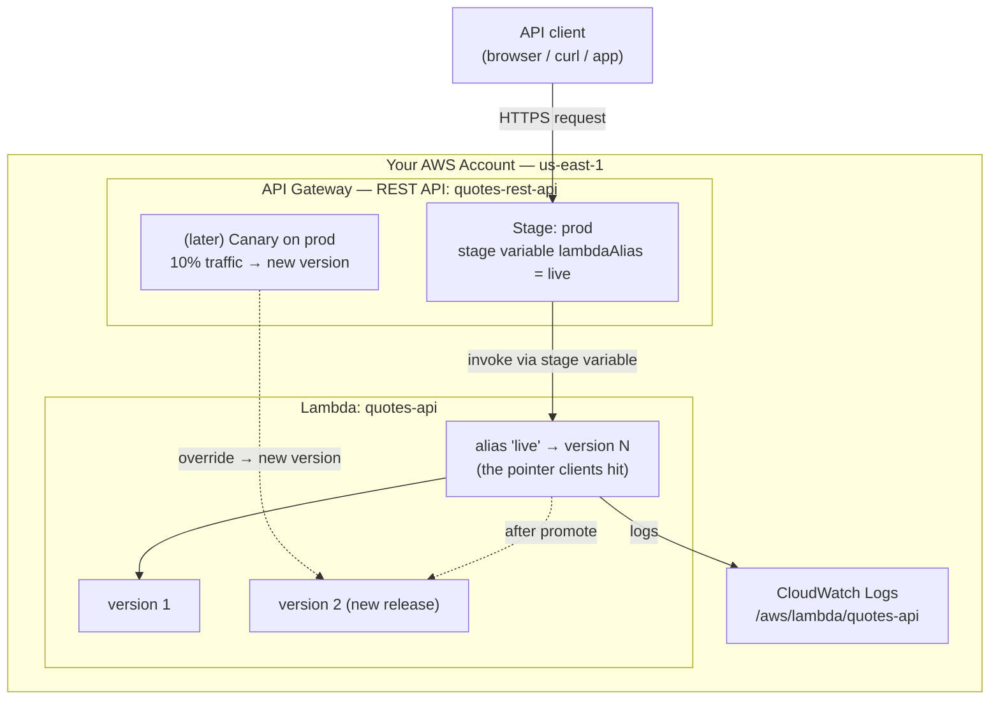

# API Gateway REST API + Lambda — Build It, Then Ship It Safely

```yaml
level: intermediate
cloud: aws
domain: serverless
technology:
  - api-gateway
  - lambda
  - iam
  - cloudwatch
estimated_time: 90 min
estimated_cost: free-tier
deployment_type: console + cli
cleanup_required: true
status: ready
```

## What You'll Build

A small **Quotes API** on **API Gateway (REST API)** backed by a single **Lambda**
function using **proxy integration**. You'll build the API the normal way — resources,
methods, a deployment stage — and then learn the part most tutorials skip: **how to ship
a new version without breaking users.**

The second half of this project is three **native** deployment strategies, no CodeDeploy,
no extra tooling — just API Gateway and Lambda primitives so you can see exactly what each
one does:

- **Rolling** — shift traffic to a new Lambda version in steps (10% → 50% → 100%) using a **weighted Lambda alias**
- **Canary** — send a small slice of *API* traffic to a new version using API Gateway's built-in **canary release** on a stage
- **Blue-green** — run two versions side by side and **flip** between them instantly (with instant rollback)

By the end you will understand:

- How a **REST API** models an endpoint: **resource → method → integration → stage**
- Why **Lambda proxy integration** hands your function the whole HTTP request
- What a **deployment** and a **stage** actually are in API Gateway (and why you must redeploy)
- How **Lambda versions and aliases** give you immutable, pointer-able releases
- The trade-offs between rolling, canary, and blue-green — and when each fits

> **Beginner → Intermediate.** Steps 1–4 are beginner (build the API). Steps 5–7 are
> intermediate (deployment strategies). This is the first of two API Gateway projects;
> Project 2 ([api-gateway-http-dynamodb-crud](../aws-api-gateway-dynamodb-crud/README.md))
> uses the newer **HTTP API** with **DynamoDB** and does its deployments purely at the
> Lambda-alias level.

---

## Architecture



**How to read it:** A client hits the **prod stage** URL. The stage's integration points at
the Lambda **alias** `live` (not a raw version) via a **stage variable**, so you can change
which version is live without touching the API. During a **canary**, API Gateway sends a
fraction of traffic down an override path to the new version; you watch it, then **promote**.
For **blue-green**, you flip the alias (or the stage variable) between two versions instantly.

---

## Why REST API here (and HTTP API in Project 2)?

API Gateway has two flavours. This project uses the **REST API** on purpose, because it has
a feature the HTTP API does **not**: a **native canary release** on a stage. That lets you
demonstrate canary deployment *at the gateway layer*. Project 2 uses the cheaper, simpler
**HTTP API** and shows the same strategies done entirely with **Lambda aliases** — a useful
contrast.

| | REST API (this project) | HTTP API (Project 2) |
|---|---|---|
| Native stage canary release | ✅ Yes | ❌ No |
| Stage variables | ✅ | ✅ |
| Price | Higher ($3.50 / M) | Lower ($1.00 / M) |
| Best for here | Teaching gateway-level canary | Teaching alias-level deploys |

---

## Application

`src/app.py` is one Lambda handler wired as a **proxy integration**, so it receives the full
request and routes itself:

| Endpoint | Purpose |
|----------|---------|
| `GET /quotes` | List all quotes (response includes `"version"` so you can see which release answered) |
| `GET /quotes/{id}` | One quote by id |
| `POST /quotes` | Add a quote (body: `{"text": "...", "author": "..."}`) |
| `GET /version` | Returns just `APP_VERSION` — the easiest way to watch a canary/blue-green flip |

Validate it on your laptop — no AWS required:

```bash
cd src
python3 test_app.py      # 7 checks, no pytest required
```

> State lives in memory and resets on cold start — intentional. This project teaches
> deployment, not persistence; Project 2 adds DynamoDB.

---

## Project Structure

```
api-gateway-rest-lambda/
├── README.md                          ← You are here
├── src/
│   ├── app.py                         ← Lambda proxy handler (4 routes)
│   └── test_app.py                    ← local validation (fake proxy events)
├── steps/
│   ├── 01-iam-role.md                 ← Lambda execution role (least privilege)
│   ├── 02-lambda-function.md          ← Create + test the function
│   ├── 03-rest-api.md                 ← Resources, methods, proxy integration
│   ├── 04-deploy-stages.md            ← Deployments, the prod stage, stage variables
│   ├── 05-rolling-deployment.md       ← Lambda versions + weighted alias (step shift)
│   ├── 06-canary-deployment.md        ← API Gateway native canary release
│   ├── 07-blue-green-deployment.md    ← Two versions, instant flip + rollback
│   └── 08-cleanup.md                  ← Tear everything down
├── costs.md
├── troubleshooting.md
└── challenges.md
```

---

## Prerequisites

| Requirement | Details |
|-------------|---------|
| AWS account | Console + CLI access for Lambda, API Gateway, IAM, CloudWatch |
| AWS CLI | `aws --version` → 2.x, configured for **us-east-1** |
| Python 3.12+ | To run `test_app.py` locally |
| Region | All steps use **us-east-1** |
| New to Lambda? | Do [lambda-basics](../../../beginner/aws/aws-lambda-basics/README.md) first |

---

## What You'll Learn Step by Step

| Step | File | Goal |
|------|------|------|
| 1 | `01-iam-role.md` | Lambda execution role with CloudWatch Logs permission |
| 2 | `02-lambda-function.md` | Create the `quotes-api` function; test it in the console |
| 3 | `03-rest-api.md` | REST API with `/quotes`, `/quotes/{id}`, `/version`; proxy integration |
| 4 | `04-deploy-stages.md` | Create a **deployment** and the **prod** stage; wire a stage variable to a Lambda alias |
| 5 | `05-rolling-deployment.md` | Publish version 2; shift the alias 10% → 50% → 100% |
| 6 | `06-canary-deployment.md` | Use API Gateway's **canary release** to send 10% of API traffic to v2, then promote |
| 7 | `07-blue-green-deployment.md` | Keep blue (v1) + green (v2) ready; flip instantly; roll back instantly |
| 8 | `08-cleanup.md` | Delete the API, function, versions, aliases, role, logs |

Start with **Step 1 →** [`steps/01-iam-role.md`](steps/01-iam-role.md)

---

## Estimated Time

1.5 – 2.5 hours. The build (steps 1–4) is ~45 min; the deployment strategies (5–7) are
the substance.

## Estimated Cost

| Service | Configuration | Cost | Notes |
|---------|--------------|------|-------|
| **API Gateway (REST)** | A few hundred requests | **~$0 (free tier)** | $3.50 per million after the free 1M/month (12 mo) |
| **AWS Lambda** | A few hundred short invokes | **~$0 (free tier)** | 1M requests + 400k GB-s/month always free |
| **CloudWatch** | Logs for the function | **~$0** | Within free tier at workshop scale |

**Typical session cost: ~$0.00.** Nothing here runs 24/7 — you pay per request, and at
workshop volume that's inside the free tier. Still, finish
[Step 8 — Cleanup](steps/08-cleanup.md). See **[costs.md](costs.md)**.

---

## What's Next

- Build the twin: [api-gateway-http-dynamodb-crud](../aws-api-gateway-dynamodb-crud/README.md) — same deployment strategies, done at the Lambda-alias level on an HTTP API with real state
- Add a **custom domain** + ACM cert and do blue-green by swapping a **base-path mapping**
- Add a **usage plan + API key** and rate-limit the API
- Front the API with **WAF** and block bad requests at the edge
