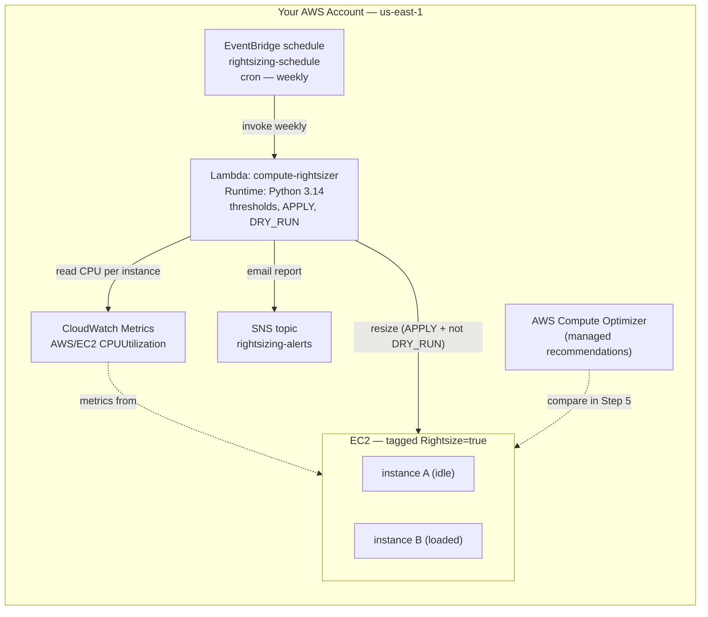

# EC2 Compute Rightsizing — Find & Fix Wasted Capacity

**Optimization & Recovery Series — Project 1 of 3**

## What You'll Build

A scheduled Lambda that audits your running EC2 fleet for **wasted compute**. Every run it reads
each instance's recent **CPU utilization from CloudWatch**, labels it `idle`,
`over-provisioned`, or `right-sized`, recommends a smaller instance type, and emails you a
report via SNS. With one switch flipped, it can also **apply** the resize
(stop → change type → start).

You'll then meet AWS's managed equivalent — **Compute Optimizer** — and compare your home-grown
metric logic against its ML-based recommendations.

By the end you will understand:

- How to pull **CPUUtilization** for an instance with `get_metric_statistics`
- A simple **classification** of idle vs over-provisioned vs right-sized capacity
- Why **idle** instances should be *stopped*, while *over-provisioned* ones should be *shrunk*
- How a live resize actually works: **stop → `modify-instance-attribute` → start**
- A **DRY_RUN** + tag-gated IAM safety posture for code that can change production compute
- Where **AWS Compute Optimizer** fits, and when to trust it over a hand-rolled rule

This is the **optimization** half of the series; Project 2 covers **recovery** (RDS disaster
recovery) and Project 3 does **both** on Kubernetes.

---

## Architecture



---

## Key Concepts

| Concept | What it means |
|---------|--------------|
| **Rightsizing** | Matching instance size to real demand — shrink the over-provisioned, stop the idle |
| **CPUUtilization** | The EC2 metric CloudWatch records for free at 5-min granularity |
| **Max vs Average CPU** | A low *average* can hide spikes; we classify on **max** to avoid starving real load |
| **Idle vs over-provisioned** | Idle (≈0% used) → *stop*; lightly used → *downsize one step* |
| **modify-instance-attribute** | The API that changes an instance's type — only while it is **stopped** |
| **Tag-gated IAM** | The resize permission only applies to instances tagged `Rightsize=true` |
| **Compute Optimizer** | AWS's managed, ML-based rightsizing service (needs 14 days of metrics) |

---

## Project Structure

```
aws-compute-rightsizing/
├── README.md                       ← You are here
├── steps/
│   ├── 01-iam-role.md              ← Read-CloudWatch + tag-gated resize role
│   ├── 02-launch-demo-instances.md ← Two t3 instances: one idle, one loaded
│   ├── 03-create-function.md       ← Deploy compute-rightsizer (dry-run first)
│   ├── 04-schedule-and-report.md   ← Weekly EventBridge rule + SNS report
│   ├── 05-compute-optimizer.md     ← Enable & compare AWS Compute Optimizer
│   ├── 06-apply-rightsizing.md     ← Flip APPLY/DRY_RUN, resize for real
│   └── 07-cleanup.md               ← Terminate everything
├── src/
│   ├── compute_rightsizer.py       ← Handler code
│   ├── test_invoke.py              ← Manual invoke (Boto3)
│   └── busy_loop.py                ← Generate CPU load on the "loaded" instance
├── costs.md
├── troubleshooting.md
└── challenges.md
```

---

## Prerequisites

| Requirement | Details |
|-------------|---------|
| AWS account | Permissions for Lambda, IAM, EventBridge, EC2, CloudWatch, SNS, Compute Optimizer |
| AWS CLI | `aws --version` returns 2.x |
| Python | 3.9+ locally |
| Boto3 | `pip install boto3` |
| Region | All steps use **us-east-1** |
| Recommended first | [Lambda on a Schedule with EventBridge](../../../beginner/aws/aws-lambda-eventbridge-scheduled/README.md) for the scheduling pattern |

---

## What You'll Learn Step by Step

| Step | File | Goal |
|------|------|------|
| 1 | `01-iam-role.md` | A role that reads CloudWatch and resizes only tagged instances |
| 2 | `02-launch-demo-instances.md` | Launch one idle and one loaded instance |
| 3 | `03-create-function.md` | Deploy the rightsizer, dry-run it |
| 4 | `04-schedule-and-report.md` | Run weekly, email the report via SNS |
| 5 | `05-compute-optimizer.md` | Enable Compute Optimizer and compare |
| 6 | `06-apply-rightsizing.md` | Turn off dry-run and resize a real instance |
| 7 | `07-cleanup.md` | Terminate instances, delete the rest |

Start with **Step 1 →** [`steps/01-iam-role.md`](steps/01-iam-role.md)

---

## Estimated Time

60 – 90 minutes (plus idle time so CloudWatch has CPU data to read).

## Estimated Cost

**~$0.10 or less** if you finish in one sitting and clean up. Two `t3.micro` instances are
Free-Tier-eligible (750 hrs/month combined for 12 months); Lambda, EventBridge, CloudWatch
metrics, SNS, and Compute Optimizer recommendations are all free at this scale. The only way to
get a real bill is to **leave the instances running** — so do [Step 7](steps/07-cleanup.md). See
[costs.md](costs.md).

---

## What's Next

- [RDS Disaster Recovery](../../../advanced/aws/aws-rds-disaster-recovery/README.md) — the **recovery** half of the
  series: snapshots, point-in-time restore, cross-region copy, and a read-replica failover drill
- [Scheduled EC2 Start/Stop](../../../beginner/aws/aws-lambda-ec2-start-stop-scheduler/README.md) — a complementary
  cost saver that powers idle instances off on a schedule
