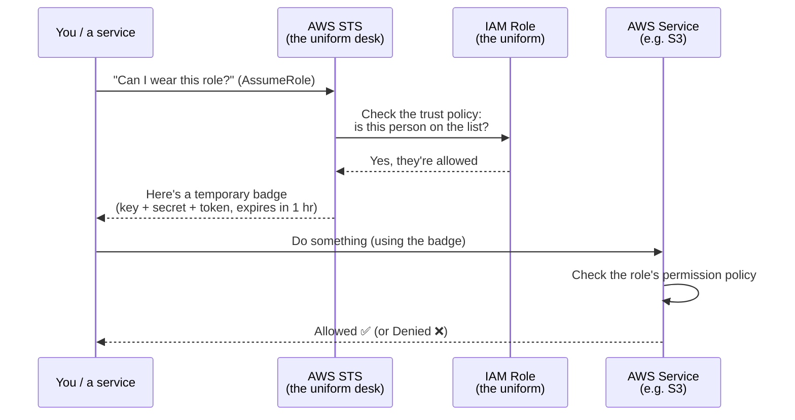
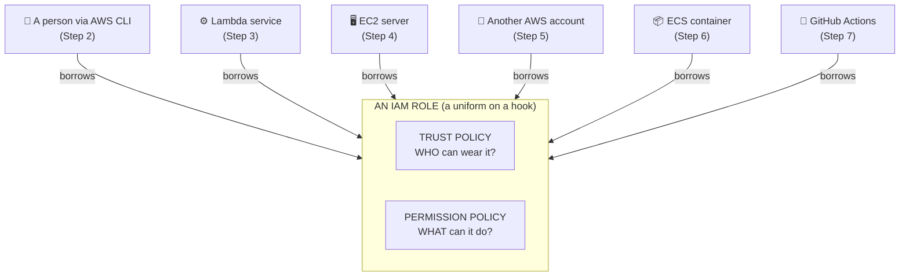

# IAM Roles & Policies — Trust, AssumeRole, and Service Roles

## What You'll Build

This project is a hands-on tour of **IAM Roles** — the part of AWS that confuses almost everyone at first. Instead of building one app, you build **six different roles**, each for a different real-world job, and you learn *why* each one works the way it does.

### The one analogy that makes roles click

Think of an IAM role like a **uniform hanging on a hook** at a company.

- Nobody *owns* the uniform. It just hangs there.
- The **uniform is labelled** with who's allowed to wear it (the security guard's uniform is only for guards). → this is the **trust policy**.
- When you **put the uniform on**, it lets you do certain things — open certain doors, enter certain rooms. → this is the **permission policy**.
- You **borrow it for a shift**, then take it off. You never keep it forever. → these are **temporary credentials**.

That's a role. Two policy documents attached to a uniform you borrow:

- **Trust policy** (formally the *assume role policy document*) → **"WHO is allowed to wear this uniform?"** — defined by its `Principal`.
- **Permission policy** (an *identity-based policy*) → **"WHAT can the wearer do?"** — defined by its `Action`/`Resource` statements.

Every IAM role — no exceptions — is just these two documents. Once that clicks, IAM stops being scary.

### Plain word ↔ technical term

The analogy is the on-ramp; the technical term is what you'll actually see in the AWS Console, CLI, docs, and CloudTrail. Learn both — this table is your decoder ring for the whole project.

| Plain word (this project) | Technical AWS term | What it really is |
|---------------------------|--------------------|-------------------|
| Borrow a uniform | **Assume a role** (`sts:AssumeRole`) | Calling STS to take on a role's identity |
| The uniform | **IAM role** | A principal with no long-term credentials |
| Label on the uniform | **Trust policy** / *assume role policy document* | JSON with a `Principal` saying who may assume it |
| What the uniform unlocks | **Permission policy** | JSON with `Action`/`Resource`/`Effect` statements |
| Name on the label | **Principal** | An IAM user ARN, a service (`*.amazonaws.com`), an account, or a federated identity provider |
| The uniform desk | **AWS STS** (Security Token Service) | The service that issues temporary credentials |
| Temporary badge | **Temporary security credentials** | `AccessKeyId` + `SecretAccessKey` + **`SessionToken`**, with an `Expiration` |
| Putting the uniform on | **An assumed-role session** | Your identity ARN becomes `assumed-role/<RoleName>/<session-name>` |

---

## How a Role Actually Works (the borrow-a-uniform flow)

When someone "assumes a role," they're asking AWS: *"Can I wear this uniform?"* AWS checks the label (trust policy), and if they're allowed, hands them a **temporary badge** that expires on its own.

**Key idea — temporary credentials expire.** A role has **no long-term credentials** of its own. Each time a principal **assumes** the role, **AWS STS** issues **temporary security credentials** (`AccessKeyId` + `SecretAccessKey` + `SessionToken`) that expire automatically (default 1 hour, configurable 15 min–12 hr via `DurationSeconds`). That's why roles are far safer than long-term IAM user access keys, which never expire and can leak.

---

## Architecture — One Role, Six Different "Who Can Wear It"

The thing that makes each scenario different is **who is allowed to wear the uniform** (the trust policy). The "what it can do" part works the same way every time.

---

## AWS Services Used

| Service | Its Job in This Project |
|---------|----------------------|
| **IAM** | Where you create the users, policies, and six roles (trust + permission policies) |
| **STS** (Security Token Service) | The "uniform desk" — serves `sts:AssumeRole` / `sts:AssumeRoleWithWebIdentity` and returns temporary security credentials |
| **Lambda** | Shows a *service* assuming an **execution role** (Step 3) |
| **EC2** | Shows a *server* assuming a role via an **instance profile** (Step 4) |
| **S3** | The resource roles get permission (`s3:GetObject`, etc.) to act on — our test target |
| **CloudWatch Logs** | Where the Lambda execution role proves it can `logs:PutLogEvents` |

---

## What You'll Learn

- The difference between a **trust policy** (who can wear the uniform) and a **permission policy** (what it can do)
- How a person **borrows a role from the AWS CLI** — both the manual way and the clean automatic way
- How **services** (Lambda, EC2, ECS) borrow roles, and why each names a different "who"
- How **another AWS account** can safely borrow a role in yours (with a secret password called an *External ID*)
- How **GitHub Actions** deploys to AWS with **no passwords stored anywhere**
- How to read and write IAM policy JSON by hand
- How to clean everything up so your account stays tidy

---

## The Six Role Scenarios (with real-world examples)

The thing that differs between scenarios is the **trust policy `Principal`** — *who* is allowed to assume the role. The "Trust Principal" column is the exact value you'll write in JSON.

| # | Scenario | Real-World Example | Trust Principal (technical) | STS API used |
|---|----------|--------------------|-----------------------------|--------------|
| 2 | **IAM user assumes a role via CLI** | An engineer normally has read-only access, but "puts on the admin uniform" for 1 hour to do a risky task | `arn:aws:iam::<acct>:user/iam-lab-user` | `sts:AssumeRole` |
| 3 | **Lambda execution role** | A photo-upload app: when a photo lands, the Lambda function writes a log and resizes the image | `lambda.amazonaws.com` (service principal) | `sts:AssumeRole` |
| 4 | **EC2 instance profile** | A web server that reads config files from S3 — without any long-term keys on the server | `ec2.amazonaws.com` (service principal) | `sts:AssumeRole` |
| 5 | **Cross-account role** | A cost-monitoring SaaS reads your billing data without you handing over keys | `arn:aws:iam::<other-acct>:root` + `ExternalId` condition | `sts:AssumeRole` |
| 6 | **ECS task role** | A shipping app in a container reads order data — with its own identity, separate from the host | `ecs-tasks.amazonaws.com` (service principal) | `sts:AssumeRole` |
| 7 | **GitHub Actions (OIDC)** | Your CI/CD pipeline pushes a new app version to AWS on every commit — with zero secrets stored in GitHub | `Federated:` the OIDC provider ARN | `sts:AssumeRoleWithWebIdentity` |

---

## Steps

Do these in order. Step 1 builds the mental model; Steps 2–7 are the six scenarios; Step 8 cleans up.

1. [IAM Foundations — Users, Policies, Roles, and Trust](./steps/01-iam-foundations.md)
2. [IAM User Assumes a Role via the AWS CLI](./steps/02-role-assumed-by-user-cli.md)
3. [Service Role — Lambda Execution Role](./steps/03-service-role-lambda.md)
4. [Service Role — EC2 Instance Profile](./steps/04-service-role-ec2-instance-profile.md)
5. [Cross-Account Role (with a secret External ID)](./steps/05-cross-account-role.md)
6. [ECS Task Role vs. Task Execution Role](./steps/06-ecs-task-role.md)
7. [GitHub Actions via OIDC — Deploy with No Stored Secrets](./steps/07-federated-oidc-github-actions.md)
8. [Cleanup — Delete every role, policy, and user](./steps/08-cleanup.md)

---

## CLI Reference (Cheat Sheet)

See [cli-reference.md](./cli-reference.md) for a one-page list of every IAM/STS command used here — including **credential export commands for Linux, macOS, and Windows (PowerShell & CMD)**, profile setup, and inspection/troubleshooting commands.

## Troubleshooting

See [troubleshooting.md](./troubleshooting.md) for the IAM errors you *will* hit (`AccessDenied`, `is not authorized to perform: sts:AssumeRole`, `MalformedPolicyDocument`, and more) explained in plain language with exact fixes.

## Challenges

See [challenges.md](./challenges.md) to go deeper: permission boundaries, session policies, tag-based access (ABAC), role chaining, and more.

---

## Estimated AWS Cost

**IAM, STS, and roles are always free.** You can do the *entire* role part of this project for **$0.00**.

The only step that can cost anything is the *optional* EC2 test in Step 4:

| Resource | Cost |
|----------|------|
| IAM users, roles, policies, STS calls | **Free** (always) |
| Lambda invocations (Step 3 verify) | Free tier: 1M requests/month |
| EC2 instance (Step 4 verify, optional) | ~$0.01/hr for `t3.micro` — **stop it when done** |
| S3 storage (test object) | A few KB — basically $0.00 |
| CloudWatch Logs | Well within the 5 GB/month free tier |

> The EC2 instance in Step 4 is the **only** thing that costs money if you forget about it. Always finish with [Step 8 — Cleanup](./steps/08-cleanup.md).

---

## Related Projects in This Repo (cross-references)

The roles you build here are the *same* roles used by the other projects — this project explains the IAM theory those projects assume you already know:

| Concept here | Where you'll use it for real |
|--------------|------------------------------|
| Lambda execution role (Step 3) | [`../lambda-basics`](../../../beginner/aws/aws-lambda-basics), [`../lambda-s3-event-processing`](../../../beginner/aws/aws-lambda-s3-event-processing) |
| ECS task role vs. execution role (Step 6) | [`../ecs-fargate-basics`](../aws-ecs-fargate-basics), [`../ecs-fargate-advanced`](../../../advanced/aws/aws-ecs-fargate-advanced) |
| Least-privilege IAM user + policy (Step 2) | [`../sqs-sns-iam-messaging`](../../../beginner/aws/aws-sqs-sns-messaging) |
| GitHub Actions OIDC role pushing to ECR (Step 7) | [`../ecs-fargate-advanced`](../../../advanced/aws/aws-ecs-fargate-advanced) (ECR push) |

---

## Region

All steps and commands assume **`us-east-1`**. If you use another region, keep it the same everywhere.
</content>
