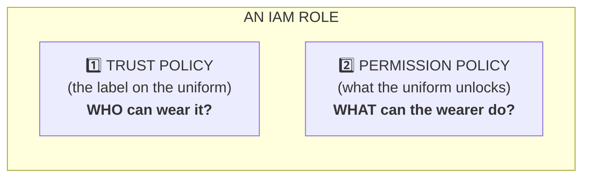
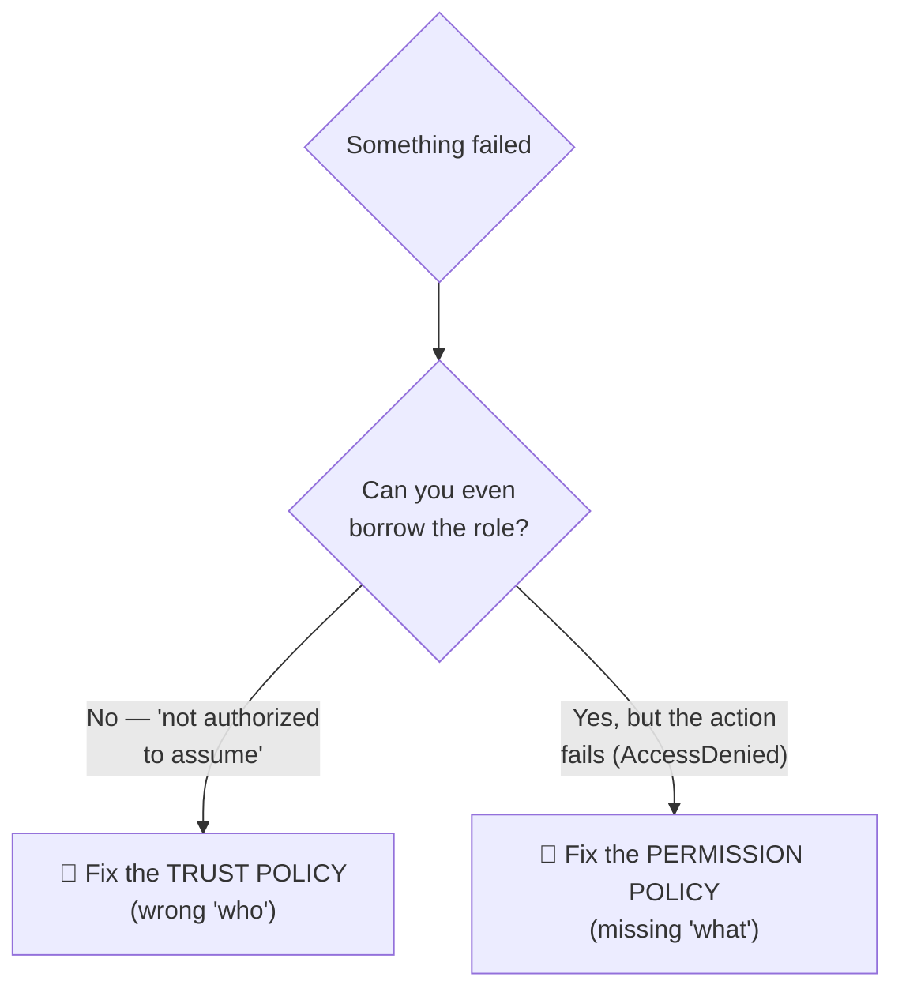
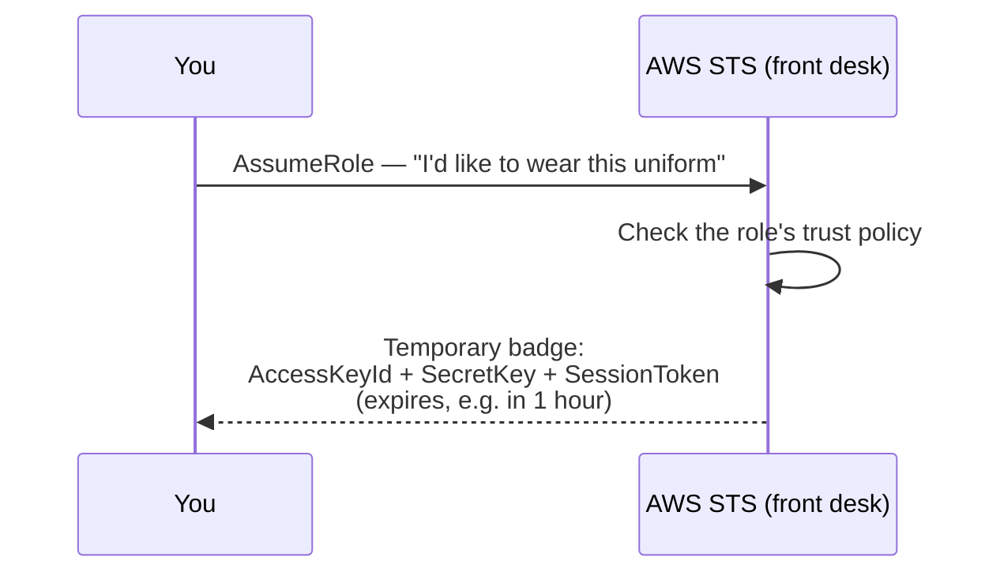

# Step 1 — IAM Foundations: Users, Policies, Roles, and Trust

## Why This Matters

Before creating a single role, you need the basic picture. Most "IAM is confusing" moments come from mixing up four words: **user**, **policy**, **role**, and **trust**. This step explains them in plain language with everyday examples. Everything in Steps 2–7 is just a re-use of these four ideas.

---

## The Four Building Blocks (explained like a building)

Imagine a company office building:

| AWS Thing | Building Analogy | Plain Meaning |
|-----------|------------------|---------------|
| **IAM User** | An employee with their own permanent ID card | A long-term identity for a person or app. Has a password and/or keys. |
| **IAM Policy** | A rulebook listing which doors a card opens | A document that says what actions are allowed or denied. |
| **IAM Role** | A **uniform on a hook** that anyone approved can borrow | An identity with **no keys of its own**. Approved people/services borrow it temporarily. |
| **Trust** | The **label on the uniform** saying who may wear it | The rule on a role that says *who* is allowed to borrow it. |

The big difference: a **user** is *you, permanently* (a long-term identity with credentials). A **role** is *a uniform you assume for a session and then return* (no long-term credentials of its own).

> **Cross-reference:** every plain-English word in this project is mapped to its real AWS term in the [plain ↔ technical glossary](../README.md#plain-word--technical-term) in the README. Keep it open in a tab — the technical terms (`AssumeRole`, `Principal`, `STS`, ARN…) are what you'll see in the Console, CLI, and AWS docs.

### A quick word on ARNs (you'll use them constantly)

An **ARN** (Amazon Resource Name) is the globally-unique ID of any AWS thing. Every `Principal`, `Resource`, and `--role-arn` in this project is an ARN. They follow a fixed shape:

```
arn:aws:iam::111122223333:user/iam-lab-user
└┬┘ └┬┘ └┬┘ └─────┬──────┘ └────────┬───────┘
 │   │   │      account ID      resource type + name
 │   │  service (iam)
 │  partition (aws)
literal "arn"
```

| ARN you'll meet | Means |
|-----------------|-------|
| `arn:aws:iam::<acct>:user/iam-lab-user` | A specific IAM **user** |
| `arn:aws:iam::<acct>:role/ReadOnlyS3AssumeRole` | A specific IAM **role** |
| `arn:aws:iam::<acct>:root` | The whole **account** (any identity in it) |
| `arn:aws:iam::aws:policy/AmazonS3ReadOnlyAccess` | An **AWS-managed policy** (note `aws` not your account) |

---

## The Two Policies Every Role Has

This is the most important idea in the whole project. **Every role carries exactly two kinds of rule:**



When a role "doesn't work," it's almost always one of these two — and knowing which one saves you every time:



---

## What a Policy Document Looks Like

Every IAM policy — trust or permission — is JSON with the same shape. Don't be scared of it; it's just a list of "is this allowed?" rules.

```json
{
  "Version": "2012-10-17",
  "Statement": [
    {
      "Sid": "AHumanReadableLabel",
      "Effect": "Allow",
      "Action": "s3:GetObject",
      "Resource": "arn:aws:s3:::my-bucket/*"
    }
  ]
}
```

Read it like a sentence: *"**Allow** the action **read an S3 object** on **files in my-bucket**."*

| Field | What It Means | Everyday Version |
|-------|---------------|------------------|
| `Version` | Policy language version — always `"2012-10-17"` | Leave it as-is; it's not a date you change |
| `Sid` | Optional label | A sticky note for yourself |
| `Effect` | `Allow` or `Deny` | Yes or No |
| `Action` | The API call being controlled | The verb: "read", "delete", "send" |
| `Resource` | Which thing(s) it applies to | The noun: "this bucket", "that queue" |
| `Principal` | **(trust policies only)** WHO is allowed | The name on the uniform's label |
| `Condition` | Optional extra rules | "...but only with a password / from this office" |

> **WHY `Principal` only shows up in trust policies:** A *permission* policy is already attached to someone, so AWS knows who "you" are. A *trust* policy is checked *before* anyone has borrowed the uniform — so it must spell out *who* by name.

---

## What STS Actually Does (the uniform desk)

When an approved person borrows a role, behind the scenes they're calling **AWS STS** (`sts:AssumeRole`). STS is like the front desk that checks the uniform's label and hands you a **temporary badge**.



That temporary badge:
- **Expires on its own** (you pick 15 min to 12 hours; default is 1 hour).
- **Carries the role's permissions**, not your original ones — you "become" the uniform.
- **Includes a session token** (the extra piece that marks it as temporary). Real-world tip: temporary keys start with `ASIA...`; permanent user keys start with `AKIA...`.

This is the whole reason roles exist: a badge that expires by itself beats a permanent key that can leak and live forever.

---

## Step 1.1 — Confirm You Have Admin Access

You need an identity that can create IAM things. In a learning account this is usually your admin user (not root).

**Console:**
1. Open the [IAM Console](https://console.aws.amazon.com/iam/)
2. Left sidebar → **Users**. If you can see the list, you have access. If you get "AccessDenied," you're not an admin.

**CLI:**

```bash
aws sts get-caller-identity
```

Expected output (your numbers differ):

```json
{
    "UserId": "AIDAEXAMPLE...",
    "Account": "111122223333",
    "Arn": "arn:aws:iam::111122223333:user/your-admin-user"
}
```

> **Write down your 12-digit Account ID** (`111122223333` above). You'll paste it into trust policies all through this project.

---

## Step 1.2 — Create a Practice User (the future "borrower")

In Step 2 an ordinary user will borrow a role. Create that user now.

**Console:**

| Field | Value |
|-------|-------|
| Go to | IAM → **Users** → **Create user** |
| User name | `iam-lab-user` |
| Console access | **Enable** (set a custom password; uncheck "must reset at next sign-in") |
| Permissions | **Attach policies directly** → attach **nothing** for now |

Click **Create user**.

**CLI alternative:**

```bash
aws iam create-user --user-name iam-lab-user
```

> We give `iam-lab-user` **zero permissions** on purpose. In Step 2 you'll see that a user who can *only borrow a role* can still get real work done — that's the whole magic of roles. (Real-world example: a junior engineer's own account can do almost nothing, but they can borrow a "deploy" role when needed.)

---

## Step 1.3 — Create Access Keys for the Practice User

The CLI flow in Step 2 needs keys for `iam-lab-user`.

**Console:**
1. IAM → **Users** → `iam-lab-user` → **Security credentials** tab
2. **Access keys** → **Create access key**
3. Choose **Command Line Interface (CLI)**, acknowledge, **Next** → **Create access key**
4. **Copy both** the Access key ID and Secret access key (the secret is shown only once!)

**CLI alternative:**

```bash
aws iam create-access-key --user-name iam-lab-user
```

Save the `AccessKeyId` and `SecretAccessKey` from the output.

> **Security note:** These are permanent keys for a *practice* user — fine in a learning account. In Step 7 you'll see how OIDC removes permanent keys entirely. We delete these in Step 8.

---

## Verification

- `aws sts get-caller-identity` shows your admin ARN and Account ID
- IAM → Users shows `iam-lab-user` with **no permissions attached**
- You've saved `iam-lab-user`'s access key ID and secret somewhere safe

---

## Key Concepts

| Concept | Plain-Language Definition |
|---------|---------------------------|
| **Trust policy** | The label on the uniform — WHO may wear it (`Principal`) |
| **Permission policy** | What the uniform unlocks — WHAT it can do |
| **STS** | The front desk that hands out a temporary badge when you borrow a role |
| **Principal** | The name on the trust label (a user, a service, or an account) |
| **Temporary credentials** | The auto-expiring badge (key + secret + **session token**) from AssumeRole |

---

Next: [Step 2 — IAM User Assumes a Role via the AWS CLI](./02-role-assumed-by-user-cli.md)
</content>
