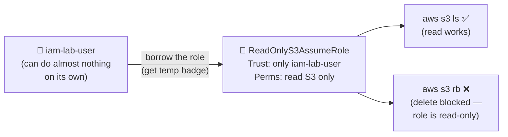
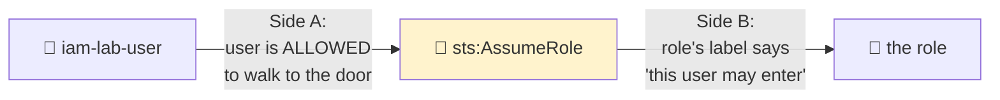
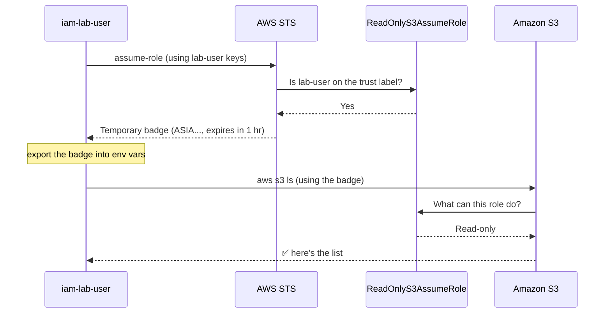

# Step 2 — IAM User Assumes a Role via the AWS CLI

## Why This Matters

This is the headline scenario. A person has a **low-power identity** day-to-day, then **borrows a stronger role for a short while** when they need it — and gives it back automatically.

**Real-world example:** An engineer's normal login can only *read* things. But once a week they need to run a risky cleanup. Instead of carrying admin keys around (dangerous — they could leak), they "put on the admin uniform" for one hour, do the job, and the uniform's badge expires on its own. That's exactly what you'll build here.

You will:
1. Create a role `ReadOnlyS3AssumeRole` that can **read S3** (its permission policy).
2. Put a label on it so **only `iam-lab-user`** may wear it (its trust policy).
3. Borrow it from the CLI **two ways** — the manual way (so you see every moving part) and the clean automatic way (how you'll really do it).

> **Technical terms in this step:** *assume a role* (`sts:AssumeRole`), trust policy `Principal` (an IAM **user ARN**), **assumed-role session**, **temporary security credentials** (`SessionToken`), and the CLI `source_profile` + `role_arn` profile. "Borrow / wear a uniform" = **assume a role** throughout — see the [glossary](../README.md#plain-word--technical-term). Foundations: [Step 1](./01-iam-foundations.md).

---

## The Working Scenario



On its own, the user can't read S3 at all. Only *after borrowing the role* can it read S3 — and even then it can't delete anything, because the role is read-only.

---

## Step 2.1 — Write the Trust Policy (the uniform's label)

This says: "only `iam-lab-user` may wear this uniform."

Create a file `trust-policy-user.json`. Replace `111122223333` with **your** Account ID from Step 1.

```json
{
  "Version": "2012-10-17",
  "Statement": [
    {
      "Sid": "AllowLabUserToAssume",
      "Effect": "Allow",
      "Principal": {
        "AWS": "arn:aws:iam::111122223333:user/iam-lab-user"
      },
      "Action": "sts:AssumeRole"
    }
  ]
}
```

> **WHY the action is `sts:AssumeRole`:** "Borrowing a role" is itself an action. This label says *iam-lab-user* (and only them) is allowed to do that one action. The `Principal` can be one specific user (most precise, as above) or the whole account `arn:aws:iam::111122223333:root` (anyone in the account who is *also* allowed on their own side).

---

## Step 2.2 — Create the Role (Console)

| Step | Action |
|------|--------|
| 1 | IAM → **Roles** → **Create role** |
| 2 | Trusted entity type: **Custom trust policy** |
| 3 | Paste the JSON from Step 2.1 (with your real Account ID) |
| 4 | **Next** |
| 5 | Add permissions: search and check **`AmazonS3ReadOnlyAccess`** (a ready-made AWS policy) |
| 6 | **Next** |
| 7 | Role name: `ReadOnlyS3AssumeRole` |
| 8 | **Create role** |

After it's created, open the role and **copy its ARN** — it looks like:
```
arn:aws:iam::111122223333:role/ReadOnlyS3AssumeRole
```

---

## Step 2.2 (CLI alternative) — Create the Role

```bash
# Create the role with the trust policy (the label)
aws iam create-role \
  --role-name ReadOnlyS3AssumeRole \
  --assume-role-policy-document file://trust-policy-user.json

# Attach the ready-made read-only S3 permission (what it can do)
aws iam attach-role-policy \
  --role-name ReadOnlyS3AssumeRole \
  --policy-arn arn:aws:iam::aws:policy/AmazonS3ReadOnlyAccess
```

Note the role ARN from the `create-role` output.

---

## Step 2.3 — Trust Has TWO Sides (the #1 gotcha)

Borrowing a role needs **both sides to agree**, like a guest list at a club:

- The **role** must say "I trust iam-lab-user" (the trust policy — done in 2.1).
- The **user** must also be allowed to *ask* to borrow it (their own permission policy).



If only one side agrees, you get the classic error: `User is not authorized to perform: sts:AssumeRole`.

Create `user-can-assume.json` (replace the Account ID):

```json
{
  "Version": "2012-10-17",
  "Statement": [
    {
      "Sid": "AllowAssumingReadOnlyRole",
      "Effect": "Allow",
      "Action": "sts:AssumeRole",
      "Resource": "arn:aws:iam::111122223333:role/ReadOnlyS3AssumeRole"
    }
  ]
}
```

Attach it to the user:

**Console:** IAM → Users → `iam-lab-user` → **Add permissions** → **Create inline policy** → JSON tab → paste → name it `AssumeReadOnlyS3` → **Create**.

**CLI:**

```bash
aws iam put-user-policy \
  --user-name iam-lab-user \
  --policy-name AssumeReadOnlyS3 \
  --policy-document file://user-can-assume.json
```

> **Remember it like this:** Trust policy = *"the door is unlocked for you."* User policy = *"you're allowed to walk up to the door."* You need both.

---

## Step 2.4 — Set Up a CLI Profile for `iam-lab-user`

Add the practice user's permanent keys (from Step 1.3) as a named profile, so we can act *as that user*:

```bash
aws configure --profile lab-user
# AWS Access Key ID:     <iam-lab-user access key from Step 1.3>
# AWS Secret Access Key: <iam-lab-user secret from Step 1.3>
# Default region name:   us-east-1
# Default output format: json
```

Confirm you're now that low-power user:

```bash
aws sts get-caller-identity --profile lab-user
```

The `Arn` should end in `user/iam-lab-user`.

Prove the user **cannot** read S3 by itself:

```bash
aws s3 ls --profile lab-user
# Expected: AccessDenied — this user has NO S3 permissions of its own
```

---

## Step 2.5 — Borrow the Role (Manual Way — see every piece)

```bash
aws sts assume-role \
  --role-arn arn:aws:iam::111122223333:role/ReadOnlyS3AssumeRole \
  --role-session-name my-cli-session \
  --profile lab-user
```

You get back a temporary badge:

```json
{
  "Credentials": {
    "AccessKeyId": "ASIA....",
    "SecretAccessKey": "....",
    "SessionToken": "....",
    "Expiration": "2026-06-07T12:34:56Z"
  },
  ...
}
```

Here's what just happened:



Now use the badge by setting it as environment variables (the next commands run **as the role**). **All three variables are required** — `AWS_SESSION_TOKEN` is what marks the credentials as temporary. Pick your shell:

**Linux / macOS (bash, zsh):**

```bash
export AWS_ACCESS_KEY_ID="ASIA...."          # from the output above
export AWS_SECRET_ACCESS_KEY="...."
export AWS_SESSION_TOKEN="...."
```

**Windows — PowerShell:**

```powershell
$env:AWS_ACCESS_KEY_ID="ASIA...."
$env:AWS_SECRET_ACCESS_KEY="...."
$env:AWS_SESSION_TOKEN="...."
```

**Windows — Command Prompt (cmd.exe):**

```bat
:: Do NOT quote the values in cmd — quotes become part of the value
set AWS_ACCESS_KEY_ID=ASIA....
set AWS_SECRET_ACCESS_KEY=....
set AWS_SESSION_TOKEN=....
```

Then verify you're now operating as the role (same commands on every OS):

```bash
aws sts get-caller-identity
# Arn now ends in: assumed-role/ReadOnlyS3AssumeRole/my-cli-session

aws s3 ls
# SUCCEEDS — you're now wearing the role's read-only S3 access
```

> **Notice the ARN changed** from `user/iam-lab-user` to `assumed-role/ReadOnlyS3AssumeRole/my-cli-session`. You're now acting *as the role* — you put the uniform on. Also notice the `ASIA...` key (temporary) and the **session token** (the mark of a borrowed badge).

When you're done with the manual session, **clear the variables** so later commands go back to your normal identity:

**Linux / macOS:**

```bash
unset AWS_ACCESS_KEY_ID AWS_SECRET_ACCESS_KEY AWS_SESSION_TOKEN
```

**Windows — PowerShell:**

```powershell
Remove-Item Env:AWS_ACCESS_KEY_ID, Env:AWS_SECRET_ACCESS_KEY, Env:AWS_SESSION_TOKEN
```

**Windows — Command Prompt:**

```bat
set AWS_ACCESS_KEY_ID=
set AWS_SECRET_ACCESS_KEY=
set AWS_SESSION_TOKEN=
```

> **Tip:** these environment variables **override** anything in `~/.aws/credentials`. If you forget to clear them, later commands keep using the expired role badge and you'll see `ExpiredToken` errors (see [troubleshooting.md](../troubleshooting.md)). The clean profile approach in Step 2.6 avoids this entirely.

---

## Step 2.6 — Borrow the Role (The Clean Way — a config profile)

In real life, nobody copy/pastes credentials. Instead you set up a profile that **borrows the role for you automatically**. Edit `~/.aws/config` and add:

```ini
[profile lab-readonly]
role_arn = arn:aws:iam::111122223333:role/ReadOnlyS3AssumeRole
source_profile = lab-user
region = us-east-1
```

| Key | What It Does |
|-----|--------------|
| `role_arn` | The role to borrow |
| `source_profile` | The keys used to *ask* for it (our `lab-user` keys) |
| `region` | Default region for the session |

Now just add `--profile lab-readonly` — the CLI quietly calls STS, gets the badge, and refreshes it for you:

```bash
aws sts get-caller-identity --profile lab-readonly
# Arn ends in assumed-role/ReadOnlyS3AssumeRole/botocore-session-...

aws s3 ls --profile lab-readonly
# SUCCEEDS

aws s3 mb s3://some-new-bucket-12345 --profile lab-readonly
# DENIED — the role is read-only, so it can't create buckets
```

> **This is the pattern to remember.** A `source_profile` + `role_arn` profile is how engineers borrow roles every single day. No credentials are ever pasted (and in Step 7, even the source keys disappear).

---

## Verification

- `aws s3 ls --profile lab-user` → **AccessDenied** (user alone has no S3 access)
- `aws s3 ls --profile lab-readonly` → **succeeds** (the role grants read)
- `aws s3 mb ... --profile lab-readonly` → **AccessDenied** (the role is read-only)
- `aws sts get-caller-identity --profile lab-readonly` shows an `assumed-role/...` ARN, not a `user/...` ARN

---

## Key Concepts

| Concept | Plain-Language Explanation |
|---------|----------------------------|
| **Two-sided trust** | The role must trust the user *and* the user must be allowed to ask — both, always |
| **`source_profile`** | The base keys the CLI uses to do the borrowing for you |
| **Session name** | A label (`--role-session-name`) that shows up in the audit log — use it to see *who* borrowed the role |
| **Temporary vs. permanent** | `ASIA...` keys + session token expire; `AKIA...` user keys never do |
| **Privilege elevation** | Low power day-to-day; borrow a stronger role only when needed |

---

Next: [Step 3 — Service Role: Lambda Execution Role](./03-service-role-lambda.md)
</content>
