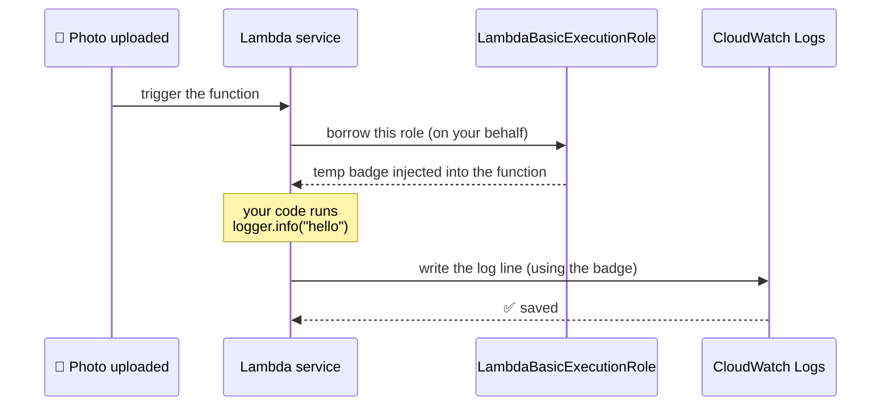

# Step 3 — Service Role: Lambda Execution Role

## Why This Matters

In Step 2 a *person* borrowed a role. Now an **AWS service** borrows one. When your Lambda function runs, **Lambda itself puts on a uniform** you gave it, so your code can talk to other AWS services (write logs, read S3, send messages). This borrowed uniform is called an **execution role**.

**Real-world example:** You build a photo-upload app. Every time someone uploads a picture, a Lambda function runs to make a thumbnail. That function needs to (a) write a log line and (b) read the original photo from S3. It can't do either with no permissions — so you give it a role, and Lambda wears that role each time it runs.

The only thing that changes from Step 2 is **who's named on the trust label** — now it's a *service*, not a person.

> **Technical terms in this step:** **execution role**, **service principal** (`lambda.amazonaws.com`), `sts:AssumeRole`, and **credential injection** (the runtime env vars `AWS_ACCESS_KEY_ID` / `AWS_SESSION_TOKEN` that Boto3 reads automatically). "Service borrows a uniform" = **the service assumes an execution role**. See the [glossary](../README.md#plain-word--technical-term).
>
> **Cross-reference:** this is the exact role used by the [`lambda-basics`](../../../../beginner/aws/aws-lambda-basics) and [`lambda-s3-event-processing`](../../../../beginner/aws/aws-lambda-s3-event-processing) projects — they create this role and move on; *here* you learn why it works.

---

## The Working Scenario



> **WHY a service needs a role:** Your function code has no AWS keys of its own. Lambda borrows the execution role for each run and quietly slips the temporary badge into the runtime. Boto3 picks it up automatically — which is exactly why you never hard-code keys in Lambda code.

---

## Step 3.1 — The Service Trust Policy

Create `trust-policy-lambda.json`:

```json
{
  "Version": "2012-10-17",
  "Statement": [
    {
      "Sid": "AllowLambdaToAssume",
      "Effect": "Allow",
      "Principal": {
        "Service": "lambda.amazonaws.com"
      },
      "Action": "sts:AssumeRole"
    }
  ]
}
```

> Compare with Step 2 — the *only* change is the label: `"Principal": { "Service": "lambda.amazonaws.com" }` instead of a user ARN. **That one line is the entire difference between a "person role" and a "service role."** Same uniform, different name on the label.

---

## Step 3.2 — Create the Role (Console)

| Step | Action |
|------|--------|
| 1 | IAM → **Roles** → **Create role** |
| 2 | Trusted entity type: **AWS service** |
| 3 | Use case: **Lambda** → **Next** |
| 4 | Attach permissions: check **`AWSLambdaBasicExecutionRole`** (lets it write CloudWatch Logs) |
| 5 | **Next** |
| 6 | Role name: `LambdaBasicExecutionRole` |
| 7 | **Create role** |

> Picking the **Lambda** use case makes the console fill in the `lambda.amazonaws.com` trust label for you — it's doing exactly what your JSON in 3.1 does, just with clicks.

---

## Step 3.2 (CLI alternative) — Create the Role

```bash
aws iam create-role \
  --role-name LambdaBasicExecutionRole \
  --assume-role-policy-document file://trust-policy-lambda.json

aws iam attach-role-policy \
  --role-name LambdaBasicExecutionRole \
  --policy-arn arn:aws:iam::aws:policy/service-role/AWSLambdaBasicExecutionRole
```

---

## Step 3.3 — (Optional) Prove It Works with a Real Function

This confirms the *service* can really borrow the role. Create `handler.py`:

```python
import logging

logger = logging.getLogger()
logger.setLevel(logging.INFO)


def lambda_handler(event, context):
    logger.info("Lambda borrowed the execution role successfully")
    return {"statusCode": 200, "body": "ok"}
```

Package and deploy (replace the Account ID in the role ARN):

```bash
zip function.zip handler.py

aws lambda create-function \
  --function-name role-demo \
  --runtime python3.14 \
  --handler handler.lambda_handler \
  --zip-file fileb://function.zip \
  --role arn:aws:iam::111122223333:role/LambdaBasicExecutionRole

aws lambda invoke \
  --function-name role-demo \
  response.json && cat response.json
```

Then confirm the log line landed in CloudWatch (this proves the role's permission worked):

```bash
aws logs tail /aws/lambda/role-demo --since 5m
```

> If you see the log line, the whole chain worked: Lambda borrowed `LambdaBasicExecutionRole`, and that role's permission let your function write to CloudWatch Logs.

---

## Adding More Permissions (the real-world pattern)

`AWSLambdaBasicExecutionRole` only allows logging. To let the thumbnail function *read the photo* from S3, you attach a second permission policy — and you scope it to just the bucket it needs (least privilege):

```json
{
  "Version": "2012-10-17",
  "Statement": [
    {
      "Sid": "ReadOneBucket",
      "Effect": "Allow",
      "Action": ["s3:GetObject"],
      "Resource": "arn:aws:s3:::my-photo-uploads/*"
    }
  ]
}
```

> The **trust label never changes** (`lambda.amazonaws.com`). You only ever grow the **"what it can do"** side. *Who* can wear the uniform stays the same; *what* it unlocks grows.

---

## Verification

- IAM → Roles → `LambdaBasicExecutionRole` → **Trust relationships** tab shows `lambda.amazonaws.com`
- (If you did 3.3) `aws logs tail /aws/lambda/role-demo` shows the success log line

---

## Key Concepts

| Concept | Plain-Language Explanation |
|---------|----------------------------|
| **Execution role** | The uniform a service wears to run *your* workload |
| **Service principal** | A trust `Principal` like `xxx.amazonaws.com` (the service's name) |
| **Credential injection** | Lambda slips the badge into the runtime; Boto3 finds it automatically — no hard-coded keys |
| **Grow perms, not trust** | Add permission policies for new access; the service trust label never changes |

---

Next: [Step 4 — Service Role: EC2 Instance Profile](./04-service-role-ec2-instance-profile.md)
</content>
