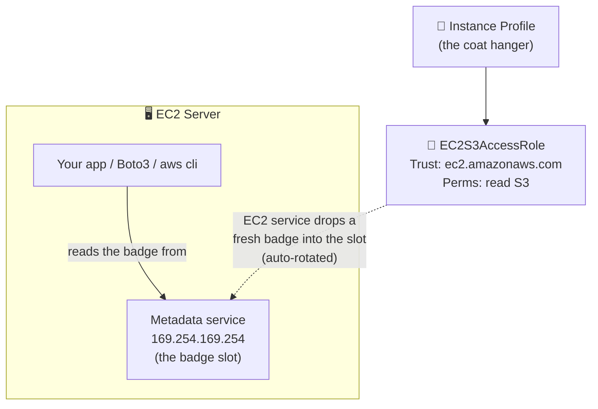

# Step 4 — Service Role: EC2 Instance Profile

## Why This Matters

This is the role pattern that **stopped people from saving passwords on servers**. In the old days, people copied access keys onto their EC2 servers (and into machine images, and accidentally into git…). With an **instance profile**, the EC2 service hands a temporary badge to code running on the server automatically — nothing is ever saved on the machine.

**Real-world example:** You run a web server on EC2. On startup it reads its config file from an S3 bucket. Instead of putting AWS keys on the server (which anyone who breaks in could steal), you attach a role to the server. The code reads S3 with no keys saved anywhere — and the badge rotates automatically.

There's one EC2-only quirk: a role can't attach to a server directly. It has to be wrapped in an **instance profile** — think of it as the *coat hanger* that the EC2 service knows how to hang the uniform on.

> **Technical terms in this step:** **instance profile** (the required wrapper around the role), **service principal** (`ec2.amazonaws.com`), the **Instance Metadata Service / IMDS** at `169.254.169.254`, and **IMDSv2** (the token-based `PUT`-then-`GET` flow). "Coat hanger" = **instance profile**; "badge slot" = **IMDS**. See the [glossary](../README.md#plain-word--technical-term).

---

## The Working Scenario



> **WHY the metadata service:** Code on the server asks a special local address — `169.254.169.254` — for the role's current badge. The EC2 service keeps a fresh badge there at all times, swapping it before it expires. Boto3 and the AWS CLI check this address automatically, so your code needs **zero** setup. (Real-world payoff: nothing to steal, nothing to rotate by hand.)

---

## Step 4.1 — The Service Trust Policy

Create `trust-policy-ec2.json`:

```json
{
  "Version": "2012-10-17",
  "Statement": [
    {
      "Sid": "AllowEC2ToAssume",
      "Effect": "Allow",
      "Principal": {
        "Service": "ec2.amazonaws.com"
      },
      "Action": "sts:AssumeRole"
    }
  ]
}
```

Same shape as the Lambda trust — just a different service name on the label (`ec2.amazonaws.com`).

---

## Step 4.2 — Create the Role and Instance Profile (Console)

The console hides the coat-hanger step — when you pick the **EC2** use case, it makes the instance profile for you automatically.

| Step | Action |
|------|--------|
| 1 | IAM → **Roles** → **Create role** |
| 2 | Trusted entity type: **AWS service** |
| 3 | Use case: **EC2** → **Next** |
| 4 | Attach permissions: check **`AmazonS3ReadOnlyAccess`** |
| 5 | **Next** |
| 6 | Role name: `EC2S3AccessRole` |
| 7 | **Create role** |

---

## Step 4.2 (CLI alternative) — Create Role + Instance Profile By Hand

The CLI makes the coat hanger visible. Notice there are **three** separate things: the role, the profile (coat hanger), and the act of hanging one on the other.

```bash
# 1. The role itself (the uniform)
aws iam create-role \
  --role-name EC2S3AccessRole \
  --assume-role-policy-document file://trust-policy-ec2.json

aws iam attach-role-policy \
  --role-name EC2S3AccessRole \
  --policy-arn arn:aws:iam::aws:policy/AmazonS3ReadOnlyAccess

# 2. The instance profile (the coat hanger EC2 attaches to a server)
aws iam create-instance-profile \
  --instance-profile-name EC2S3AccessProfile

# 3. Hang the role on the coat hanger
aws iam add-role-to-instance-profile \
  --instance-profile-name EC2S3AccessProfile \
  --role-name EC2S3AccessRole
```

> **WHY the extra wrapper:** For historical reasons, EC2 attaches an *instance profile*, not a role directly. A profile holds exactly one role. The console squashes this into one click; the CLI shows the truth. Only EC2 needs this — Lambda and ECS don't.

---

## Step 4.3 — (Optional) Verify on a Real Server

> ⚠️ **This is the only part of the whole project that costs money.** A `t3.micro` is ~$0.01/hr. Terminate it in Step 8. Skip this section entirely if you want to keep the project at $0.00.

1. Launch a `t3.micro` Amazon Linux instance (EC2 → Launch instance).
2. Under **Advanced details → IAM instance profile**, pick `EC2S3AccessProfile`.
3. SSH in (or use **EC2 Instance Connect**) and run:

```bash
# See that the role is hanging on this server
TOKEN=$(curl -s -X PUT "http://169.254.169.254/latest/api/token" \
  -H "X-aws-ec2-metadata-token-ttl-seconds: 60")
curl -s -H "X-aws-ec2-metadata-token: $TOKEN" \
  http://169.254.169.254/latest/meta-data/iam/security-credentials/
# → prints: EC2S3AccessRole

# The role's permissions just work — no keys configured anywhere
aws s3 ls
# → SUCCEEDS using the server's borrowed badge
```

> Notice you never ran `aws configure` on this server. The badge came entirely from the attached role through the metadata slot. That's the whole point — no secrets on the box.

**Terminate the server right after** to stop charges (or wait for Step 8).

---

## Verification

- IAM → Roles → `EC2S3AccessRole` → **Trust relationships** shows `ec2.amazonaws.com`
- `aws iam get-instance-profile --instance-profile-name EC2S3AccessProfile` lists `EC2S3AccessRole` inside it
- (If you launched a server) `aws s3 ls` worked on the box with no keys configured

---

## Key Concepts

| Concept | Plain-Language Explanation |
|---------|----------------------------|
| **Instance profile** | The "coat hanger" that wraps a role so EC2 can attach it to a server |
| **Metadata service (IMDS)** | The `169.254.169.254` slot where the server picks up its current badge |
| **No keys on disk** | The whole reason instance roles exist — nothing to steal, auto-rotated |
| **IMDSv2** | The safer token-first way to read the metadata slot (the `PUT` then `GET` shown above) |

---

Next: [Step 5 — Cross-Account Role (with External ID)](./05-cross-account-role.md)
</content>
