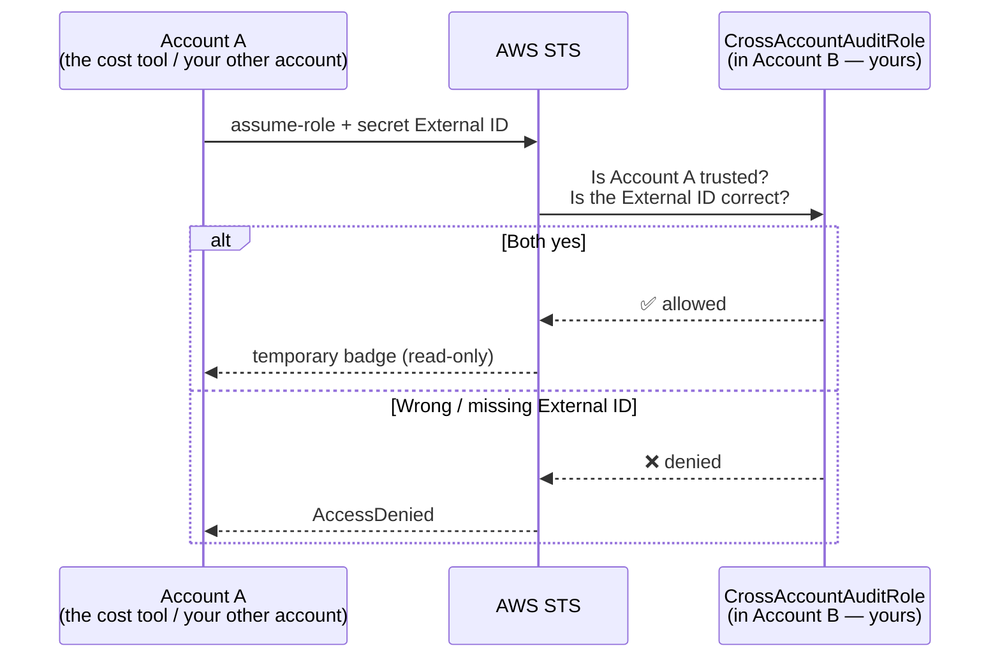

# Step 5 — Cross-Account Role (with a Secret External ID)

## Why This Matters

Until now, the person or service borrowing the role lived in **your** AWS account. A cross-account role lets someone in a **different** account borrow a role in yours.

**Real-world examples:**
- A company keeps **dev, staging, and production** in three separate accounts, and lets engineers hop between them by borrowing roles.
- You sign up for a **cost-monitoring tool** (a SaaS like a billing dashboard). Instead of emailing them your AWS keys (never do this!), you create a role they can borrow to *read* your billing — and nothing else.

The new idea here is the **External ID** — a **secret password** the other party must say when borrowing. It protects you when a *third party* is involved.

> **Technical terms in this step:** **cross-account trust**, the `Principal` `arn:aws:iam::<acct>:root` (an account principal), the `Condition` key **`sts:ExternalId`**, and the **confused deputy problem** it defends against. "Say the secret" = **pass `--external-id` to `sts:AssumeRole`**. See the [glossary](../README.md#plain-word--technical-term).

---

## The Working Scenario



> In this single-account lab you can play **both sides**: your admin acts as "Account A," and the role lives in the same account. The mechanics are identical to a real two-account setup — only the account numbers differ.

---

## Step 5.1 — The Cross-Account Trust Policy

The label now names another **account**, plus a `Condition` that demands the secret External ID.

Create `trust-policy-crossaccount.json`. In a real setup you'd use the *other* account's ID in the principal; in this lab both are *your* account ID — replace `111122223333` with yours:

```json
{
  "Version": "2012-10-17",
  "Statement": [
    {
      "Sid": "AllowAccountAWithExternalId",
      "Effect": "Allow",
      "Principal": {
        "AWS": "arn:aws:iam::111122223333:root"
      },
      "Action": "sts:AssumeRole",
      "Condition": {
        "StringEquals": {
          "sts:ExternalId": "lab-shared-secret-2026"
        }
      }
    }
  ]
}
```

| Part | What It Means |
|------|---------------|
| `Principal.AWS: ...:root` | **Anyone** in that account *may* borrow — but only if their own policy also allows it |
| `sts:ExternalId` condition | The borrower **must** say this exact secret, or it's denied |

> **WHY the External ID — the "confused deputy" problem in plain English:** Imagine that cost-monitoring tool uses *one* role-borrowing setup for *all* its customers. If a sneaky customer learns *your* role's name (your ARN), they could trick the tool into borrowing *your* role and peeking at your data. The External ID is a private password the tool stores only for you and sends only when acting for you — so someone who knows just the role name still can't get in.
>
> **Rule of thumb:** Always require an External ID when a *third party* borrows your role. For your *own* accounts that you control, it's optional but harmless.

---

## Step 5.2 — Create the Role (Console)

| Step | Action |
|------|--------|
| 1 | IAM → **Roles** → **Create role** |
| 2 | Trusted entity type: **AWS account** |
| 3 | Choose **Another AWS account**, enter the trusted account ID |
| 4 | Check **Require external ID** and enter `lab-shared-secret-2026` |
| 5 | **Next** → attach **`ReadOnlyAccess`** (ready-made) → **Next** |
| 6 | Role name: `CrossAccountAuditRole` → **Create role** |

---

## Step 5.2 (CLI alternative) — Create the Role

```bash
aws iam create-role \
  --role-name CrossAccountAuditRole \
  --assume-role-policy-document file://trust-policy-crossaccount.json

aws iam attach-role-policy \
  --role-name CrossAccountAuditRole \
  --policy-arn arn:aws:iam::aws:policy/ReadOnlyAccess
```

---

## Step 5.3 — Borrow It Across Accounts (CLI)

From the **borrowing** side (in this lab, your admin), borrow the role **and say the secret**:

```bash
aws sts assume-role \
  --role-arn arn:aws:iam::111122223333:role/CrossAccountAuditRole \
  --role-session-name audit-session \
  --external-id lab-shared-secret-2026
```

Now try it **without** the secret to watch the guard stop you:

```bash
aws sts assume-role \
  --role-arn arn:aws:iam::111122223333:role/CrossAccountAuditRole \
  --role-session-name audit-session
# → AccessDenied: the External ID didn't match
```

Or wire it into a profile (the `external_id` key sends the secret for you):

```ini
[profile cross-audit]
role_arn = arn:aws:iam::111122223333:role/CrossAccountAuditRole
source_profile = default
external_id = lab-shared-secret-2026
region = us-east-1
```

```bash
aws sts get-caller-identity --profile cross-audit
# Arn → assumed-role/CrossAccountAuditRole/botocore-session-...
```

---

## Verification

- Borrowing **with** the correct `--external-id` succeeds
- Borrowing **without** (or with a wrong) external ID returns **AccessDenied**
- The borrowed identity has read-only access across the account (`ReadOnlyAccess`)

---

## Key Concepts

| Concept | Plain-Language Explanation |
|---------|----------------------------|
| **Cross-account role** | A role in account B that someone in account A can borrow |
| **`:root` principal** | "Anyone in this account" — they still need their own permission to borrow |
| **External ID** | A secret password in the trust label that blocks the "confused deputy" trick |
| **Two-account model** | Same steps whether the accounts are different or (in this lab) the same |

---

Next: [Step 6 — ECS Task Role vs. Task Execution Role](./06-ecs-task-role.md)
</content>
