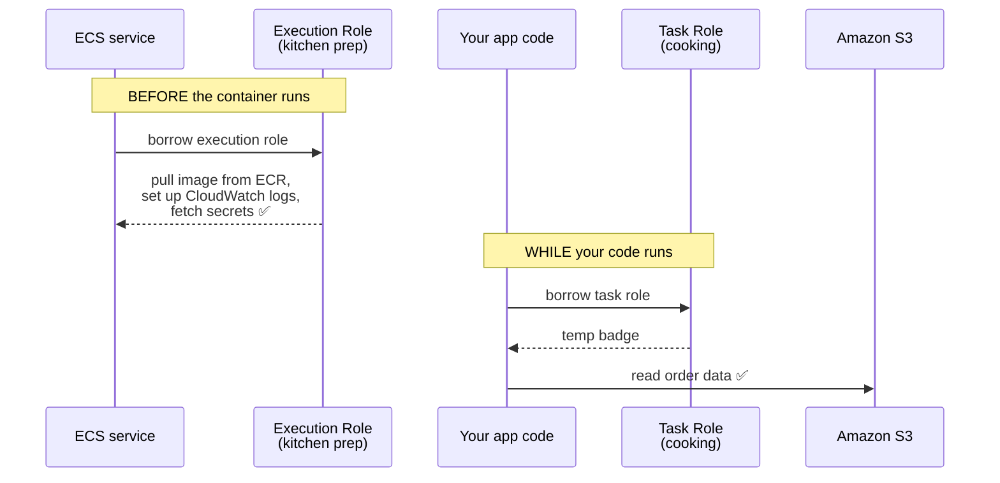

# Step 6 — ECS Task Role vs. Task Execution Role

## Why This Matters

ECS trips people up because **one container uses two roles at the same time**, and they're easy to mix up:

- **Task Execution Role** — used by **ECS itself** to *set up and start* the container (download the image, prepare logging, fetch secrets).
- **Task Role** — used by **your app inside** the running container (read S3, talk to a database, send messages).

**Real-world example — a food delivery app in a container:**
- *Getting the kitchen ready* (download the app image, open the log book, grab the safe's secrets) → that's the **execution role**. It's the prep work ECS does *before* your code runs.
- *Cooking the orders* (read order data from S3, write to the orders database) → that's the **task role**. It's what your code does *while* running.

Mixing these up causes the classic "my container starts fine but my app gets AccessDenied" (or the reverse).

> **Technical terms in this step:** **task execution role** vs **task role**, the shared **service principal** `ecs-tasks.amazonaws.com`, and the task definition fields `executionRoleArn` and `taskRoleArn`. "Kitchen prep" = **execution role**; "cooking" = **task role**. See the [glossary](../README.md#plain-word--technical-term).
>
> **Cross-reference:** these are the same two roles defined in [`ecs-fargate-basics`](../../aws-ecs-fargate-basics) and [`ecs-fargate-advanced`](../../../../advanced/aws/aws-ecs-fargate-advanced) (`ECS*TaskExecutionRole` / `ECS*TaskRole`) — *here* you learn the why behind the split.

---

## The Working Scenario



> **Memory aid:** *Execution* role = **get the container running** (ECS's job, before). *Task* role = **what the app does once running** (your code's job, during). Both wear the **same** trust label — `ecs-tasks.amazonaws.com` — but carry different permissions.

---

## Step 6.1 — Both Roles Share One Trust Policy

Create `trust-policy-ecs.json`:

```json
{
  "Version": "2012-10-17",
  "Statement": [
    {
      "Sid": "AllowEcsTasksToAssume",
      "Effect": "Allow",
      "Principal": {
        "Service": "ecs-tasks.amazonaws.com"
      },
      "Action": "sts:AssumeRole"
    }
  ]
}
```

> Both roles use **this exact trust label**. The only difference between them is the *permissions* you attach. Same "who can wear it," different "what it can do."

---

## Step 6.2 — Create the Task Execution Role (the prep crew)

This is the "kitchen prep" role. AWS gives you a ready-made policy with exactly the right startup permissions.

**Console:**

| Step | Action |
|------|--------|
| 1 | IAM → **Roles** → **Create role** → **AWS service** → use case **Elastic Container Service** → **Elastic Container Service Task** |
| 2 | Attach **`AmazonECSTaskExecutionRolePolicy`** |
| 3 | Name: `ECSAppTaskExecutionRole` → **Create role** |

**CLI:**

```bash
aws iam create-role \
  --role-name ECSAppTaskExecutionRole \
  --assume-role-policy-document file://trust-policy-ecs.json

aws iam attach-role-policy \
  --role-name ECSAppTaskExecutionRole \
  --policy-arn arn:aws:iam::aws:policy/service-role/AmazonECSTaskExecutionRolePolicy
```

> `AmazonECSTaskExecutionRolePolicy` lets ECS download the container image and write logs — the bare minimum to *start* a container. On purpose, it gives **nothing** about your app's actual data.

---

## Step 6.3 — Create the Task Role (your app's own identity)

This is the role your *code* uses. Give it exactly what the app needs — here, read one S3 bucket.

Create `task-role-perms.json` (replace the bucket name):

```json
{
  "Version": "2012-10-17",
  "Statement": [
    {
      "Sid": "AppReadsItsBucket",
      "Effect": "Allow",
      "Action": ["s3:GetObject", "s3:ListBucket"],
      "Resource": [
        "arn:aws:s3:::my-app-bucket",
        "arn:aws:s3:::my-app-bucket/*"
      ]
    }
  ]
}
```

**CLI:**

```bash
aws iam create-role \
  --role-name ECSAppTaskRole \
  --assume-role-policy-document file://trust-policy-ecs.json

aws iam put-role-policy \
  --role-name ECSAppTaskRole \
  --policy-name AppS3Read \
  --policy-document file://task-role-perms.json
```

> **WHY split them:** Safety and least privilege. The execution role is the same for every app you run, so AWS manages it for you. The task role is unique to *each app* — so if one app gets hacked, its task role limits the damage to just *that app's* data, not your whole system.

---

## Step 6.4 — How They're Wired Together

You won't run a task here (that's the ECS projects' job), but this is where the two roles are named — notice the two **separate** fields:

```json
{
  "family": "ecs-app-task",
  "executionRoleArn": "arn:aws:iam::111122223333:role/ECSAppTaskExecutionRole",
  "taskRoleArn": "arn:aws:iam::111122223333:role/ECSAppTaskRole",
  "containerDefinitions": [ ... ]
}
```

| Field | Role | Used By | When |
|-------|------|---------|------|
| `executionRoleArn` | `ECSAppTaskExecutionRole` | ECS itself | *before* the app starts |
| `taskRoleArn` | `ECSAppTaskRole` | your app code | *while* it runs |

---

## Verification

- Both roles' **Trust relationships** show `ecs-tasks.amazonaws.com`
- `ECSAppTaskExecutionRole` has `AmazonECSTaskExecutionRolePolicy` (image pull + logs)
- `ECSAppTaskRole` has only the scoped S3 policy
- You can say which role pulls the image (execution) and which reads S3 at runtime (task)

---

## Key Concepts

| Concept | Plain-Language Explanation |
|---------|----------------------------|
| **Task Execution Role** | Prep crew: pull image, set up logs, fetch secrets — used *before* the container runs |
| **Task Role** | The app's own identity: what your code can do *while* running |
| **Same trust, different perms** | Both trust `ecs-tasks.amazonaws.com`; they differ only in permissions |
| **Blast radius** | A per-app task role limits the damage if one container is hacked |

---

Next: [Step 7 — GitHub Actions via OIDC](./07-federated-oidc-github-actions.md)
</content>
