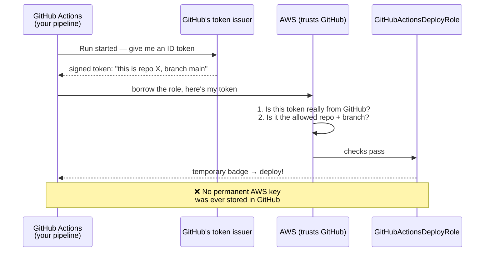

# Step 7 — GitHub Actions via OIDC: Deploy with No Stored Secrets

## Why This Matters

Every role so far was borrowed by something *inside* AWS (a user or a service). This last one is borrowed by something **completely outside AWS** — a GitHub Actions pipeline — and the amazing part: **no AWS passwords are stored anywhere.**

**Real-world example:** Every time you push code, you want GitHub to build your app and deploy it to AWS. The old, risky way was to paste a permanent AWS access key into GitHub's secrets. The problem: if that key ever leaks (a bad log line, a compromised plugin), an attacker has your AWS keys *forever*. The modern way (this step) uses **OIDC**: GitHub proves who it is with a freshly-minted, short-lived token each run — so there's no permanent key to steal.

**The simple idea:** instead of giving GitHub a *key*, you teach AWS to *recognize GitHub's ID*. It's like a nightclub that accepts your passport (issued by a trusted government) instead of making you carry a special membership card that could be copied.

**What does "OIDC" actually stand for?** **OpenID Connect** — an industry-standard identity protocol built on top of OAuth 2.0 (the same family that powers "Sign in with Google"). The "ID" GitHub hands over is a signed **JWT** (JSON Web Token): a small, tamper-evident chunk of JSON that says *who* is calling (which repo, which branch) and *who it's for* (AWS). AWS verifies the signature and reads those facts — called **claims** — to decide whether to let the caller in.

> **Technical terms in this step:** **OIDC federation**, the **IAM OIDC identity provider**, a **federated principal** (`Federated:` in the trust policy), the **`sts:AssumeRoleWithWebIdentity`** call (note: *not* plain `AssumeRole`), and the JWT claim conditions **`:aud`** (audience) and **`:sub`** (subject = repo + branch). "Passport" = **OIDC token (JWT)**; "the issuing government" = **the OIDC provider**. See the [glossary](../README.md#plain-word--technical-term).
>
> **Cross-reference:** this role pushes images to ECR for [`ecs-fargate-advanced`](../../../../advanced/aws/aws-ecs-fargate-advanced) — it's how you'd wire up CI/CD without storing AWS keys in GitHub.

---

## The Working Scenario



> **WHY this beats stored keys:** A leaked permanent key works forever until someone notices. A GitHub OIDC token lasts only minutes, is tied to one pipeline run, and can't be reused. There's simply no secret sitting around to steal.

---

## Step 7.1 — Tell AWS to Trust GitHub (register the ID issuer)

First, AWS needs to know that GitHub's tokens are legit. You do this once per account.

**Console:**

| Step | Action |
|------|--------|
| 1 | IAM → **Identity providers** → **Add provider** |
| 2 | Provider type: **OpenID Connect** |
| 3 | Provider URL: `https://token.actions.githubusercontent.com` → **Get thumbprint** |
| 4 | Audience: `sts.amazonaws.com` |
| 5 | **Add provider** |

**CLI:**

```bash
aws iam create-open-id-connect-provider \
  --url https://token.actions.githubusercontent.com \
  --client-id-list sts.amazonaws.com
```

> The audience `sts.amazonaws.com` just means "these tokens are meant to be traded in for AWS credentials." It has to match what the GitHub Action sends.

---

## Step 7.2 — The Federated Trust Policy

The label now names the **GitHub ID issuer**, and the `Condition` block does the real security work — it locks the role to *one specific repo and branch*.

Create `trust-policy-oidc.json`. Replace `111122223333` and `your-org/your-repo`:

```json
{
  "Version": "2012-10-17",
  "Statement": [
    {
      "Sid": "AllowGitHubOIDC",
      "Effect": "Allow",
      "Principal": {
        "Federated": "arn:aws:iam::111122223333:oidc-provider/token.actions.githubusercontent.com"
      },
      "Action": "sts:AssumeRoleWithWebIdentity",
      "Condition": {
        "StringEquals": {
          "token.actions.githubusercontent.com:aud": "sts.amazonaws.com"
        },
        "StringLike": {
          "token.actions.githubusercontent.com:sub": "repo:your-org/your-repo:ref:refs/heads/main"
        }
      }
    }
  ]
}
```

| Condition | What It Locks Down |
|-----------|--------------------|
| `:aud = sts.amazonaws.com` | The token was made for AWS, not something else |
| `:sub = repo:org/repo:ref:refs/heads/main` | **Only** the `main` branch of **that one repo** may borrow the role |

> ⚠️ **The `:sub` condition is critical.** Without it, *any* GitHub repo on the planet could borrow your role. The `:sub` line pins it to your repo and branch. You *can* loosen it (e.g. `repo:your-org/your-repo:*` for any branch) but never leave it off entirely.
>
> Also note the action is **`sts:AssumeRoleWithWebIdentity`**, not plain `sts:AssumeRole` — outside identities use this "web identity" version of borrowing.

---

## Step 7.3 — Create the Role

```bash
aws iam create-role \
  --role-name GitHubActionsDeployRole \
  --assume-role-policy-document file://trust-policy-oidc.json
```

Attach only what the pipeline needs — keep it tight. Example: push images to ECR:

```json
{
  "Version": "2012-10-17",
  "Statement": [
    {
      "Sid": "EcrPush",
      "Effect": "Allow",
      "Action": [
        "ecr:GetAuthorizationToken",
        "ecr:BatchCheckLayerAvailability",
        "ecr:PutImage",
        "ecr:InitiateLayerUpload",
        "ecr:UploadLayerPart",
        "ecr:CompleteLayerUpload"
      ],
      "Resource": "*"
    }
  ]
}
```

```bash
aws iam put-role-policy \
  --role-name GitHubActionsDeployRole \
  --policy-name EcrPush \
  --policy-document file://oidc-perms.json
```

---

## Step 7.4 — The GitHub Side

This is what the *repo* puts in `.github/workflows/deploy.yml`. The two key parts are `id-token: write` (lets the runner get an OIDC token) and the official AWS action — with **no secrets at all**:

```yaml
permissions:
  id-token: write   # REQUIRED — lets the job ask for an OIDC token
  contents: read

jobs:
  deploy:
    runs-on: ubuntu-latest
    steps:
      - uses: aws-actions/configure-aws-credentials@v4
        with:
          role-to-assume: arn:aws:iam::111122223333:role/GitHubActionsDeployRole
          aws-region: us-east-1
      - run: aws sts get-caller-identity   # proves the role was borrowed
```

> Look closely: there's **no `aws-access-key-id` and no `aws-secret-access-key`** — not in the file, not in GitHub secrets. The action trades the run's OIDC token for a temporary AWS badge behind the scenes. That's the whole payoff: nothing to leak.

---

## Verification

- IAM → **Identity providers** lists `token.actions.githubusercontent.com`
- `GitHubActionsDeployRole` trust policy shows the `Federated` principal and the `:sub` repo/branch lock
- (If you have a repo to test) a workflow run prints an `assumed-role/GitHubActionsDeployRole/...` ARN from `get-caller-identity`

---

## Key Concepts

| Concept | Plain-Language Explanation |
|---------|----------------------------|
| **OIDC federation** | Trusting an outside login system's signed tokens instead of storing AWS keys |
| **`AssumeRoleWithWebIdentity`** | The "borrow a role" call used by outside identities |
| **`:sub` condition** | Pins the role to one repo + branch — the security linchpin |
| **`id-token: write`** | The GitHub permission that lets a workflow get its OIDC token |
| **Zero stored secrets** | No permanent AWS key exists to leak — the headline benefit |

---

Next: [Step 8 — Cleanup](./08-cleanup.md)
</content>
