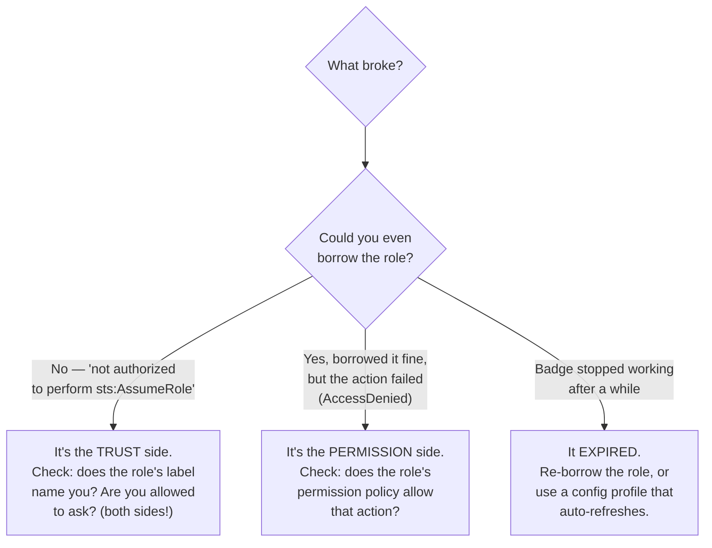

# Troubleshooting

The IAM errors you *will* hit in this project, in **Error → Cause → Fix** format, explained in plain language.

Almost every role problem is one of two things: the **trust policy** (who can wear the uniform) or the **permission policy** (what it can do). Figure out which side broke and you've basically solved it. Use this quick map:



---

## `User: ... is not authorized to perform: sts:AssumeRole on resource: ...`

**Cause:** The *calling identity's own policy* doesn't allow it to assume the role. The role's trust policy may be perfect, but the caller still needs `sts:AssumeRole` permission on their side. (Trust is two-sided — see Step 2.3.)

**Fix:**
1. Attach a policy to the calling user/role allowing `sts:AssumeRole` on the target role ARN.
2. For `iam-lab-user`, that's the `AssumeReadOnlyS3` inline policy from Step 2.3.

```bash
aws iam put-user-policy --user-name iam-lab-user \
  --policy-name AssumeReadOnlyS3 --policy-document file://user-can-assume.json
```

---

## `... is not authorized to perform: sts:AssumeRole` — but the *user* policy is correct

**Cause:** The *role's trust policy* doesn't name this principal. This is the other half of two-sided trust.

**Fix:**
1. IAM → Roles → your role → **Trust relationships** tab.
2. Confirm the `Principal` exactly matches the caller's ARN (or account root).
3. A common slip: the trust policy references a *user* ARN but you're calling from a *different* user, or you fat-fingered the Account ID.

```bash
aws iam get-role --role-name ReadOnlyS3AssumeRole \
  --query "Role.AssumeRolePolicyDocument"
```

---

## `MalformedPolicyDocument` when creating a role or policy

**Cause:** Invalid JSON, or a structural mistake — most often a `Principal` in a *permission* policy, or a missing `Version`.

**Fix:**

| Mistake | Fix |
|---------|-----|
| `Principal` in a permission policy | Remove it — `Principal` belongs **only** in trust policies |
| Missing `"Version": "2012-10-17"` | Add it (it's the policy-language version, not a date) |
| Trailing comma / unquoted key | Validate the JSON (`python -m json.tool < file.json`) |
| `file://` path wrong | Confirm the file exists in your current directory |

---

## `AccessDenied` *after* successfully assuming the role

**Cause:** You assumed the role fine (trust is good), but the **permission policy** doesn't allow the action you tried. This is the permission side, not the trust side.

**Fix:**
1. Check what the assumed role can actually do.
2. Remember the role's permissions **replace** your own — your user's permissions don't add to them.

```bash
aws iam list-attached-role-policies --role-name ReadOnlyS3AssumeRole
aws iam list-role-policies --role-name ReadOnlyS3AssumeRole
```

> Example from Step 2: `aws s3 mb` fails under `lab-readonly` because `AmazonS3ReadOnlyAccess` grants no write — that's expected, not a bug.

---

## `The security token included in the request is invalid` / `ExpiredToken`

**Cause:** You're using temporary credentials that expired, or you exported only two of the three values (forgot `AWS_SESSION_TOKEN`).

**Fix:**
1. Temporary creds **require all three**: `AWS_ACCESS_KEY_ID`, `AWS_SECRET_ACCESS_KEY`, **and** `AWS_SESSION_TOKEN`.
2. If expired (default 1 hour), re-run `aws sts assume-role` to get fresh ones.
3. Easier: use a `~/.aws/config` profile (Step 2.6) — the CLI refreshes automatically.

```bash
unset AWS_ACCESS_KEY_ID AWS_SECRET_ACCESS_KEY AWS_SESSION_TOKEN  # then re-assume
```

---

## Cross-account assume fails even though the trust policy names the account

**Cause:** You're missing (or sending the wrong) **External ID**. The trust policy's `Condition` requires `sts:ExternalId` to match exactly.

**Fix:**

```bash
aws sts assume-role --role-arn <arn> --role-session-name s \
  --external-id lab-shared-secret-2026
```

The string is case-sensitive and must match the trust policy character-for-character.

---

## `Not authorized to perform sts:AssumeRoleWithWebIdentity` (GitHub OIDC)

**Cause (most common):** The `sub` condition in the trust policy doesn't match the workflow's actual repo/branch claim.

**Fix:**
1. Confirm the workflow runs on the branch named in `:sub` (e.g. `refs/heads/main`).
2. Confirm `your-org/your-repo` is exactly right (case-sensitive).
3. Confirm the workflow has `permissions: id-token: write`.
4. Confirm the audience `:aud` is `sts.amazonaws.com` and matches the registered provider's client-id.

> To debug, temporarily loosen `StringLike` `:sub` to `repo:your-org/your-repo:*`, confirm it works, then tighten back to the specific branch.

---

## `EntityAlreadyExists` when creating a role

**Cause:** A role with that name already exists (perhaps from a previous run).

**Fix:** Either reuse it, or delete the old one first (see [Step 8](./steps/08-cleanup.md)), then recreate.

```bash
aws iam get-role --role-name ReadOnlyS3AssumeRole   # check if it exists
```

---

## `DeleteConflict: Cannot delete entity, must remove ... first`

**Cause:** You're deleting a role/user/instance-profile that still has dependents attached (policies, keys, or a role inside a profile).

**Fix:** Remove dependents first, in order:

| Deleting a... | Remove first |
|---------------|--------------|
| Role | Detach managed policies, delete inline policies |
| Instance profile | `remove-role-from-instance-profile` |
| User | Access keys, login profile, inline/attached policies, group memberships |

See Step 8 for the exact command sequence.

---

## IAM policy change "not taking effect"

**Cause:** IAM is eventually consistent (usually seconds), and an existing **temporary session** keeps the permissions it was issued with.

**Fix:**
1. For console: sign out and back in.
2. For an assumed-role session: re-assume the role to get a fresh session reflecting the new policy.
3. Wait ~10–30 seconds for propagation if you just edited a policy.

---

## `An error occurred (AccessDenied) ... iam:CreateRole`

**Cause:** *Your* identity isn't an admin / lacks IAM permissions. You can't create roles without `iam:CreateRole`.

**Fix:** Use an admin identity (Step 1.1). Confirm with `aws sts get-caller-identity` that you're the expected admin, not the low-privilege `iam-lab-user`.
</content>
