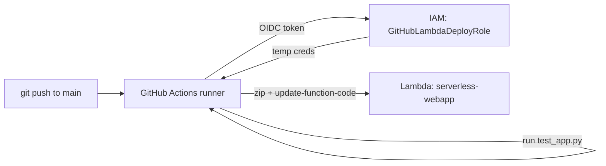

# Step 7 — Deploy with GitHub Actions (OIDC + update-function-code)

The serverless deploy is the simplest in this repo: zip the code, call
`aws lambda update-function-code`. No S3, no SSM, no instances to restart. As with the EC2
project, the workflow authenticates with **GitHub OIDC** — no stored AWS keys.

The sample workflow is `.github/workflows/deploy.yml`. This step creates the AWS side.

> **New to OIDC?** OIDC (**OpenID Connect**) lets GitHub and AWS trust each other *without
> a shared password*. On every workflow run, GitHub mints a short-lived signed token — a
> "passport" that proves *which repo and branch* is calling — and AWS trades it for
> temporary credentials after checking it. So no permanent AWS key is stored in GitHub to
> leak. Full conceptual walkthrough: the EC2 project's
> [Step 3 — OIDC trust relationship](../../../../advanced/aws/aws-ec2-vpc-monitored-webapp/steps/03-iam-roles.md#35-anatomy-of-the-oidc-trust-relationship)
> and the foundational
> [iam-roles-and-policies → Step 7](../../aws-iam-roles-and-policies/steps/07-federated-oidc-github-actions.md).

---

## 7.1 The Pipeline at a Glance



Compared to the EC2 pipeline, the rollout step collapses from "sync to S3 → SSM restart on
every instance" to a single API call — there's only one function, and Lambda swaps the code
atomically.

---

## 7.2 Create the GitHub OIDC Provider (once per account)

If you already added it in the EC2 project, **skip this** — it's account-wide.

1. **IAM → Identity providers → Add provider → OpenID Connect**.
   - Provider URL: `https://token.actions.githubusercontent.com`
   - Audience: `sts.amazonaws.com`
2. **Add provider.**

---

## 7.3 Create the Deploy Role

`GitHubLambdaDeployRole` — trust scoped to your repo, permission scoped to this one function:

**Trust policy** (replace `ORG/REPO`):

```json
{
  "Version": "2012-10-17",
  "Statement": [{
    "Effect": "Allow",
    "Principal": {"Federated": "arn:aws:iam::<ACCOUNT_ID>:oidc-provider/token.actions.githubusercontent.com"},
    "Action": "sts:AssumeRoleWithWebIdentity",
    "Condition": {
      "StringEquals": {"token.actions.githubusercontent.com:aud": "sts.amazonaws.com"},
      "StringLike": {"token.actions.githubusercontent.com:sub": "repo:ORG/REPO:ref:refs/heads/main"}
    }
  }]
}
```

**Permission policy** — least privilege, just the deploy actions on this function:

```json
{
  "Version": "2012-10-17",
  "Statement": [{
    "Effect": "Allow",
    "Action": ["lambda:UpdateFunctionCode", "lambda:GetFunction"],
    "Resource": "arn:aws:lambda:us-east-1:<ACCOUNT_ID>:function:serverless-webapp"
  }]
}
```

```bash
aws iam create-role --role-name GitHubLambdaDeployRole \
  --assume-role-policy-document file://github-trust.json
aws iam put-role-policy --role-name GitHubLambdaDeployRole \
  --policy-name lambda-deploy --policy-document file://lambda-deploy.json
```

---

## 7.4 Wire Up the Workflow

1. Copy `.github/workflows/deploy.yml` into the `.github/workflows/` folder of **your own
   app repo** (not cloud-projects — GitHub only runs a repo's own workflows).
2. Replace `<ACCOUNT_ID>` in the `role-to-assume` ARN.
3. Commit and push to `main`. The **Actions** run validates the handler with `test_app.py`,
   zips `app.py`, and calls `update-function-code`.

---

## 7.5 Verify the Deploy

1. Bump `APP_VERSION` in `src/app.py` (e.g. to `1.1.0`), commit, push.
2. Watch the Actions run go green.
3. `curl https://<api-id>.execute-api.us-east-1.amazonaws.com/` — `version` now shows `1.1.0`.
4. Confirm in **CloudTrail Event history**: the `UpdateFunctionCode` event shows the
   assumed GitHub OIDC role session — fully auditable.

---

## Checkpoint

- [ ] GitHub OIDC provider exists (new or reused from the EC2 project)
- [ ] `GitHubLambdaDeployRole` trusts only `repo:ORG/REPO` on `main`
- [ ] Permission policy is scoped to the single function ARN
- [ ] A push to `main` deploys; `version` updates behind the API
- [ ] The deploy appears in CloudTrail as an assumed-role session

---

**Next:** [Step 8 — Cleanup](./08-cleanup.md)
