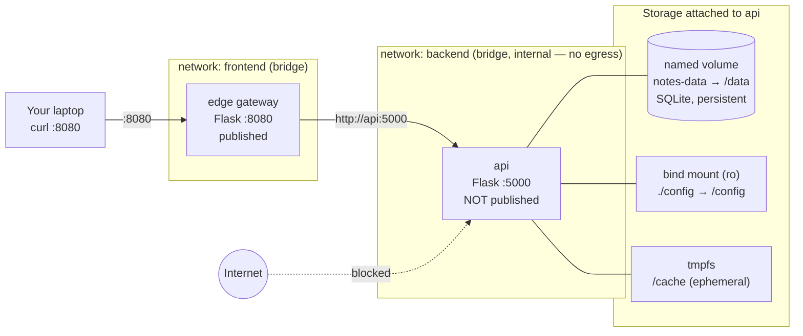

# Docker Networks & Storage — A Persistent, Segmented Notes App

```yaml
level: intermediate
cloud: docker
domain: networking-storage
technology:
  - docker
  - docker-compose
  - flask
  - volumes
  - bridge-networks
estimated_time: 75-90 minutes
estimated_cost: free-tier
deployment_type: cli
cleanup_required: true
status: ready
```

> **One-line pitch:** Build a three-tier notes app where a public **edge** gateway fronts a private
> **api** that persists data to a **named volume** — practising network **segmentation** (a public
> tier and an isolated internal tier) and all three Docker **storage** types (named volume, bind
> mount, tmpfs), plus a real backup-and-restore.

This is the **intermediate** Docker project. It assumes you've done (or understand) the
[beginner networking lab](../../../beginner/docker/docker-network-flask-basics/README.md): one
user-defined network and container-name DNS. Here we go further — **multiple** networks with
isolation, and **stateful** containers with persistent storage. Different app, deliberately.

## Learning objectives

By the end you will be able to:

- Segment an app across **two networks** — a host-facing `frontend` and an **`internal` `backend`** — and explain what each boundary buys you
- Prove **network isolation**: the api is unreachable from the host and has **no internet egress**, while the edge reaches it fine
- Use the three Docker storage types deliberately: **named volume** (persistent DB), **read-only bind mount** (host-managed config), **tmpfs** (ephemeral scratch)
- Demonstrate **persistence**: remove and recreate a container and watch its data survive on the volume
- **Back up and restore** a named volume with a throwaway helper container — and simulate data loss
- Reproduce the whole topology with Compose, and understand why `down` keeps your data but `down -v` destroys it

## Real-world use case

This is the shape of nearly every production web service: a public entry point (an ingress / API
gateway / reverse proxy) that is the *only* thing exposed, sitting in front of application containers
that hold state and must **not** be reachable from the internet. The database lives on persistent
storage so a container restart or redeploy never loses data, and operators take volume backups. This
lab is that pattern, shrunk to two Flask containers you can reason about completely.

## What you'll build

- Two images: `notes-edge` (public gateway) and `notes-api` (private, stateful)
- Two user-defined networks: **`frontend`** (host-facing) and **`backend`** (`internal`, no egress)
- A **named volume** `notes-data` holding a SQLite database that survives container removal
- A **read-only bind mount** for `config/app.json` and a **tmpfs** for a throwaway cache
- A backup tarball of the volume, and a restore into a fresh volume after simulated data loss

## Architecture



<!-- Deeper network + storage + backup diagrams live in architecture.md. -->

See **[architecture.md](architecture.md)** for the request-flow, isolation, and backup/restore diagrams.

## Prerequisites

Summarized here; see [prerequisites.md](prerequisites.md) for the full list.

- **Docker Engine 20.10+** with the **Compose v2 plugin** (`docker compose`)
- The [beginner Docker networking lab](../../../beginner/docker/docker-network-flask-basics/README.md) done or understood (single network + DNS)
- Comfort with a terminal and reading JSON

## Project structure

```
docker-networks-storage-notes/
├── README.md                       ← You are here
├── architecture.md                 ← Network, storage, and backup diagrams
├── prerequisites.md
├── docker-compose.yml              ← Compose version of Steps 3–5
├── config/
│   └── app.json                    ← Read-only bind-mount source (title/banner)
├── src/
│   ├── edge/                       ← Public gateway (holds no data)
│   │   ├── app.py
│   │   ├── requirements.txt
│   │   └── Dockerfile
│   └── api/                        ← Private, stateful service (SQLite on a volume)
│       ├── app.py
│       ├── requirements.txt
│       └── Dockerfile
├── steps/
│   ├── 01-introduction.md          ← Networks, isolation & storage concepts + the plan
│   ├── 02-build-images.md          ← Build edge + api; tour the storage-aware code
│   ├── 03-networks-and-isolation.md← Two networks (one internal), run both, prove isolation
│   ├── 04-storage-persistence.md   ← Volume vs bind mount vs tmpfs; data survives recreation
│   ├── 05-backup-restore.md        ← Back up the volume, simulate loss, restore
│   ├── 06-docker-compose.md        ← The whole topology in one file
│   └── 07-cleanup.md               ← Remove containers, networks, volume, images
├── troubleshooting.md
├── challenges.md
└── references.md
```

## Steps

| # | Step | What you do |
|---|------|-------------|
| 1 | [Introduction](steps/01-introduction.md) | Multi-network segmentation, `internal` networks, and the 3 storage types |
| 2 | [Build images](steps/02-build-images.md) | Build `notes-edge` and `notes-api`; read the storage-aware api |
| 3 | [Networks & isolation](steps/03-networks-and-isolation.md) | Create two networks (one `--internal`), run both, **prove** the api is isolated |
| 4 | [Storage & persistence](steps/04-storage-persistence.md) | Named volume vs bind mount vs tmpfs; recreate the api, data survives |
| 5 | [Backup & restore](steps/05-backup-restore.md) | Tar the volume out, `docker volume rm`, restore into a fresh volume |
| 6 | [Docker Compose](steps/06-docker-compose.md) | Declare networks, volume, bind mount, tmpfs in one file |
| 7 | [Cleanup](steps/07-cleanup.md) | Tear down — and the crucial `down` vs `down -v` difference |

Start with **Step 1 →** [`steps/01-introduction.md`](steps/01-introduction.md)

## Validation checklist

- [ ] `curl localhost:8080/` renders the notes page via the edge
- [ ] The api is **not** reachable from the host (no published port), but `docker exec edge` can reach it by name
- [ ] The api has **no internet egress** (an outbound call from inside it fails — it's on the `internal` network)
- [ ] Adding a note, then removing and recreating the api container, keeps the note (named volume)
- [ ] Editing `config/app.json` on the host changes the page title after an api restart (bind mount)
- [ ] The `/cache` marker disappears after an api restart (tmpfs is ephemeral)
- [ ] A volume backup restores your notes after `docker volume rm`
- [ ] `docker compose down` keeps the volume; `docker compose down -v` removes it

## 💰 Cost

| Resource | Cost | Free tier? |
|----------|------|-----------|
| Docker Engine (local) | **$0** | N/A — runs on your machine |
| Images / containers / networks / volumes | **$0** | N/A — no cloud resources created |

**Estimated total for this lab:** **$0.00** — nothing here touches a cloud provider.
**⚠️ Left running:** only local CPU/RAM and a little disk for images + the volume; do the cleanup step to reclaim it.

## 🧹 Cleanup

> **⚠️ Do the cleanup step.** No money at risk, but the named volume persists on purpose — it will
> outlive `docker compose down`. Step 7 shows exactly how to remove it and everything else.

Cleanup is [Step 7](steps/07-cleanup.md).

## Troubleshooting

See [troubleshooting.md](troubleshooting.md) — `Error → Cause → Fix`.

## Challenges

See [challenges.md](challenges.md) — add a real database container, a second isolated tier, volume
drivers, healthchecks, and a hot-backup sidecar.

## What to try next

- Previous: [Docker Networking Basics](../../../beginner/docker/docker-network-flask-basics/README.md) — one network, stateless
- Cloud version: [ECS on Fargate (Advanced)](../../../advanced/aws/aws-ecs-fargate-advanced/README.md) — networks, load balancing, and persistence in AWS
- Kubernetes version: [k8s Optimization & Recovery](../../kubernetes/k8s-optimization-and-recovery/README.md) — persistent volumes and backup/restore with Velero

## References

See [references.md](references.md) for official Docker networking and storage docs.
