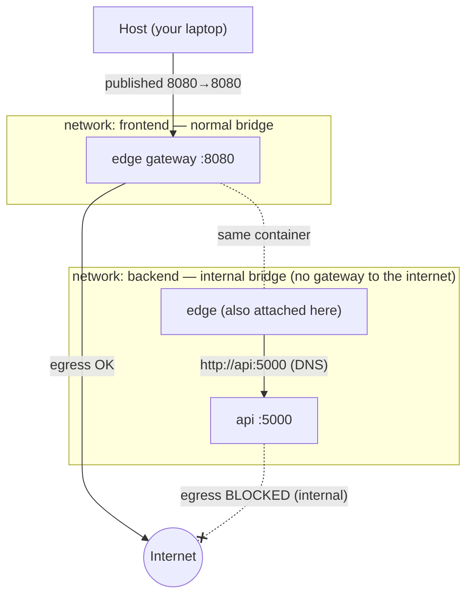
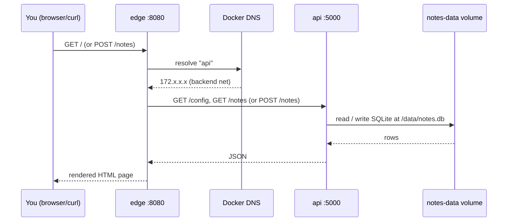
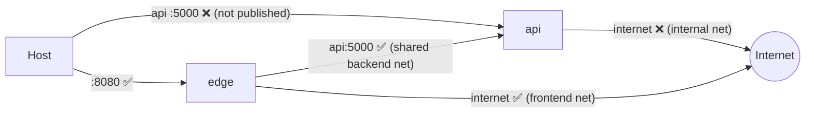
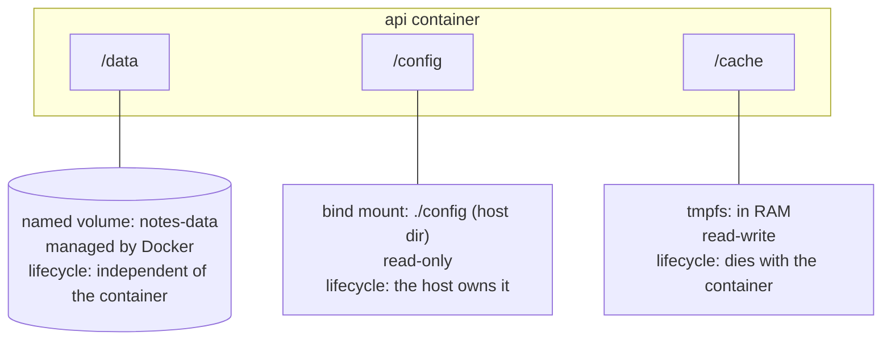
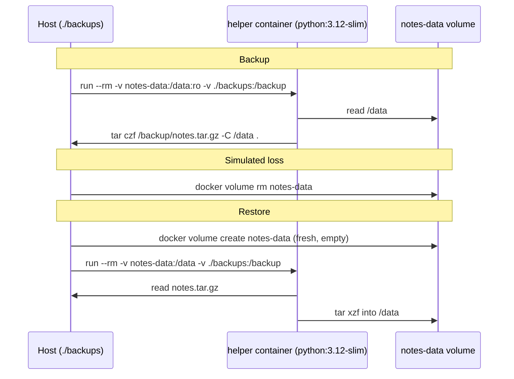

# Architecture

Deeper diagrams for the notes app — the network topology, the request flow, the isolation boundaries,
and the storage / backup lifecycle. The README has the one-glance overview; this file is the detail.

---

## Network topology

Two user-defined bridge networks. The **edge** container straddles both; the **api** sits only on the
internal one. That single fact is the whole security story: the api is never on a host-facing network.

- **frontend** is a normal bridge: it has a gateway, so the edge can reach the internet and the host
  can reach the edge through the published port.
- **backend** is created with `--internal` (CLI) / `internal: true` (Compose): **no gateway**, so
  nothing on it can route to the internet. The api can still talk to the edge and vice-versa, because
  intra-network traffic doesn't need a gateway.

---

## Request flow

The api reads its display config from the **bind mount** (`/config/app.json`) and writes a marker to
the **tmpfs** (`/cache`) on each note — two side-channels that make the storage differences visible.

---

## Isolation boundaries (what can reach what)

| From → To | Reachable? | Why |
|-----------|-----------|-----|
| Host → edge :8080 | ✅ | Port published with `-p 8080:8080` |
| Host → api :5000 | ❌ | Api has no published port and is on an internal network |
| edge → api | ✅ | Both share the `backend` network; DNS resolves `api` |
| api → internet | ❌ | `backend` is `internal` — no gateway, no egress |
| edge → internet | ✅ | `edge` is also on `frontend`, a normal bridge |

---

## Storage model

Three mounts on the **api**, each a different Docker storage type with a different lifecycle:

| Mount | Type | Path | Survives container `rm`? | Survives host reboot? | Editable from host? |
|-------|------|------|--------------------------|-----------------------|---------------------|
| `notes-data` | **named volume** | `/data` | ✅ yes | ✅ yes | via a helper container |
| `./config` | **bind mount (ro)** | `/config` | ✅ (it's a host dir) | ✅ | ✅ directly — it *is* a host file |
| `/cache` | **tmpfs** | `/cache` | ❌ no | ❌ no (RAM only) | ❌ not on disk at all |

> **Rule of thumb:** named volumes for data Docker should own and persist (databases); bind mounts
> for host-authored files you want to edit in place (config, source in dev); tmpfs for secrets or
> scratch that must never hit disk.

---

## Backup & restore lifecycle

A named volume is just a directory Docker manages; you back it up by mounting it into a throwaway
container alongside a host directory and copying between them.

The helper container pattern works because **any** container can mount the volume — the volume's life
is independent of the api that normally uses it. That independence is exactly why named volumes are
the right home for data.
