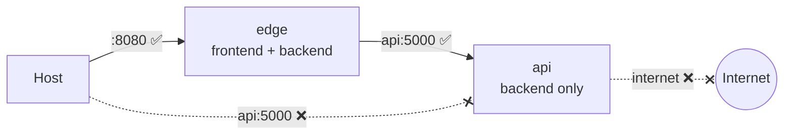
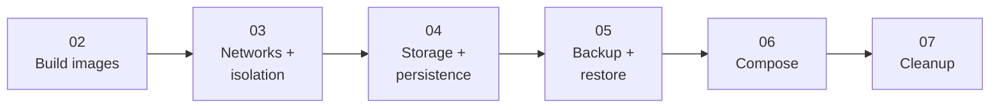

# Step 1 — Introduction: Segmentation and State

The [beginner lab](../../../../beginner/docker/docker-network-flask-basics/README.md) taught one thing:
containers on a **user-defined network** find each other by name. This project assumes you have that,
and adds the two things real apps need: **network segmentation** (not everything on one flat network)
and **persistent storage** (containers that don't lose data when they restart).

We build a small **notes app**: type a note, it's saved, it's still there tomorrow.

---

## 1.1 Why more than one network?

In the beginner lab, `frontend` and `backend` shared a single network. Fine for two friendly
containers — but in production you don't want *everything* mutually reachable. You want tiers:

- A **public tier** the outside world can reach (a gateway / reverse proxy / ingress).
- A **private tier** holding your app logic and data, reachable **only** from the public tier — never
  directly from the host or the internet.

We model that with two networks:

| Network | Kind | Who's on it | Reachable from host? | Internet egress? |
|---------|------|-------------|----------------------|------------------|
| `frontend` | normal bridge | `edge` | yes (via published port) | yes |
| `backend` | **internal** bridge | `edge`, `api` | **no** | **no** |

The `edge` container is on **both** — it's the bridge between the public and private tiers, and the
single, deliberate front door. The `api` is on `backend` **only**.

---

## 1.2 What `internal` buys you

A normal bridge network has a **gateway** that gives its containers a route out to the internet (and
lets published ports come in). Create a network with `--internal` (or `internal: true` in Compose)
and Docker gives it **no gateway**:

- Containers on it **cannot reach the internet** (no egress).
- They **can** still talk to each other (intra-network traffic needs no gateway).
- Nothing on the host can route to them.

So the `api` can serve the `edge`, persist to disk, and do its job — but it can't be reached from
outside and can't phone home. We'll *prove* all three in Step 3.

---

## 1.3 The three kinds of Docker storage

A container's own filesystem is **ephemeral**: remove the container and anything written inside it is
gone. To keep data, you mount storage from outside. Docker has three kinds, and this app uses **all
three** on the `api`, on purpose:

| Type | We mount it at | Purpose here | Lifecycle |
|------|----------------|--------------|-----------|
| **Named volume** | `/data` | The SQLite database | Docker-managed; **survives** container removal and reboot |
| **Bind mount (ro)** | `/config` | Host-authored config (`config/app.json`) | The **host** owns the file; edit it in place |
| **tmpfs** | `/cache` | A throwaway write marker | In RAM; **dies** with the container |

> **The mental model:** *named volumes* for data Docker should own and keep (databases); *bind mounts*
> for files you author on the host and want reflected live (config, dev source); *tmpfs* for scratch
> or secrets that must never touch disk.

The point of putting all three on one container is that you'll **see the difference**: after a
restart, the volume's data is still there, the bind-mounted config still reflects the host, and the
tmpfs marker is gone.

---

## 1.4 The app

Two Flask services (full code in [`src/`](../src)):

- **edge** ([`src/edge/app.py`](../src/edge/app.py)) — the gateway. Renders a tiny HTML notes page and
  proxies everything to the api at `http://api:5000`. Published on `:8080`. Holds no data.
- **api** ([`src/api/app.py`](../src/api/app.py)) — owns the notes. Persists them to SQLite at
  `/data/notes.db` (named volume), reads its title/banner from `/config/app.json` (bind mount), and
  writes a marker to `/cache` (tmpfs) on each note. On the `backend` network only.

---

## 1.5 The plan

Steps 3–5 do it the hard way with raw `docker` commands so the mechanics are explicit; Step 6 shows
how Compose declares the entire topology — two networks, a volume, a bind mount, and a tmpfs — in one
file.

---

## Checkpoint

- [ ] You can explain why the api is on an **internal** network and the edge on both
- [ ] You can state what `--internal` blocks (egress + host reach) and what it still allows (container-to-container)
- [ ] You can name the three storage types and which survives a container being removed
- [ ] Docker is running (`docker run --rm hello-world` works)

---

**Next:** [Step 2 — Build the Images](02-build-images.md)
