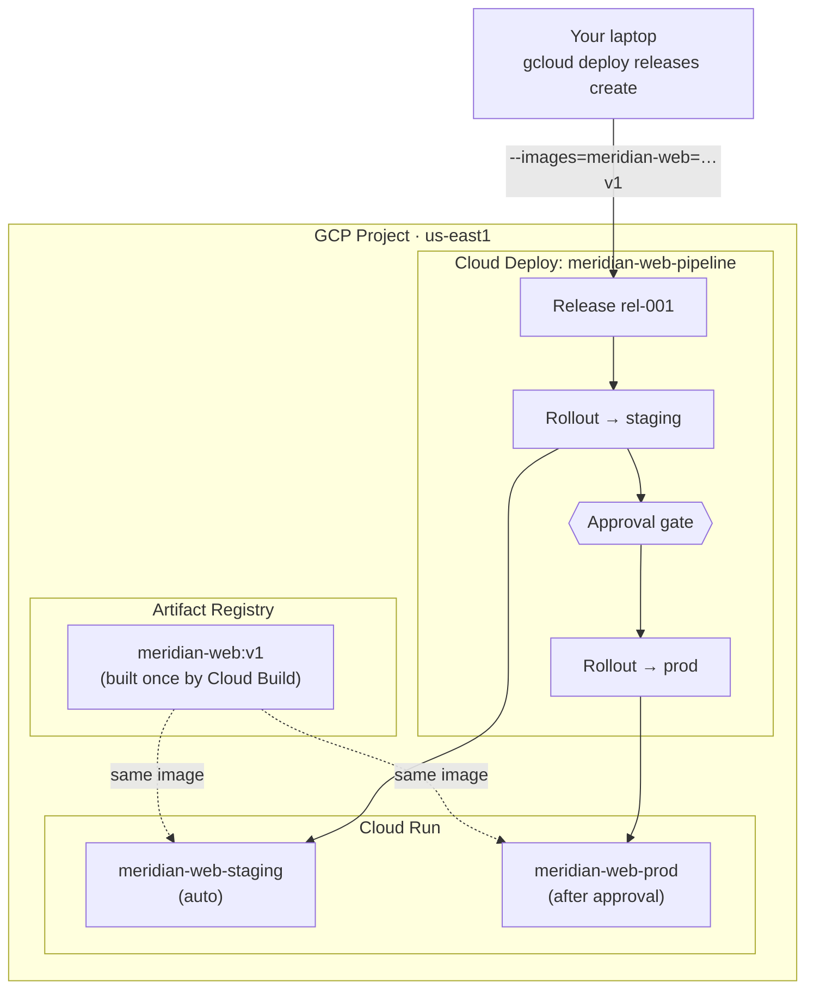

# GCP Cloud Deploy — A Staging → Prod Delivery Pipeline for Cloud Run

```yaml
level: intermediate
cloud: gcp
domain: ci-cd
technology:
  - cloud-deploy
  - cloud-run
  - cloud-build
  - artifact-registry
  - skaffold
estimated_time: 90 min
estimated_cost: low
deployment_type: console + gcloud
cleanup_required: true
status: ready
```

## What You'll Build

You'll take a container image and drive it through a **managed continuous-delivery pipeline** with
**Cloud Deploy**: build once with Cloud Build, then **promote the exact same image** from a
**staging** Cloud Run service to a **prod** Cloud Run service — with a **manual approval gate**
before prod and a **one-command rollback**. By the end you'll understand:

- What a **delivery pipeline**, **target**, **release**, and **rollout** are in Cloud Deploy
- Why CD tools **promote one immutable artifact** across environments (build once, deploy many)
- How **Skaffold** renders a per-target Cloud Run manifest, and how images get substituted at release
- How an **approval gate** stops a rollout until a human says go
- How **rollback** re-promotes a previous release in seconds
- The **service accounts and IAM** a pipeline needs to act on your behalf

This is the **intermediate** project in the GCP **App Delivery** track. Do the
[beginner Cloud Run & Artifact Registry project](../../../beginner/gcp/gcp-cloud-run-artifact-registry/README.md)
first — this one assumes you can already build an image with Cloud Build and deploy it to Cloud Run.

---

## Architecture



---

## Services Used

| Service | Role in this Project |
|---------|---------------------|
| **Cloud Deploy** | The delivery pipeline: releases, rollouts, promotion, approval, rollback |
| **Cloud Run** | The two deploy **targets** — `staging` and `prod` services |
| **Cloud Build** | Builds the image once (Cloud Deploy also uses it to run render/deploy jobs) |
| **Artifact Registry** | Stores the single image that gets promoted through both stages |
| **Skaffold** | Declares how each target renders its Cloud Run manifest |
| **Cloud IAM** | The execution service account + roles that let the pipeline act |

---

## Key Concepts

| Concept | What it means |
|---------|---------------|
| **Delivery pipeline** | An ordered promotion path (`staging → prod`) defined in `clouddeploy.yaml` |
| **Target** | A place a release can be deployed — here, each is a Cloud Run location |
| **Release** | An immutable bundle: the rendered manifests + the pinned image(s) |
| **Rollout** | One deployment of a release to one target (staging rollout, prod rollout) |
| **Promotion** | Moving a release to the next stage — the same artifact, not a rebuild |
| **Approval gate** | `requireApproval: true` pauses a rollout until a human approves |
| **Rollback** | Re-promote the previously successful release to a target, fast |
| **Skaffold profile** | Per-target rendering config; selects that stage's service manifest |

---

## Project Structure

```
gcp-cloud-deploy-pipeline/
├── README.md                         ← You are here
├── src/
│   ├── app.py                        ← Flask app: / reports target/version, /healthz
│   ├── requirements.txt              ← flask==3.1.0 + gunicorn
│   └── Dockerfile                    ← python:3.12-slim + gunicorn on $PORT
├── deploy/
│   ├── clouddeploy.yaml              ← Pipeline + staging/prod targets (prod needs approval)
│   ├── skaffold.yaml                 ← Per-target render config (staging/prod profiles)
│   ├── service-staging.yaml          ← Cloud Run manifest for staging (TARGET=staging)
│   └── service-prod.yaml             ← Cloud Run manifest for prod (TARGET=prod)
├── steps/
│   ├── 01-setup-and-iam.md           ← Enable APIs, grant the execution SA its roles
│   ├── 02-build-image.md             ← Build the image once with Cloud Build
│   ├── 03-define-pipeline.md         ← Apply the pipeline + targets, understand the YAML
│   ├── 04-create-release.md          ← Cut a release → auto-deploy to staging
│   ├── 05-promote-and-rollback.md    ← Approve → prod, then roll back
│   └── 06-cleanup.md                 ← Delete pipeline, services, images
├── costs.md
├── troubleshooting.md
└── challenges.md
```

---

## Prerequisites

| Requirement | Details |
|-------------|---------|
| gcloud CLI | Installed & authenticated — see the [networking project's Step 1](../../../beginner/gcp/gcp-vpc-firewall-basics/steps/01-install-gcloud.md) |
| Beginner project | Do [Cloud Run & Artifact Registry](../../../beginner/gcp/gcp-cloud-run-artifact-registry/README.md) first — you'll reuse the same image path |
| A GCP project | With billing linked |
| Region | All steps use **`us-east1`** |

---

## What You'll Learn Step by Step

| Step | File | Goal |
|------|------|------|
| 1 | `01-setup-and-iam.md` | Enable the Cloud Deploy API and grant the execution SA its roles |
| 2 | `02-build-image.md` | Build the image once with Cloud Build (reuse `meridian-apps` repo) |
| 3 | `03-define-pipeline.md` | Apply the delivery pipeline + staging/prod targets |
| 4 | `04-create-release.md` | Create a release; watch it auto-deploy to staging |
| 5 | `05-promote-and-rollback.md` | Approve promotion to prod, then roll back |
| 6 | `06-cleanup.md` | Delete the pipeline, both services, and images |

Start with **Step 1 →** [`steps/01-setup-and-iam.md`](steps/01-setup-and-iam.md)

---

## Estimated Time

75 – 120 minutes (some waiting on rollouts).

## Estimated Cost

| Resource | Configuration | Cost | Notes |
|----------|--------------|------|-------|
| **Cloud Deploy** | 1 delivery pipeline, a few hours | **~$0.02–0.05** | Small per-pipeline daily charge; a fraction of a day is pennies |
| **Cloud Run** | 2 services, scale-to-zero | **~$0** | Idle = $0; stays in the free request/compute tier |
| **Cloud Build** | 1 image build + render/deploy jobs | **~$0** | First 120 build-minutes/day free |
| **Artifact Registry** | 1 small image | **~$0** | First 0.5 GB free |

**Typical session cost: under $0.10** if you clean up the same day.

> ⚠️ Unlike the beginner project, **Cloud Deploy is not free** — a delivery pipeline carries a small
> per-day charge whether or not you run releases. It's pennies for a session, but **[Step 6 —
> Cleanup](steps/06-cleanup.md) deletes the pipeline** so it doesn't accrue day after day.

For the full breakdown → see **[costs.md](costs.md)**.

---

## How This Compares to the Rest of the Repo

| Approach | Where | Cutover style |
|----------|-------|---------------|
| **Cloud Deploy pipeline** (this project) | GCP | Managed promotion staging→prod + approval + rollback |
| Cloud Run **traffic split / revisions** | [beginner GCP](../../../beginner/gcp/gcp-cloud-run-artifact-registry/README.md) | Manual canary/rollback within one service |
| Lambda alias + API Gateway | [aws-api-gateway-rest-lambda](../../../intermediate/aws/aws-api-gateway-rest-lambda/README.md) | Native rolling/canary/blue-green, no managed CD tool |

---

## What's Next

- Try the **[challenges](challenges.md)** — a canary rollout strategy, a verify/test job before
  promotion, a real GitHub Actions trigger, and a second region as a third target.
- Compare with the AWS deployment-strategy projects:
  [API Gateway Series](../../../intermediate/aws/aws-api-gateway-rest-lambda/README.md).
