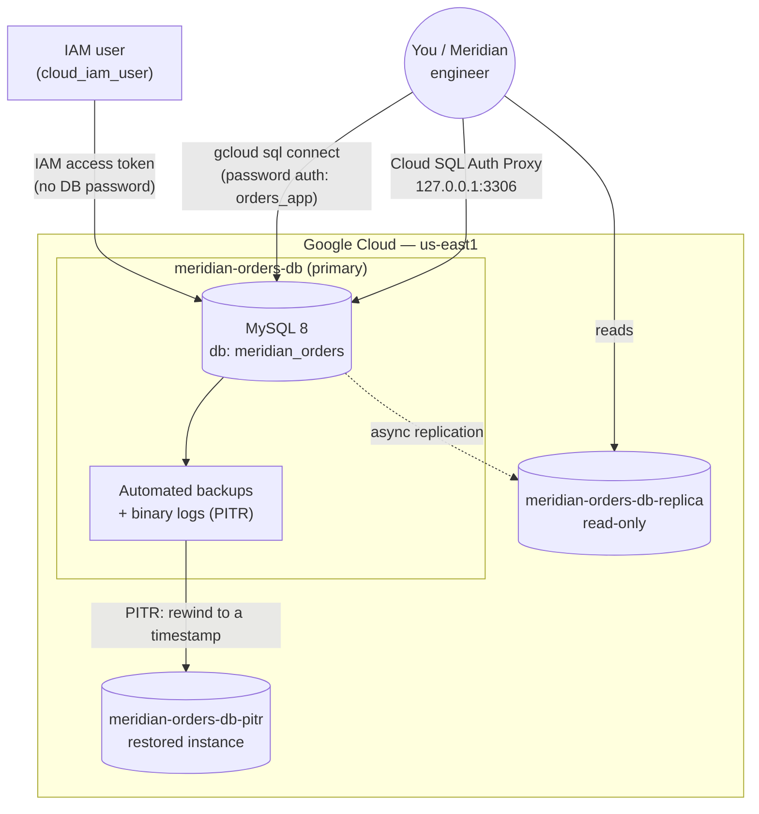

# Cloud SQL Managed Database — Retiring the On-Prem MySQL Box

```yaml
level: intermediate
cloud: gcp
domain: databases
technology:
  - cloud-sql
  - mysql
  - iam
estimated_time: 90-120 min
estimated_cost: hourly
deployment_type: console + gcloud
cleanup_required: true
status: ready
```

## What You'll Build

Meridian Retail runs orders and inventory off a single self-managed MySQL box under someone's
desk — no automated backups, no replica, one password everyone shares. You'll retire it onto
**Cloud SQL for MySQL**: a managed instance with automated backups, point-in-time recovery, a
read replica, and connections authenticated with **IAM identities instead of shared passwords**.
You'll seed real rows, break things on purpose, and prove you can get the data back — the same
disaster-recovery muscle memory the AWS RDS project builds, but with Google's managed primitives.

By the end you'll understand:

- How to size and provision a **Cloud SQL for MySQL** instance, and the public-IP-plus-authorized-networks
  vs. private-IP-plus-VPC-peering tradeoff
- **Database users** and least-privilege application accounts vs. the root user
- **IAM database authentication** — connecting with a short-lived access token instead of a
  long-lived database password
- **Automated backups** and **point-in-time recovery (PITR)** — and why a restore always produces
  a **new instance**
- **Read replicas** — async replication, replica lag, and read-scaling
- Where to look first when something's slow: **Cloud SQL Insights** and Cloud Monitoring

This is **Project 3 of 4** in the Meridian Retail GCP series. Builds on:
[Storage Security & Lifecycle](../../../intermediate/gcp/gcp-storage-security-lifecycle/README.md)
(Project 2 — bucket hardening for the `doc-portal-sa` service account). **Next in this series →**
[Databases & Workload Identity](../../../advanced/gcp/gcp-databases-workload-identity/README.md)
(Project 4 — consumes the `orders_app` password this project stores and moves it into Workload
Identity / Secret Manager).

---

## Architecture



---

## Services Used

| Service | Role in this Project |
|---------|---------------------|
| **Cloud SQL for MySQL** | Managed relational database — primary, replica, and PITR-restored instance |
| **Cloud SQL Auth Proxy** | Encrypted local tunnel to the instance without managing SSL certs yourself |
| **IAM** | Grants `cloudsql.admin` for admin work, and IAM database authentication for passwordless connections |
| **Cloud Monitoring** | Instance metrics (CPU, connections, replica lag) and dashboards |
| **Cloud SQL Insights** | Query-level performance visibility (slow queries, lock waits) |

---

## Key Concepts

| Concept | What it means |
|---------|---------------|
| **Shared-core tier** | Smallest/cheapest Cloud SQL machine tier — fine for a lab, not for production load |
| **Public IP + authorized networks** | Lab-simple connectivity: instance has a public IP, but only your IP can reach it |
| **Private IP + VPC peering** | Production-grade: instance has no public IP at all, reachable only from inside your VPC |
| **Database user vs. root** | `orders_app` gets only the grants it needs; `root` is for admin work, not app traffic |
| **IAM database authentication** | Connect with a Google-issued OAuth token instead of a stored DB password |
| **Automated backups** | Daily backup + binary logs; the foundation for PITR |
| **PITR** | Restore to any second within the retention window — always creates a **new instance** |
| **Read replica** | Async, read-only copy; scales read traffic and is a failover candidate, not free HA |
| **Replica lag** | How far behind the replica is — your effective RPO if you promote it during an incident |

---

## Project Structure

```
gcp-cloud-sql-managed-database/
├── README.md                                   ← You are here
├── src/
│   ├── db_seed.py                              ← Create orders table, insert rows + RPO marker
│   ├── db_verify.py                            ← Count rows / check RPO marker against any host
│   └── requirements.txt                        ← pymysql==1.1.1
├── steps/
│   ├── 01-create-cloud-sql-instance.md         ← Provision meridian-orders-db (public IP, authorized networks)
│   ├── 02-database-users-and-connectivity.md   ← DB + app user + Auth Proxy / gcloud sql connect
│   ├── 03-iam-database-authentication.md       ← IAM DB auth: connect with a token, not a password
│   ├── 04-backups-and-point-in-time-recovery.md ← Manual backup + PITR restore drill
│   ├── 05-read-replica-and-monitoring.md       ← Read replica, replication lag, Insights/Monitoring
│   └── 06-cleanup.md                           ← Delete replica → restored instance → primary
├── costs.md
├── troubleshooting.md
└── challenges.md
```

---

## Prerequisites

| Requirement | Details |
|-------------|---------|
| gcloud CLI | Installed & authenticated — see [SETUP.md](../../../../SETUP.md) |
| IAM permission | `roles/cloudsql.admin` on the project (or broader) |
| Cloud SQL Admin API | Enabled — `gcloud services enable sqladmin.googleapis.com` |
| Python | 3.12+ locally, with `pymysql` installed (`pip install -r src/requirements.txt`) — for the seed/verify scripts |
| Region | All steps use **`us-east1`** |

---

## What You'll Learn Step by Step

| Step | File | Goal |
|------|------|------|
| 1 | `01-create-cloud-sql-instance.md` | Provision `meridian-orders-db` with public IP + authorized networks |
| 2 | `02-database-users-and-connectivity.md` | Create the DB, an app user, and connect via Auth Proxy |
| 3 | `03-iam-database-authentication.md` | Enable IAM DB auth and connect with a token, not a password |
| 4 | `04-backups-and-point-in-time-recovery.md` | Seed data, break it, PITR-restore to a new instance |
| 5 | `05-read-replica-and-monitoring.md` | Build a read replica; check lag; peek at Insights/Monitoring |
| 6 | `06-cleanup.md` | Delete replica → restored instance → primary, in that order |

Start with **Step 1 →** [`steps/01-create-cloud-sql-instance.md`](steps/01-create-cloud-sql-instance.md)

---

## Estimated Time

90 – 120 minutes (Cloud SQL create/restore/replica operations each take 5–15 minutes of waiting).

## Estimated Cost

| Resource | Configuration | Cost | Notes |
|----------|--------------|------|-------|
| **Cloud SQL — primary** | shared-core tier (e.g. `db-f1-micro`), 10 GB SSD | **~$0.015–0.03/hr** | Bills hourly, idle or not |
| **Cloud SQL — read replica** | same tier | **~$0.015–0.03/hr** | A second concurrent instance while it exists |
| **Cloud SQL — PITR-restored instance** | same tier | **~$0.015–0.03/hr** | A third concurrent instance during the drill |
| **Backup storage** | a few GB | **~$0.01–0.05/session** | Small, but persists until you delete the instance |
| **Network egress** | minimal (lab traffic) | **~$0** | Negligible at this scale |

> ⚠️ **Cloud SQL has no permanent free tier.** Unlike a free-tier `e2-micro` VM, every Cloud SQL
> instance — primary, replica, and the PITR restore — bills **per hour from the moment it's
> created until the moment it's deleted**, whether or not you're connected to it. This project
> briefly runs **three instances at once**. **[Step 6 — Cleanup](steps/06-cleanup.md) is
> mandatory the same day.**

For the full breakdown → see **[costs.md](costs.md)**.

---

## What's Next

- Try the **[challenges](challenges.md)** — PostgreSQL flavor comparison, Private Service Connect,
  Cloud SQL Insights on a slow query, and exporting a backup to GCS.
- Continue to **Project 4** — [Databases & Workload Identity](../../../advanced/gcp/gcp-databases-workload-identity/README.md),
  which takes the `orders_app` password you handled manually here and moves it into Secret Manager
  behind Workload Identity.

This project maps directly onto the **Cloud SQL, backup/DR, and IAM database authentication**
domains covered in Google's Associate Cloud Engineer and Professional Cloud Architect exams —
provisioning, connectivity models, and recovery drills are exactly the scenarios those exams test.
