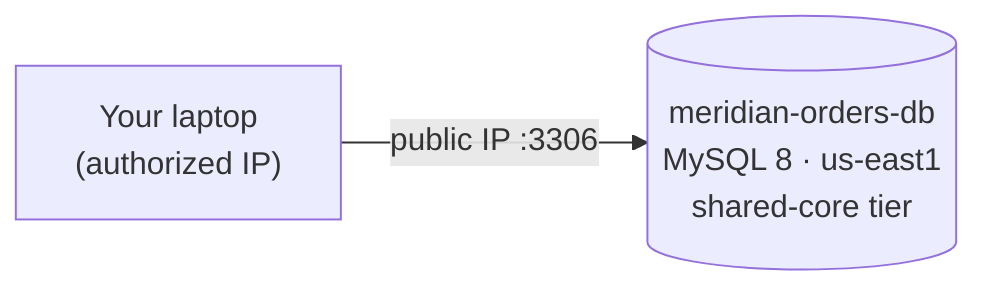

# Step 1 — Create the Cloud SQL Instance

Meridian Retail's orders/inventory database has lived on a single self-managed MySQL box for
years — no automated backups, no monitoring, one shared root password. You're replacing it with
**Cloud SQL for MySQL**: Google manages patching, storage, and backups; you focus on the schema
and the app. This step provisions the instance itself, `meridian-orders-db`.

---

## 1.1 Sizing and Connectivity — the Two Decisions That Matter

| Decision | Choice for this lab | Production alternative |
|----------|---------------------|-------------------------|
| **Machine tier** | Smallest shared-core tier (e.g. `db-f1-micro` / current shared-core equivalent) | A dedicated-core tier sized to real CPU/memory load |
| **Connectivity** | **Public IP + authorized networks** (scoped to your IP) | **Private IP + VPC peering** — no public IP at all |
| **High availability** | Single zone | Regional (HA) — a standby in a second zone |

Cloud SQL machine-type names change over time as Google adds tiers, so treat "smallest
shared-core tier" as the durable concept and check `gcloud sql tiers list` for what's current in
your project.

> **Why public IP for a lab?** It lets you connect straight from your laptop with no VPN or bastion
> host, which keeps this project focused on the database concepts. **Authorized networks** narrow
> that public IP down to *just your address* — the same "public but locked to one IP" pattern used
> in the AWS RDS DR project. In production you'd use **private IP + VPC peering** so the database
> never has a route from the public internet at all — Challenge 3 in [challenges.md](../challenges.md)
> covers the modern replacement, Private Service Connect.

---

## 1.2 What You'll Create



| Field | Value |
|-------|-------|
| Instance ID | `meridian-orders-db` |
| Database engine | MySQL 8.0 |
| Region | `us-east1` |
| Machine tier | Smallest shared-core tier |
| Storage | 10 GB SSD, storage auto-increase **off** (keep cost predictable) |
| Connectivity | Public IP, authorized network = your IP only |
| Backups | Automated backups **on** (configured in Step 4) |

---

## 1.3 Console — Create the Instance

1. **☰ → SQL → Create instance → Choose MySQL.**
2. Fill in:

   | Field | Value |
   |-------|-------|
   | Instance ID | `meridian-orders-db` |
   | Password | *(set a root password, save it somewhere safe)* |
   | Database version | MySQL 8.0 |
   | Region | `us-east1` |
   | Zonal availability | Single zone |

3. Expand **Customize your instance**:

   | Section | Field | Value |
   |---------|-------|-------|
   | Machine configuration | Machine type | Smallest available shared-core (e.g. Sandbox / `db-f1-micro`) |
   | Storage | Storage type | SSD |
   | Storage | Storage capacity | 10 GB |
   | Storage | Enable automatic storage increases | **Off** |
   | Connections | Public IP | **On** |
   | Connections | Authorized networks | Add network → name `my-ip`, value `<your-ip>/32` |
   | Connections | Private IP | Off (this lab uses public IP + authorized networks) |

4. **Create instance.** Provisioning takes **5–10 minutes**.

---

## 1.4 gcloud CLI (Alternative)

```bash
# Find your public IP to scope the authorized network
MY_IP=$(curl -s ifconfig.me)

gcloud sql instances create meridian-orders-db \
  --database-version=MYSQL_8_0 \
  --region=us-east1 \
  --tier=db-f1-micro \
  --storage-type=SSD \
  --storage-size=10 \
  --no-storage-auto-increase \
  --authorized-networks="${MY_IP}/32" \
  --root-password='<CHOOSE_A_ROOT_PASSWORD>'
```

- `--tier=db-f1-micro` → the smallest shared-core tier at time of writing; run
  `gcloud sql tiers list --filter="region:us-east1"` to see what's current.
- `--authorized-networks` → without this, a public-IP instance still rejects every connection —
  Cloud SQL's own firewall defaults to **deny all**, same spirit as GCP VPC firewalls.
- `--no-storage-auto-increase` → keeps a runaway query from silently growing (and billing) storage.

Verify:

```bash
gcloud sql instances describe meridian-orders-db \
  --format='value(state,ipAddresses[0].ipAddress)'
```

Expected: `RUNNABLE` and a public IPv4 address.

---

## 1.5 Why This Matters

- **Managed patching and storage** — Google handles OS/engine patches and storage expansion;
  Meridian's team stops babysitting a MySQL box.
- **Authorized networks scope the blast radius.** A public IP with no authorized-network rule
  would (like an AWS RDS instance with a `0.0.0.0/0` security group) let the entire internet
  attempt to authenticate. Scoping to `/32` mirrors the least-privilege network posture used
  throughout this repo.
- **Storage auto-increase off, on purpose.** In production you usually want it on to avoid an
  outage from full disk; here it's off so a seeding mistake can't quietly balloon your bill.
- **Single zone for now.** Regional (HA) doubles the instance cost for automatic failover — worth
  it for a real workload, overkill for a lab. Challenge 6 has you cost it out.

---

## Checkpoint

- [ ] `meridian-orders-db` shows **RUNNABLE** in `gcloud sql instances describe`
- [ ] The instance has a **public IP** and an authorized network scoped to **your IP only**
- [ ] You can explain why public IP + authorized networks is a lab shortcut, not a production pattern
- [ ] You saved the **root password** somewhere safe (you'll need it briefly in Step 2)

---

**Next:** [Step 2 — Database, Users & Connectivity](./02-database-users-and-connectivity.md)
