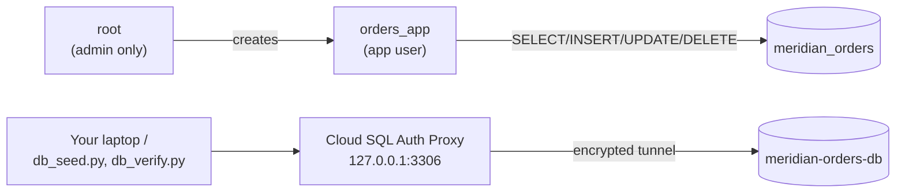

# Step 2 — Database, Users & Connectivity

An instance with only a root user is the same shared-password problem Meridian's old on-prem box
had, just moved to the cloud. This step creates the actual `meridian_orders` database, a
least-privilege application user, and gets you connected two different ways: `gcloud sql connect`
for quick admin work, and the **Cloud SQL Auth Proxy** for how your app (and the seed/verify
scripts) should really connect.

---

## 2.1 Root vs. Application User

| Account | Used for | Privileges |
|---------|----------|-----------|
| `root` | One-off admin tasks (creating the DB/user) | Full instance privileges — never used by the app |
| `orders_app` | Everything the application does | `SELECT`, `INSERT`, `UPDATE`, `DELETE` on `meridian_orders` only |

Same principle as an IAM execution role scoped to one bucket instead of an account-wide
admin key: if `orders_app`'s password leaks, the blast radius is one database, not the instance.

---

## 2.2 What You'll Create



| Object | Value |
|--------|-------|
| Database | `meridian_orders` |
| App user | `orders_app` |
| App user password | Generated, stored in an env var — **never hardcoded** |

> **Foreshadowing:** right now you'll export `DB_PASSWORD` by hand in your shell. Project 4 of
> this series replaces that with **Secret Manager** + Workload Identity so nothing sensitive ever
> touches a shell history or a config file.

---

## 2.3 Console — Create the Database and App User

1. **☰ → SQL → meridian-orders-db → Databases → Create database.**

   | Field | Value |
   |-------|-------|
   | Database name | `meridian_orders` |
   | Character set | `utf8mb4` (default) |

2. **Users → Add user account.**

   | Field | Value |
   |-------|-------|
   | User name | `orders_app` |
   | Password | *(let the console generate one, or set your own — copy it now)* |
   | Host | `%` (any host — the authorized-network rule already limits *where* connections come from) |

3. There's no per-database GRANT UI in the console for MySQL — connect as `root` (via
   `gcloud sql connect`, next section) and run the grant manually:

   ```sql
   GRANT SELECT, INSERT, UPDATE, DELETE ON meridian_orders.* TO 'orders_app'@'%';
   FLUSH PRIVILEGES;
   ```

---

## 2.4 gcloud CLI (Alternative)

```bash
# 1. Create the database
gcloud sql databases create meridian_orders --instance=meridian-orders-db

# 2. Generate a password locally instead of typing one (never hardcode it)
export DB_PASSWORD=$(python3 -c "import secrets; print(secrets.token_urlsafe(18))")
echo "Save this somewhere safe: $DB_PASSWORD"

# 3. Create the least-privilege app user
gcloud sql users create orders_app \
  --instance=meridian-orders-db \
  --password="${DB_PASSWORD}"

# 4. Scope its privileges to just this database (connect as root to grant)
gcloud sql connect meridian-orders-db --user=root <<'SQL'
GRANT SELECT, INSERT, UPDATE, DELETE ON meridian_orders.* TO 'orders_app'@'%';
FLUSH PRIVILEGES;
SQL
```

`gcloud sql connect` is convenient for one-off admin SQL: it temporarily adds your current IP to
the authorized networks, opens a `mysql` shell, then removes the rule again when you exit.

---

## 2.5 Connect via the Cloud SQL Auth Proxy (the App's Real Path)

The Auth Proxy opens an encrypted local tunnel to the instance without you managing SSL certs or
maintaining authorized-network entries — it's the GCP-idiomatic way an application connects.

```bash
# Download the proxy (Linux example; see Cloud SQL docs for macOS/Windows)
curl -o cloud-sql-proxy https://storage.googleapis.com/cloud-sql-connectors/cloud-sql-proxy/v2.14.0/cloud-sql-proxy.linux.amd64
chmod +x cloud-sql-proxy

# Get the instance connection name
INSTANCE_CONN=$(gcloud sql instances describe meridian-orders-db --format='value(connectionName)')

# Start the proxy in one terminal — leave it running
./cloud-sql-proxy "${INSTANCE_CONN}" --port 3306
```

In a second terminal, point the seed script at `127.0.0.1`:

```bash
export DB_HOST=127.0.0.1
export DB_USER=orders_app
export DB_PASSWORD='<the password from 2.4>'
export DB_NAME=meridian_orders

pip install -r ../src/requirements.txt
python ../src/db_seed.py --rows 5
```

You should see `Seeded 5 order row(s) + 1 RPO marker...` and an `RPO MARKER (UTC): ...` line —
keep that timestamp, you'll use it in Step 4.

---

## 2.6 Why This Matters

- **Least-privilege DB user.** `orders_app` can't `DROP TABLE`, alter schema, or touch other
  databases on the instance — the same reasoning behind every `*Role`/`*TaskRole` in this repo's
  IAM conventions, just applied inside MySQL's own grant system.
- **The Auth Proxy over raw public-IP + password.** It encrypts the connection automatically and
  means your authorized-networks list doesn't need to track every laptop that ever connects —
  the proxy authenticates using your `gcloud`/service-account credentials, not a firewall rule.
- **No hardcoded secrets.** `DB_PASSWORD` lives in an env var for this lab; Project 4 replaces it
  with Secret Manager so it's never even in your shell history for long.

---

## Checkpoint

- [ ] `meridian_orders` database exists on `meridian-orders-db`
- [ ] `orders_app` user exists with `SELECT/INSERT/UPDATE/DELETE` on `meridian_orders` only
- [ ] Cloud SQL Auth Proxy tunnels `127.0.0.1:3306` to the instance
- [ ] `python src/db_seed.py` succeeded through the proxy and printed an RPO marker timestamp

---

**Next:** [Step 3 — IAM Database Authentication](./03-iam-database-authentication.md)
