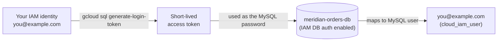

# Step 3 — IAM Database Authentication

`orders_app`'s password works, but it's still a long-lived secret someone has to generate, store,
and eventually rotate. **IAM database authentication** removes that entirely for *human* access:
instead of a database password, you connect with a short-lived **IAM access token** tied to your
Google identity. This continues the no-long-lived-secret theme from Projects 1–2 (where
`doc-portal-sa` used a service account instead of static keys) — now applied to database logins.

---

## 3.1 How IAM Database Authentication Works

| Concept | What it means |
|---------|---------------|
| **IAM DB auth flag** | An instance-level setting that lets Cloud SQL trust IAM-issued tokens as a login method |
| **Cloud SQL IAM user** | An IAM principal (user or service account) registered as a MySQL user via `--type=cloud_iam_user` |
| **Access token as password** | You run `gcloud sql generate-login-token` and pass the token where a password would go |
| **Token lifetime** | ~1 hour — no password to leak, rotate, or forget in a shell history |
| **Still least-privilege** | An IAM DB user still needs MySQL `GRANT`s — IAM only replaces *authentication*, not *authorization* |

> IAM database authentication is for **people and service accounts that need direct SQL access**
> (you, right now, for admin/debugging). It's a different mechanism from the app's `orders_app`
> password — Project 4 introduces **Workload Identity**, which lets a *workload* assume an
> identity without either a DB password or a static key.

---

## 3.2 What You'll Create



---

## 3.3 Console — Enable IAM Database Authentication

1. **☰ → SQL → meridian-orders-db → Edit.**
2. Under **Flags**, add:

   | Field | Value |
   |-------|-------|
   | Flag | `cloudsql_iam_authentication` |
   | Value | `On` |

3. **Save.** The instance restarts to apply the flag (a couple of minutes).
4. **Users → Add user account → IAM.**

   | Field | Value |
   |-------|-------|
   | Principal type | IAM user |
   | Email | your Google account email |

5. Grant it privileges the same way as `orders_app` — connect as `root` and run:

   ```sql
   GRANT SELECT ON meridian_orders.* TO 'you@example.com'@'%';
   FLUSH PRIVILEGES;
   ```

---

## 3.4 gcloud CLI (Alternative)

```bash
# 1. Turn on IAM database authentication (causes a brief restart)
gcloud sql instances patch meridian-orders-db \
  --database-flags=cloudsql_iam_authentication=on

# 2. Add yourself as a Cloud SQL IAM user — this is the step that's easy to skip and
#    then wonder why "the user doesn't exist" (see troubleshooting.md)
gcloud sql users create "$(gcloud config get-value account)" \
  --instance=meridian-orders-db \
  --type=cloud_iam_user

# 3. Grant it read access, same as any other MySQL user
gcloud sql connect meridian-orders-db --user=root <<SQL
GRANT SELECT ON meridian_orders.* TO '$(gcloud config get-value account)'@'%';
FLUSH PRIVILEGES;
SQL

# 4. Generate a short-lived login token and connect with it as the "password"
export DB_PASSWORD=$(gcloud sql generate-login-token)
mysql --host=127.0.0.1 --port=3306 \
  --user="$(gcloud config get-value account)" \
  --password="${DB_PASSWORD}" \
  --enable-cleartext-plugin \
  meridian_orders
```

Verify:

```bash
gcloud sql instances describe meridian-orders-db \
  --format='value(settings.databaseFlags)'
```

Expected: `cloudsql_iam_authentication=on` in the output.

> `--enable-cleartext-plugin` is required by the MySQL client because the token is sent as a
> cleartext "password" over what is still a TLS-protected connection (the Auth Proxy or
> `gcloud sql connect` handle the TLS layer) — it does not mean the token is sent unencrypted
> over the network.

---

## 3.5 Why This Matters

- **No password to leak.** An access token expires in about an hour; even if it's captured, its
  useful life is short. A leaked static DB password is a standing risk until someone notices and
  rotates it.
- **Identity, not a secret, is the credential.** Access is governed by IAM (who you are, what
  role you hold) rather than by who happens to know a string. Revoking access is an IAM change,
  not a "rotate the password everywhere" fire drill.
- **This is authentication, not authorization.** You still `GRANT` privileges per MySQL user —
  IAM DB auth swaps out *how you prove who you are*, not *what you're allowed to do once
  connected*.
- **Sets up Project 4.** Workload Identity extends this same "no static secret" idea to
  service-to-service access, which is exactly the gap `orders_app`'s password still leaves open.

---

## Checkpoint

- [ ] `cloudsql_iam_authentication` flag is **on** for `meridian-orders-db`
- [ ] Your IAM identity exists as a Cloud SQL user with `--type=cloud_iam_user`
- [ ] You connected using `gcloud sql generate-login-token` instead of a stored password
- [ ] You can explain the difference between IAM DB auth (this step) and Workload Identity (Project 4)

---

**Next:** [Step 4 — Backups & Point-in-Time Recovery](./04-backups-and-point-in-time-recovery.md)
