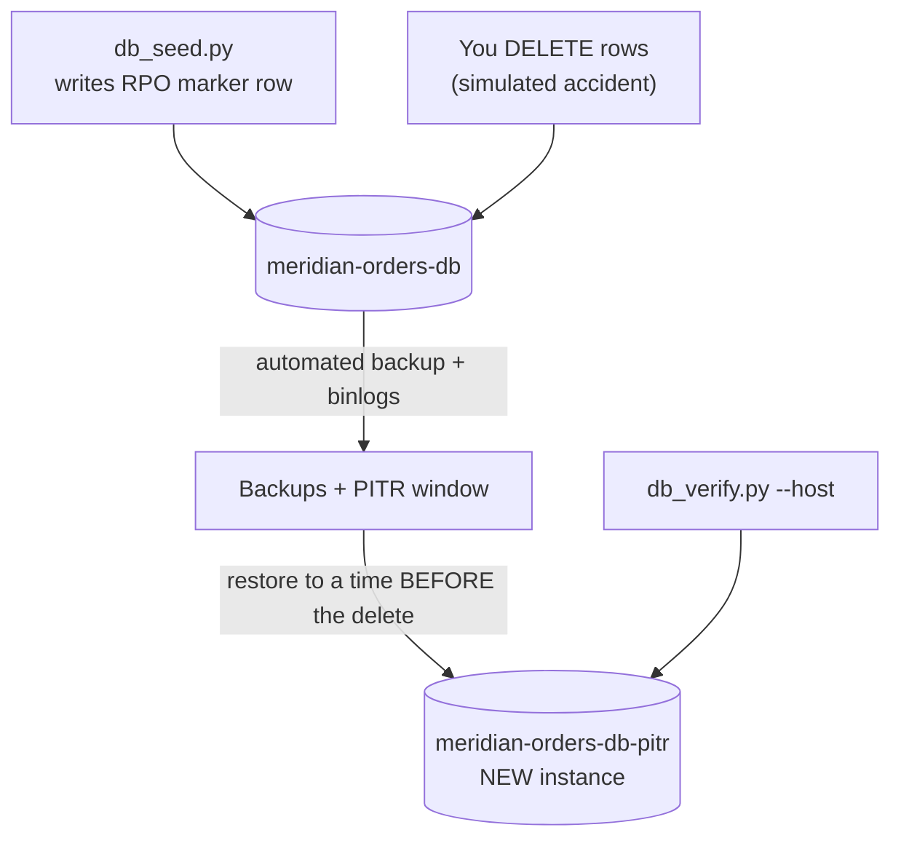

# Step 4 — Backups & Point-in-Time Recovery

This is the drill you'll actually use one day: someone runs a bad `DELETE` against
`meridian_orders` and you need to rewind to *just before it happened*. Automated backups plus
binary logging make that possible down to a specific second, not just "yesterday's snapshot."

---

## 4.1 Automated Backups, Binary Logging, and PITR

| Concept | What it means |
|---------|---------------|
| **Automated backups** | A daily backup taken inside a configured backup window |
| **Binary logging (`point_in_time_recovery`)** | Records every change between backups — required for PITR |
| **Retention** | How long backups + logs are kept (default 7 days, configurable) |
| **On-demand backup** | A manual backup you trigger right now, independent of the daily schedule |
| **PITR restore** | Restores to any second within the retention window — **always into a new instance** |

> Same rule as the AWS RDS project: Cloud SQL never restores *in place*. A PITR restore produces a
> **new instance** with a **new connection name / IP**. Your original instance is untouched. This
> trips people up — see [troubleshooting.md](../troubleshooting.md).

---

## 4.2 What You'll Do



---

## 4.3 Console — Confirm Backups and Take an On-Demand Backup

1. **☰ → SQL → meridian-orders-db → Edit → Backups.**

   | Field | Value |
   |-------|-------|
   | Automated backups | **On** |
   | Backup window | Any (default is fine) |
   | Retention | 7 days |
   | Point-in-time recovery | **On** (enables binary logging) |

2. **Save.**
3. **Backups tab → Create backup** (an on-demand backup, separate from the daily automated one).

   | Field | Value |
   |-------|-------|
   | Description | `pre-pitr-drill` |

---

## 4.4 gcloud CLI (Alternative)

```bash
# 1. Confirm/enable automated backups + PITR (binary logging)
gcloud sql instances patch meridian-orders-db \
  --backup-start-time=03:00 \
  --enable-point-in-time-recovery \
  --retained-backups-count=7

# 2. Take an on-demand backup
gcloud sql backups create --instance=meridian-orders-db --description="pre-pitr-drill"
```

Verify:

```bash
gcloud sql instances describe meridian-orders-db \
  --format='value(settings.backupConfiguration.enabled,settings.backupConfiguration.pointInTimeRecoveryEnabled)'
```

Expected: `True  True`.

---

## 4.5 Cause a "Disaster" and Restore to Before It

Note the current UTC time, then delete the sample rows to simulate the accident:

```bash
date -u   # note this timestamp

python - <<'PY'
import os, pymysql
c = pymysql.connect(host="127.0.0.1", user=os.environ["DB_USER"],
                    password=os.environ["DB_PASSWORD"], database="meridian_orders", autocommit=True)
with c.cursor() as cur:
    cur.execute("DELETE FROM orders WHERE customer LIKE 'customer-%'")
    cur.execute("SELECT COUNT(*) FROM orders"); print("orders now:", cur.fetchone()[0])
PY
```

`db_verify.py` now shows fewer rows, but the **RPO marker row still exists** because it was
written before the delete. Now restore to a point **after the marker but before the delete**:

### Console

1. **SQL → meridian-orders-db → Actions → Restore to point in time**.
2. **Custom** timestamp, chosen between your Step 2 RPO marker and the delete above.
3. Target instance: `meridian-orders-db-pitr` (a **new** instance ID — PITR always creates one).
4. **Restore.** Takes **~5–10 minutes**.

### CLI

```bash
gcloud sql instances clone meridian-orders-db meridian-orders-db-pitr \
  --point-in-time='2026-07-11T14:05:00Z'
```

`gcloud sql instances clone --point-in-time` is the CLI equivalent of "Restore to point in time" —
Cloud SQL's underlying restore operation always clones into a new instance rather than rewinding
the source.

---

## 4.6 Verify the Restore

```bash
# Get the new instance's public IP (add your IP as an authorized network first if needed)
PITR_IP=$(gcloud sql instances describe meridian-orders-db-pitr --format='value(ipAddresses[0].ipAddress)')
gcloud sql instances patch meridian-orders-db-pitr \
  --authorized-networks="$(curl -s ifconfig.me)/32"

python ../src/db_verify.py --host "${PITR_IP}" --user orders_app --password "${DB_PASSWORD}" --database meridian_orders
```

Expected: `RPO marker : FOUND ... -- PASS` and the deleted `customer-*` rows are back — you
restored with an **RPO of seconds** (the gap to the last binary log flush) and an **RTO of
~5–10 minutes** (the restore/clone time).

> **The connection name changed.** `meridian-orders-db-pitr` has its own IP and connection name.
> Production teams put a stable name (e.g. a private DNS record) in front of the primary so
> failover is a DNS change, not an app redeploy — see Challenge 3.

---

## Checkpoint

- [ ] Automated backups + point-in-time recovery are **on**, retention 7 days
- [ ] You deleted rows, then restored to a timestamp **before** the delete
- [ ] `meridian-orders-db-pitr` is a **new** instance (different IP/connection name than the primary)
- [ ] `db_verify.py` against the PITR instance shows `RPO marker : FOUND ... -- PASS`

> **Cost watch:** you now have **two** instances running. Either delete
> `meridian-orders-db-pitr` now if you're done verifying, or keep going and clean up everything in
> [Step 6](./06-cleanup.md).

---

**Next:** [Step 5 — Read Replica & Monitoring](./05-read-replica-and-monitoring.md)
