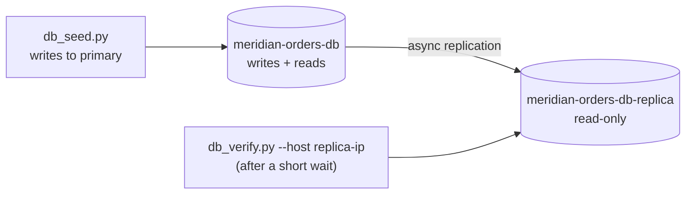

# Step 5 — Read Replica & Monitoring

PITR handles "restore after a mistake," but it doesn't help two other problems: read traffic
overwhelming the primary, and not knowing something's slow until a customer complains. A **read
replica** offloads reads; **Cloud SQL Insights** and **Cloud Monitoring** give you visibility
before things break.

---

## 5.1 Read Replicas

| Concept | What it means |
|---------|---------------|
| **Read replica** | An async, read-only copy of the primary |
| **Replication** | Continuous, not scheduled — changes propagate in roughly seconds |
| **Replica lag** | How far behind the replica is; your effective RPO if you ever promote it |
| **Use case here** | Offload reporting/read-heavy queries so they don't compete with order writes |
| **Not free HA** | A replica scales reads and *can* be promoted in a pinch, but promotion is a manual, one-way operation — it's not automatic failover |

---

## 5.2 What You'll Create



---

## 5.3 Console — Create the Read Replica

1. **☰ → SQL → meridian-orders-db → Actions → Create read replica.**

   | Field | Value |
   |-------|-------|
   | Replica instance ID | `meridian-orders-db-replica` |
   | Region | `us-east1` |
   | Machine tier | Same shared-core tier as the primary |
   | Connectivity | Public IP + authorized network = your IP |

2. **Create replica.** Provisioning takes **~5–10 minutes**.

---

## 5.4 gcloud CLI (Alternative)

```bash
gcloud sql instances create meridian-orders-db-replica \
  --master-instance-name=meridian-orders-db \
  --region=us-east1 \
  --tier=db-f1-micro \
  --authorized-networks="$(curl -s ifconfig.me)/32"
```

Verify:

```bash
gcloud sql instances describe meridian-orders-db-replica \
  --format='value(state,masterInstanceName)'
```

Expected: `RUNNABLE  meridian-orders-db`.

---

## 5.5 Prove Replication — Write to Primary, Read from Replica

```bash
REPLICA_IP=$(gcloud sql instances describe meridian-orders-db-replica --format='value(ipAddresses[0].ipAddress)')

# Write one new row to the PRIMARY
python ../src/db_seed.py --host 127.0.0.1 --user orders_app --password "${DB_PASSWORD}" --database meridian_orders --rows 1

# Give replication a moment, then read from the REPLICA
sleep 10
python ../src/db_verify.py --host "${REPLICA_IP}" --user orders_app --password "${DB_PASSWORD}" --database meridian_orders
```

The new row shows up on the replica without you copying anything. Try writing directly to the
replica and watch it fail — proof it's genuinely read-only, not just a second primary:

```bash
python ../src/db_seed.py --host "${REPLICA_IP}" --user orders_app --password "${DB_PASSWORD}" --database meridian_orders --rows 1
# expect an error such as: "The MySQL server is running with the --read-only option"
```

> If the write appears on the replica in well under 10 seconds, your replica lag is low — check
> the exact number with the `cloudsql.googleapis.com/database/replication/replica_lag` metric in
> Cloud Monitoring.

---

## 5.6 Cloud SQL Insights and Cloud Monitoring

1. **☰ → SQL → meridian-orders-db → Query insights.** Enable it if prompted. Run a few queries
   through `db_verify.py`, then look at **Query insights** for execution counts and latency —
   this is where you'd spot a missing index or an N+1 query pattern.
2. **☰ → Monitoring → Dashboards → search "Cloud SQL".** The default Cloud SQL dashboard surfaces
   CPU, memory, connections, storage, and — once you have a replica — **replication lag**, all
   without any setup on your part.

---

## 5.7 Why This Matters

- **Reads and writes have different scaling needs.** Sending reporting/analytics queries to a
  replica keeps that load off the instance that's taking customer orders.
- **Replica lag is a real number, not a theoretical one.** Any read from a replica can be
  momentarily stale — fine for a dashboard, risky for "did that order just get placed?" checks
  that need the primary.
- **Observability before an incident, not during one.** Cloud SQL Insights and Monitoring are
  free to enable and mean the first time you learn a query is slow isn't a customer complaint.

---

## Checkpoint

- [ ] `meridian-orders-db-replica` shows **RUNNABLE** with `masterInstanceName=meridian-orders-db`
- [ ] A row written to the primary appeared on the replica within seconds (`db_verify.py` shows it)
- [ ] Writing directly to the replica failed (read-only enforced)
- [ ] You looked at Query Insights and the Cloud SQL Monitoring dashboard at least once

---

**Next:** [Step 6 — Cleanup](./06-cleanup.md) ⚠️ **You now have three Cloud SQL instances
running — don't skip this.**
