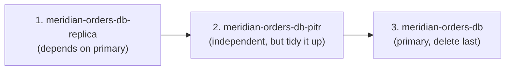

# Step 6 — Cleanup

**This is the most important step in the project.** Cloud SQL instances bill **per hour while
they exist**, even idle, and you're currently running **three**: the primary, the PITR-restored
instance, and the read replica. Deleting an instance also deletes **its backups** — that's
expected here (this is a lab), but worth saying out loud so it never surprises you in production.

> Tip: list everything first so nothing gets missed.
> ```bash
> gcloud sql instances list --format='table(name,state,tier)'
> ```

---

## 6.1 Why the Order Matters

Cloud SQL will not let you delete a primary instance while a read replica still points at it —
the replica has to go first (or be promoted, which detaches it). The safe teardown order is:



---

## 6.2 Delete the Read Replica

### Console

**SQL → meridian-orders-db-replica → Delete** → type the instance name to confirm.

### CLI

```bash
gcloud sql instances delete meridian-orders-db-replica --quiet
```

---

## 6.3 Delete the PITR-Restored Instance

```bash
gcloud sql instances delete meridian-orders-db-pitr --quiet
```

---

## 6.4 Delete the Primary

Only now — after the replica is gone — will Cloud SQL allow this.

```bash
gcloud sql instances delete meridian-orders-db --quiet
```

> **This deletes the primary's automated backups too.** Cloud SQL backups are attached to their
> instance; there's no "keep the backups, delete the instance" option in the default flow. If you
> ever need to preserve data past an instance's life, **export to GCS first**
> ([Challenge 7](../challenges.md)).

---

## 6.5 Final Verification

```bash
gcloud sql instances list
```

Expected: an **empty list** — no `meridian-orders-db*` instances remain.

---

## Checkpoint

- [ ] `meridian-orders-db-replica` deleted first
- [ ] `meridian-orders-db-pitr` deleted
- [ ] `meridian-orders-db` (primary) deleted last
- [ ] `gcloud sql instances list` returns **empty** — no hourly charges left

You've finished the **Cloud SQL managed database** project — instance provisioning, least-privilege
database users, IAM database authentication, PITR, and a read replica. Continue to
**Project 4** — [Databases & Workload Identity](../../../../advanced/gcp/gcp-databases-workload-identity/README.md),
which takes the `orders_app` password you handled manually here and moves it into Secret Manager
behind Workload Identity.
