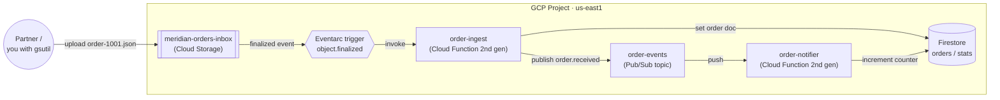
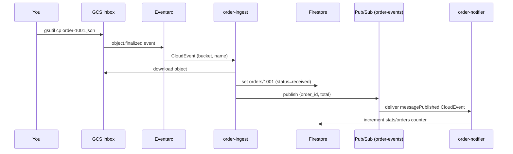

# GCP Event-Driven Functions — Eventarc, Firestore & Pub/Sub

```yaml
level: intermediate
cloud: gcp
domain: serverless
technology:
  - cloud-functions
  - eventarc
  - pub-sub
  - firestore
  - cloud-storage
estimated_time: 90 min
estimated_cost: low
deployment_type: console + gcloud
cleanup_required: true
status: ready
```

> **One-line pitch:** Drop an order file into a bucket and watch it flow through a fully serverless,
> event-driven pipeline — **GCS → Eventarc → Cloud Function → Firestore → Pub/Sub → a second Cloud
> Function** — with no servers, no polling, and no glue code you didn't write.

## What You'll Build

Meridian Retail's partners drop order files into a Cloud Storage bucket. You'll build the **event
pipeline** that reacts to each upload:

1. A file lands in the **inbox bucket**.
2. **Eventarc** turns that `object.finalized` event into a call to the **`order-ingest`** function.
3. `order-ingest` reads the file, validates it, writes an order record to **Firestore**, and
   **publishes** an "order received" event to a **Pub/Sub** topic.
4. **`order-notifier`**, subscribed to that topic, fires independently to "notify the customer" and
   update a running counter in Firestore.

This is the classic **event-driven, decoupled** shape: producers and consumers never call each other
directly, everything scales to zero, and you can add new consumers without touching the producer.

By the end you'll understand:

- **Eventarc** — the routing layer that delivers events from ~130 Google sources (here, Cloud
  Storage) to Cloud Run / functions, and the service accounts that make it work
- **CloudEvents** — the standard event envelope your function receives (`functions_framework.cloud_event`)
- **Fan-in vs. fan-out** — one function writes the system of record; Pub/Sub fans the event out to
  many independent consumers
- **At-least-once delivery** and why your handlers must be **idempotent**
- Writing to **Firestore** from a function and reading it back to verify the pipeline

This is the **intermediate** project in the GCP **Serverless** track. It builds directly on
[`gcp-cloud-functions-basics`](../../../beginner/gcp/gcp-cloud-functions-basics/README.md) (HTTP
functions) and is the GCP counterpart to
[`aws-lambda-s3-event-processing`](../../../beginner/aws/aws-lambda-s3-event-processing/README.md).

## Learning Objectives

By the end you will be able to:

- Deploy an **Eventarc-triggered** function that fires on Cloud Storage uploads
- Explain the Eventarc trust chain (GCS service agent → Pub/Sub → Eventarc → your function)
- Deploy a **Pub/Sub-triggered** function and understand the CloudEvent envelope for each
- Write and read **Firestore** documents from serverless code, using the doc ID for idempotency
- Reason about at-least-once delivery, retries, and dead-lettering

## Real-World Use Case

"A file shows up, do something with it" is one of the most common integration patterns in the
enterprise: partners drop CSVs, cameras upload images, systems export nightly dumps. The naïve
version is a cron job that polls a folder. The serverless version reacts **the instant** the object
lands, costs nothing when idle, scales out under a flood of uploads, and — because it publishes an
event rather than calling the next stage directly — lets you bolt on new processing later without a
rewrite.

## Architecture



### Event flow



See [architecture.md](architecture.md) for the IAM/trust-chain and retry/dead-letter diagrams.

## Services Used

| Service | Role in this Project |
|---------|---------------------|
| **Cloud Storage** | The inbox bucket partners upload order files to |
| **Eventarc** | Routes the bucket's `object.finalized` event to `order-ingest` |
| **Cloud Functions (2nd gen)** | `order-ingest` (event) and `order-notifier` (Pub/Sub) handlers |
| **Firestore (Native)** | System of record: `orders` documents + a `stats` counter |
| **Pub/Sub** | Decouples ingest from downstream consumers; fan-out point |
| **IAM / service agents** | The trust chain that lets GCS→Eventarc→function deliver events |

## Key Concepts

| Concept | What it means |
|---------|---------------|
| **Eventarc** | Managed event router: source → (via Pub/Sub) → your Cloud Run/function target |
| **CloudEvent** | The CNCF-standard event envelope; `@functions_framework.cloud_event` gives you `event.data` |
| **object.finalized** | The GCS event fired when a new object (or new version) finishes writing |
| **Fan-out** | One event → many independent subscribers, each scaling on its own |
| **At-least-once** | Eventarc/Pub/Sub may deliver an event more than once → handlers must be idempotent |
| **Idempotency** | Using the `order_id` as the Firestore doc ID so re-delivery overwrites, not duplicates |
| **Dead-letter topic** | Where messages go after N failed deliveries so a poison event can't block the queue |

## Project Structure

```
gcp-event-driven-functions-pubsub/
├── README.md                       ← You are here
├── architecture.md                 ← Trust-chain, delivery, and retry diagrams
├── prerequisites.md
├── src/
│   ├── order_ingest/
│   │   ├── main.py                 ← GCS-triggered: validate → Firestore → publish
│   │   └── requirements.txt
│   ├── order_notifier/
│   │   ├── main.py                 ← Pub/Sub-triggered: notify + increment counter
│   │   └── requirements.txt
│   └── sample-orders/              ← order-1001.json, order-1002.json, bad-order.json
├── steps/
│   ├── 01-setup.md                 ← Project, APIs, Firestore DB, service accounts
│   ├── 02-bucket-and-topic.md      ← Inbox bucket + Pub/Sub topic
│   ├── 03-deploy-ingest.md         ← Eventarc-triggered order-ingest (+ the trust chain)
│   ├── 04-deploy-notifier.md       ← Pub/Sub-triggered order-notifier
│   ├── 05-run-the-pipeline.md      ← Upload files, watch it flow, inspect Firestore
│   ├── 06-reliability.md           ← Retries, idempotency, dead-letter topic
│   └── 07-cleanup.md               ← Delete everything
├── costs.md
├── troubleshooting.md
├── challenges.md
└── references.md
```

## Prerequisites

Summarized here; full list in [prerequisites.md](prerequisites.md).

| Requirement | Details |
|-------------|---------|
| Prior project | Do [`gcp-cloud-functions-basics`](../../../beginner/gcp/gcp-cloud-functions-basics/README.md) first — this assumes you can deploy a function |
| gcloud CLI | Installed & authenticated; billing linked |
| Region | All resources in **`us-east1`** |
| Firestore | Created **once per project** in Native mode (Step 1) — shared with the DB track's `carts` |

## Steps

| # | Step | What you do |
|---|------|-------------|
| 1 | [Setup](steps/01-setup.md) | Enable APIs, create the Firestore DB, create the runtime service account |
| 2 | [Bucket & topic](steps/02-bucket-and-topic.md) | Create the inbox bucket and the `order-events` topic |
| 3 | [Deploy `order-ingest`](steps/03-deploy-ingest.md) | Eventarc GCS trigger + wire the trust chain |
| 4 | [Deploy `order-notifier`](steps/04-deploy-notifier.md) | Pub/Sub-triggered consumer |
| 5 | [Run the pipeline](steps/05-run-the-pipeline.md) | Upload orders, watch logs, read Firestore |
| 6 | [Reliability](steps/06-reliability.md) | Prove idempotency; add a dead-letter topic |
| 7 | [Cleanup](steps/07-cleanup.md) | Delete functions, triggers, topic, bucket |

Start with **Step 1 →** [`steps/01-setup.md`](steps/01-setup.md)

## Validation Checklist

- [ ] Uploading `order-1001.json` creates a Firestore `orders/1001` document with `status: received`
- [ ] The `order-events` topic receives a message and `order-notifier` fires
- [ ] The `stats/orders` counter increments once per order
- [ ] `bad-order.json` (missing fields) is logged as a `WARNING` and does **not** create a doc
- [ ] Re-uploading the same file does **not** create a duplicate (idempotency)

## 💰 Cost

| Resource | Cost | Free tier? |
|----------|------|-----------|
| **Cloud Functions (2nd gen)** | ~$0 | 2M invocations/month free |
| **Cloud Storage** | ~$0 | 5 GB-months free; a few tiny JSONs |
| **Eventarc** | ~$0 | No per-event charge; rides on Pub/Sub |
| **Pub/Sub** | ~$0 | First 10 GB/month free |
| **Firestore** | ~$0 | 1 GiB + 50k reads / 20k writes per day free |

**Estimated total for this lab: ~$0.00** — everything is inside free tiers if you clean up the same
day. **⚠️ Left running:** the bucket, topic, Firestore data, and two functions persist until deleted;
an accidental upload loop could generate invocations. See [costs.md](costs.md).

## 🧹 Cleanup

> **⚠️ Do the cleanup step.** Leftover triggers keep listening; leftover Firestore data persists.

Cleanup is [Step 7](steps/07-cleanup.md): delete both functions (removing their Eventarc triggers),
the topic and any subscriptions, the bucket and its objects, and the Firestore documents.

## Troubleshooting

See [troubleshooting.md](troubleshooting.md) — `Error → Cause → Fix`.

## Challenges

See [challenges.md](challenges.md) — add a real notification, an image-processing stage, an ordering
guarantee, and more.

## What to Try Next

- [GCP Serverless Orchestration with Workflows](../../../advanced/gcp/gcp-serverless-workflows-orchestration/README.md)
  — the **advanced** project: coordinate multiple functions into a reliable **order-fulfillment
  workflow** with retries, Cloud Tasks, and an API Gateway front door.
- Compare with AWS: [`aws-lambda-s3-event-processing`](../../../beginner/aws/aws-lambda-s3-event-processing/README.md)
  and [`aws-sqs-sns-messaging`](../../../beginner/aws/aws-sqs-sns-messaging/README.md).

## References

See [references.md](references.md) for official docs.
