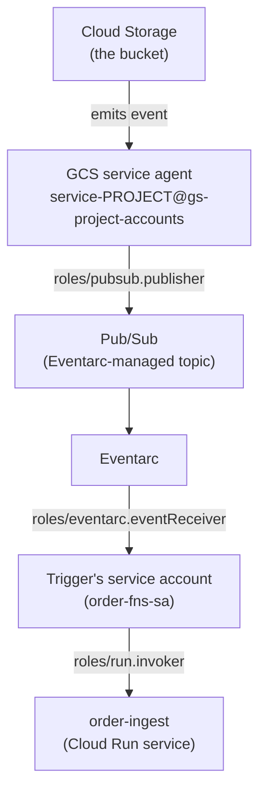
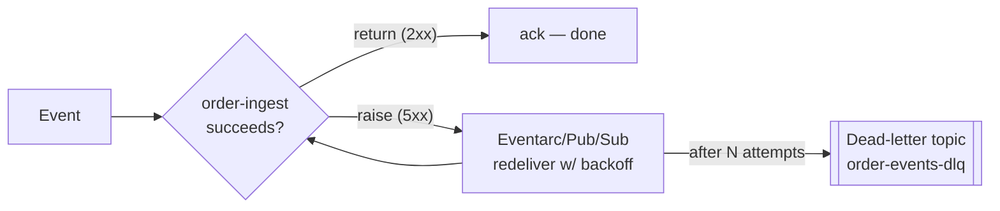
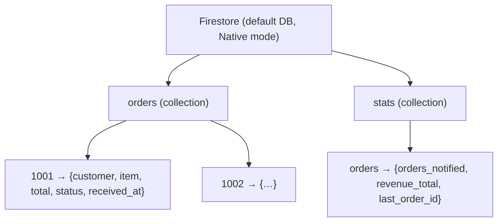

# Architecture — GCP Event-Driven Functions

Deeper diagrams that would crowd the README: the Eventarc **trust chain**, the **delivery/retry**
model, and the **data model** in Firestore.

---

## 1. The Eventarc trust chain (why so many service accounts?)

An Eventarc GCS trigger isn't a single hop — Cloud Storage doesn't call your function directly. It
publishes to Pub/Sub, Eventarc routes it, and your function's identity must be allowed to receive it.
Every arrow below is an IAM grant you'll make (or that must already exist) in Step 3.

| Grant | Principal | On | Why |
|-------|-----------|----|----|
| `roles/pubsub.publisher` | GCS service agent | project | GCS must publish object events to Eventarc's Pub/Sub |
| `roles/eventarc.eventReceiver` | `order-fns-sa` | project | The trigger identity may receive Eventarc events |
| `roles/run.invoker` | `order-fns-sa` | the function's Cloud Run service | Eventarc invokes the function *as* this SA |
| `roles/iam.serviceAccountTokenCreator` | Pub/Sub service agent | project | Pub/Sub mints OIDC tokens to call the function (auto, but needed) |

> The single biggest source of "my trigger doesn't fire" is a missing link in this chain. Step 3
> grants each one explicitly and Step 3's checkpoint verifies the trigger reached `ACTIVE`.

---

## 2. Delivery & retry model

- **Success = return normally.** The framework acks the event.
- **Failure = raise.** The event is redelivered with exponential backoff — **at least once**, so a
  handler that isn't idempotent will double-write on a retry.
- **Poison events** (that always fail) are the reason for a **dead-letter topic**: after the max
  delivery attempts, the message is parked in the DLQ instead of retrying forever. You add one in
  Step 6.

### Idempotency in this project

`order-ingest` uses the **`order_id` as the Firestore document ID** and calls `.set()` (not `.add()`).
Re-processing the same file overwrites the same document — no duplicate orders — which is exactly what
you want under at-least-once delivery.

---

## 3. Firestore data model

- `orders/{order_id}` — one document per order, written by **order-ingest** (system of record).
- `stats/orders` — a single counter document, incremented by **order-notifier** using
  `firestore.Increment(1)` so concurrent notifiers don't clobber each other.

The two functions touch **different documents**, which is why they can run fully independently and
scale on their own.
