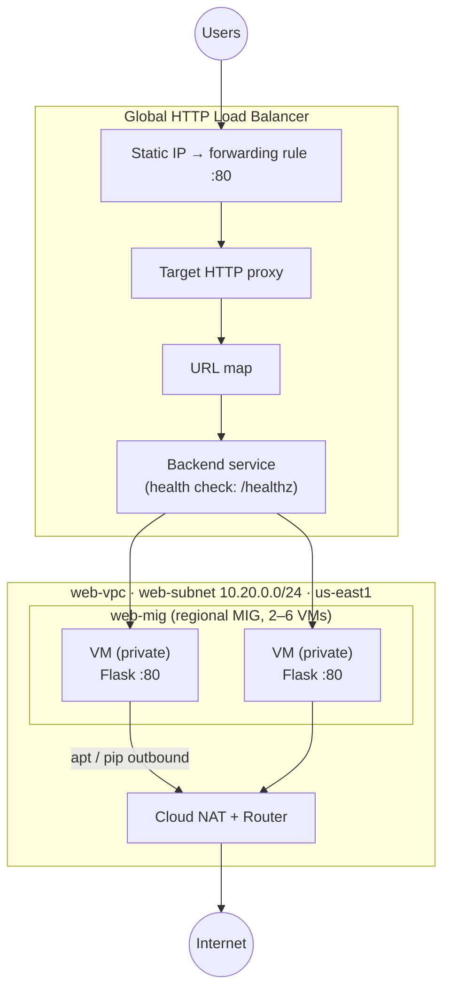

# GCP HTTP Load Balancer & Autoscaling — A Production-Shaped Web Tier

## What You'll Build

You'll build the way real web backends run on Google Cloud: a fleet of **private** VMs (no public
IPs) that **autoscale** with demand, sit behind a **global HTTP load balancer**, reach the internet
outbound through **Cloud NAT**, and **heal themselves** when a VM dies. Each VM runs a tiny Python
Flask app so you can watch traffic spread and the group grow. By the end you'll understand:

- Why backends should be **private** and how **Cloud NAT** gives them outbound access
- The Google load-balancer **chain**: forwarding rule → proxy → URL map → backend service → MIG
- **Instance templates** and **Managed Instance Groups (MIGs)**
- **Autoscaling** on CPU and **autohealing** via health checks
- The two Google-owned **health-check source ranges** every LB firewall rule must allow

This is the **intermediate** project in the GCP networking series. Do the
[beginner VPC & Firewall project](../../../beginner/gcp/gcp-vpc-firewall-basics/README.md) first — this one assumes
gcloud is installed and you're comfortable with VPCs, subnets, and firewall rules.

---

## Architecture



---

## Services Used

| Service | Role in this Project |
|---------|---------------------|
| **VPC + subnet** | Private network for the backend VMs |
| **Cloud Router + Cloud NAT** | Outbound-only internet for VMs with no external IP |
| **Instance template** | Blueprint for identical VMs (machine type, tag, startup script) |
| **Managed Instance Group** | Runs the VMs; provides autoscaling + autohealing |
| **Health checks** | One for MIG autohealing, one for LB traffic routing |
| **External Application LB** | Global public front door that spreads traffic across VMs |
| **Compute Engine** | The `e2-small` VMs running the Flask app |

---

## Key Concepts

| Concept | What it means |
|---------|---------------|
| **Private backend** | VMs have no external IP; only the LB is public — smaller attack surface |
| **Cloud NAT** | Managed outbound NAT so private VMs can `apt`/`pip` without inbound exposure |
| **Instance template** | Immutable VM blueprint; required to back a MIG |
| **Managed Instance Group** | Maintains a desired count of VMs; autoscales and self-heals |
| **LB chain** | Forwarding rule → proxy → URL map → backend service → instance group |
| **Named port** | The link (`http:80`) that lets the backend service find the app port |
| **Health-check ranges** | `35.191.0.0/16` + `130.211.0.0/22` must be allowed or the LB returns 502 |

---

## Project Structure

```
gcp-http-lb-autoscaling/
├── README.md                          ← You are here
├── src/
│   ├── app.py                         ← Flask app: /, /healthz, /load
│   ├── requirements.txt               ← flask==3.1.0
│   └── startup-script.sh              ← Installs Flask & runs the app at boot
├── steps/
│   ├── 01-vpc-and-nat.md              ← VPC, subnet, Cloud Router + Cloud NAT
│   ├── 02-firewall-rules.md          ← Health-check, IAP-SSH, internal rules
│   ├── 03-instance-template.md       ← VM blueprint (no external IP)
│   ├── 04-managed-instance-group.md  ← Regional MIG + autoscaling + autohealing
│   ├── 05-load-balancer.md           ← The full LB chain, backend-first
│   ├── 06-test-and-scale.md          ← Load test → scale out; delete a VM → self-heal
│   └── 07-cleanup.md                 ← Delete everything (has real cost!)
├── costs.md
├── troubleshooting.md
└── challenges.md
```

---

## Prerequisites

| Requirement | Details |
|-------------|---------|
| gcloud CLI | Installed & authenticated — see the [beginner project's Step 1](../../../beginner/gcp/gcp-vpc-firewall-basics/steps/01-install-gcloud.md) |
| A GCP project | With billing linked and the Compute Engine API enabled |
| Comfort with | VPCs, subnets, and firewall rules (from the beginner project) |
| Region | All steps use **`us-east1`** / zone **`us-east1-b`** |

---

## What You'll Learn Step by Step

| Step | File | Goal |
|------|------|------|
| 1 | `01-vpc-and-nat.md` | Build the VPC/subnet and give private VMs outbound via Cloud NAT |
| 2 | `02-firewall-rules.md` | Allow health checks + IAP SSH; keep backends off the public net |
| 3 | `03-instance-template.md` | Create the VM blueprint with a Flask startup script |
| 4 | `04-managed-instance-group.md` | Run a regional MIG with autoscaling + autohealing |
| 5 | `05-load-balancer.md` | Assemble the global HTTP load balancer chain |
| 6 | `06-test-and-scale.md` | Load-test to scale out; kill a VM to watch self-healing |
| 7 | `07-cleanup.md` | Tear it all down in the right order |

Start with **Step 1 →** [`steps/01-vpc-and-nat.md`](steps/01-vpc-and-nat.md)

---

## Estimated Time

75 – 120 minutes (autoscaling and LB provisioning involve some waiting).

## Estimated Cost

| Resource | Configuration | Cost | Notes |
|----------|--------------|------|-------|
| **Compute Engine** | 2–6 × `e2-small` | **~$0.02–0.07/hr** | Scales with load during the test |
| **External Application LB** | Forwarding rule + data | **~$0.025/hr** | Billed while the forwarding rule exists |
| **Cloud NAT** | 1 gateway | **~$0.0014/hr + data** | Billed per hour while it exists |
| **Static IP (in use)** | 1 global IP | **~$0** in use | Bills only when reserved-but-unused |

**Typical session cost: $0.20 – $0.60** for 1–3 hours if you clean up the same day.

> ⚠️ Unlike the beginner project, this one has **no free-tier umbrella** — the load balancer and
> Cloud NAT bill per hour. **[Step 7 — Cleanup](steps/07-cleanup.md) is mandatory.**

For the full breakdown → see **[costs.md](costs.md)**.

---

## What's Next

- Try the **[challenges](challenges.md)** — HTTPS with a managed cert, Cloud CDN, rolling updates to
  a new template, and a `kubectl`-free path to the same idea.
- Compare with the AWS equivalent in this repo:
  [ec2-vpc-monitored-webapp](../../../advanced/aws/aws-ec2-vpc-monitored-webapp/README.md) (ALB + Auto Scaling Group).
