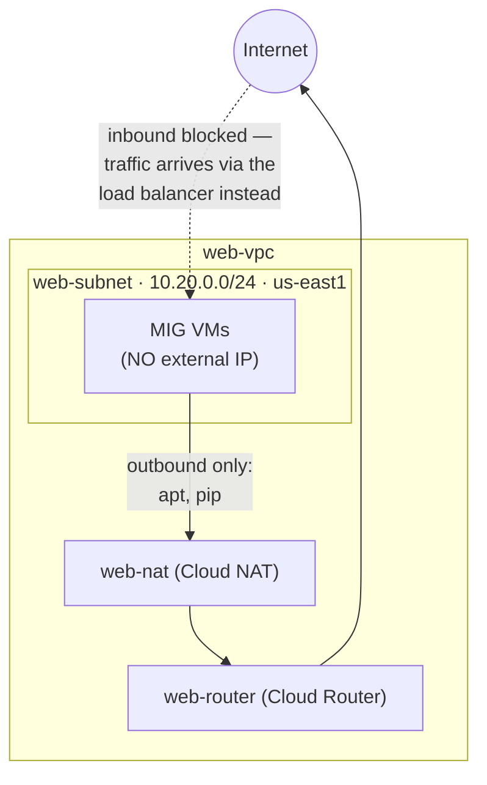

# Step 1 — VPC, Subnet & Cloud NAT

In this intermediate project your web servers will have **no external IP addresses** — they sit
privately behind a load balancer. But they still need to reach the internet **outbound** (to run
`apt-get` and `pip install` at boot). **Cloud NAT** provides exactly that: outbound-only internet
access for private VMs.

> **Prerequisites:** You should have completed the
> [beginner project](../../../../beginner/gcp/gcp-vpc-firewall-basics/README.md) — or at least its
> [Step 1](../../../../beginner/gcp/gcp-vpc-firewall-basics/steps/01-install-gcloud.md), so `gcloud` is installed,
> you're authenticated, a project is selected, billing is linked, and the Compute Engine API is on.
> Set your defaults: `gcloud config set compute/region us-east1` and
> `gcloud config set compute/zone us-east1-b`.

---

## 1.1 The Big Picture



**Why no external IPs?** Exposing every backend VM to the internet is a bad pattern — more attack
surface, more IPs to manage. Instead: the **load balancer** is the only public entry point, and
**Cloud NAT** handles outbound. This is how production backends are built.

---

## 1.2 Create the VPC and Subnet

### Console

1. **☰ → VPC network → VPC networks → Create VPC network.**
2. Set **Name** = `web-vpc`, **Subnet creation mode** = **Custom**.
3. Add one subnet:

   | Field | Value |
   |-------|-------|
   | Name | `web-subnet` |
   | Region | `us-east1` |
   | IPv4 range | `10.20.0.0/24` |

4. Click **Create**.

### gcloud CLI (Alternative)

```bash
gcloud compute networks create web-vpc --subnet-mode=custom

gcloud compute networks subnets create web-subnet \
  --network=web-vpc \
  --region=us-east1 \
  --range=10.20.0.0/24
```

---

## 1.3 Create a Cloud Router

Cloud NAT needs a **Cloud Router** to run on. (You won't configure any dynamic routing — the router
is just the vehicle NAT rides on.)

### Console

1. **☰ → Network services → Cloud Routers → Create router.**

   | Field | Value |
   |-------|-------|
   | Name | `web-router` |
   | Network | `web-vpc` |
   | Region | `us-east1` |

2. Click **Create**.

### gcloud CLI (Alternative)

```bash
gcloud compute routers create web-router \
  --network=web-vpc \
  --region=us-east1
```

---

## 1.4 Create Cloud NAT

### Console

1. **☰ → Network services → Cloud NAT → Get started / Create NAT gateway.**

   | Field | Value |
   |-------|-------|
   | Gateway name | `web-nat` |
   | Network | `web-vpc` |
   | Region | `us-east1` |
   | Cloud Router | `web-router` |
   | Source (NAT mapping) | All subnets' primary IP ranges (default) |

2. Click **Create**.

### gcloud CLI (Alternative)

```bash
gcloud compute routers nats create web-nat \
  --router=web-router \
  --region=us-east1 \
  --nat-all-subnet-ip-ranges \
  --auto-allocate-nat-external-ips
```

- `--nat-all-subnet-ip-ranges` → NAT covers every VM in the subnet.
- `--auto-allocate-nat-external-ips` → Google hands out the shared public IP(s) automatically.

---

## 1.5 Verify

```bash
gcloud compute routers nats describe web-nat \
  --router=web-router --region=us-east1 \
  --format='value(name,natIpAllocateOption,sourceSubnetworkIpRangesToNat)'
```

Expected: `web-nat  AUTO_ONLY  ALL_SUBNETWORKS_ALL_IP_RANGES`.

> You can't fully test NAT until VMs exist (Step 3) — but if the app installs Flask successfully at
> boot, NAT is working.

---

## Checkpoint

- [ ] `web-vpc` exists (custom mode) with subnet `web-subnet` (`10.20.0.0/24`, us-east1)
- [ ] Cloud Router `web-router` exists in us-east1
- [ ] Cloud NAT `web-nat` exists and maps all subnet ranges
- [ ] You can explain why the backend VMs will have **no external IP**

---

**Next:** [Step 2 — Firewall Rules](./02-firewall-rules.md)
