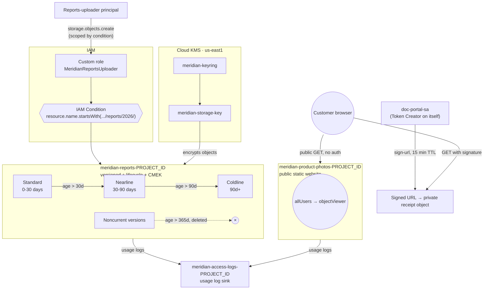

# GCP Storage Security & Lifecycle — Custom Roles, Encryption & Automated Tiering

```yaml
level: intermediate
cloud: gcp
domain: storage
technology:
  - cloud-storage
  - cloud-kms
  - iam-conditions
  - custom-roles
estimated_time: 90-110 min
estimated_cost: low
deployment_type: console + gcloud
cleanup_required: true
status: ready
```

## What You'll Build

Meridian Retail's documents bucket from Project 1 is about to go into production, and production has
different rules. You'll take a plain bucket and turn it into something a security review would
actually approve: a **custom IAM role** that grants only the three permissions a reports-uploader
job needs, an **IAM Condition** that further restricts *where* that role can write, **object
versioning** and **lifecycle rules** that age old reports from Standard down to Coldline storage and
eventually delete stale versions automatically, a **customer-managed encryption key (CMEK)** in Cloud
KMS protecting the reports bucket, **signed URLs** for handing a customer a private receipt without a
long-lived secret, a **public static website bucket** for product photos, and **bucket logging** so
you can see who touched what. By the end you'll understand:

- How to derive a **custom IAM role** from a predefined role instead of guessing permissions
- How **IAM Conditions** use **CEL** to scope a grant by resource name, and where conditions apply
- **Object versioning** and **lifecycle rules** — matchers, actions, and why age-based tiering saves money
- **Retention policies** vs. **bucket lock** — and why you never lock one in a lab
- **CMEK** — how the GCS service agent needs its own grant on your KMS key before encryption works
- **Signed URLs** generated *keylessly* via service account impersonation, and why that beats a JSON key
- The line between a bucket that's fine to make **public** and one that must stay **private**
- **Bucket usage logs** vs. **Cloud Audit Logs** for tracking access to Cloud Storage

This is **Project 2 of 4** in the GCP IAM/Storage/Databases series. **Builds on:**
[Project 1 — IAM & Storage Fundamentals](../../../beginner/gcp/gcp-iam-storage-fundamentals/README.md),
where you created the `meridian-docs-<PROJECT_ID>` bucket and the `doc-portal-sa` service account —
this project assumes that IAM vocabulary (principals, roles, bindings) is already familiar. **Next in
this series →** [Project 3 — Cloud SQL Managed Database](../gcp-cloud-sql-managed-database/README.md).

---

## Architecture



---

## Services Used

| Service | Role in this Project |
|---------|---------------------|
| **Cloud Storage** | Reports bucket (versioned/lifecycle/CMEK), product-photos bucket (public site), access-logs bucket |
| **Cloud IAM — custom roles** | `MeridianReportsUploader`, built from a predefined role's permission set |
| **Cloud IAM — Conditions** | CEL expression scoping the uploader's grant to an object-name prefix |
| **Cloud KMS** | Keyring + key providing customer-managed encryption for the reports bucket |
| **Cloud Storage signed URLs** | Time-limited, keyless links for private customer receipts |
| **Cloud Storage bucket logging** | Usage logs written as objects to a dedicated log bucket |

---

## Key Concepts

| Concept | What it means |
|---------|---------------|
| **Custom role** | A role you define with an exact permission list, built from a predefined role as a starting point |
| **IAM Condition (CEL)** | A boolean expression evaluated at request time that further restricts an IAM binding |
| **Object versioning** | Keeps prior versions of an object instead of overwriting them on every write |
| **Lifecycle rule** | A matcher (age, storage class, version state) + an action (`SetStorageClass`, `Delete`) evaluated daily |
| **Retention policy** | A minimum age an object must reach before it can be deleted or overwritten |
| **Bucket lock** | Makes a retention policy irreversible — never apply this outside production |
| **CMEK** | A Cloud KMS key you own and control, used instead of Google's default encryption key |
| **GCS service agent** | The Google-managed identity Cloud Storage itself uses to call KMS on your behalf |
| **Signed URL** | A URL with an embedded, time-limited cryptographic signature granting temporary access |
| **Keyless signing** | Generating a signed URL via short-lived impersonation instead of a downloaded JSON key |
| **Static website bucket** | A public bucket serving `index.html`/404 pages directly over HTTP(S) |
| **Bucket usage logs** | Periodic log objects describing storage and requests, written to a separate bucket |

---

## Project Structure

```
gcp-storage-security-lifecycle/
├── README.md                                  ← You are here
├── steps/
│   ├── 01-custom-roles-and-conditions.md      ← Least-privilege custom role + an IAM Condition scoping it
│   ├── 02-versioning-and-lifecycle-rules.md   ← Version the reports bucket, automate Standard→Nearline→Coldline
│   ├── 03-retention-and-cmek-encryption.md    ← Retention policy demo + encrypt the reports bucket with CMEK
│   ├── 04-signed-urls-and-static-website.md   ← Keyless signed URLs vs. a public product-photos site
│   ├── 05-bucket-logging-and-audit.md         ← Usage logs + a note on Cloud Audit Logs for GCS
│   └── 06-cleanup.md                          ← Delete buckets/versions, destroy the KMS key, remove IAM
├── costs.md
├── troubleshooting.md
└── challenges.md
```

---

## Prerequisites

| Requirement | Details |
|-------------|---------|
| gcloud CLI | Installed & authenticated — see [SETUP.md](../../../../SETUP.md) |
| Prior project | Completed [Project 1 — IAM & Storage Fundamentals](../../../beginner/gcp/gcp-iam-storage-fundamentals/README.md), or equivalent comfort with IAM principals, roles, and basic bucket creation |
| Project-level IAM | `roles/owner`, **or** all of: `roles/resourcemanager.projectIamAdmin` + `roles/storage.admin` + `roles/cloudkms.admin` + `roles/iam.roleAdmin` |
| APIs enabled | Cloud Storage API, Cloud KMS API, IAM API (`cloudkms.googleapis.com`, `iam.googleapis.com`) |
| Region | All steps use **`us-east1`** |

---

## What You'll Learn Step by Step

| Step | File | Goal |
|------|------|------|
| 1 | `01-custom-roles-and-conditions.md` | Build a minimal-permission custom role and scope it with a CEL condition |
| 2 | `02-versioning-and-lifecycle-rules.md` | Version the reports bucket and automate storage-class tiering + expiry |
| 3 | `03-retention-and-cmek-encryption.md` | Demo an unlocked retention policy, then encrypt with a customer-managed key |
| 4 | `04-signed-urls-and-static-website.md` | Generate keyless signed URLs; contrast with a public static website bucket |
| 5 | `05-bucket-logging-and-audit.md` | Turn on usage logs and know what Cloud Audit Logs adds on top |
| 6 | `06-cleanup.md` | Tear down every bucket, version, key, and IAM binding |

Start with **Step 1 →** [`steps/01-custom-roles-and-conditions.md`](steps/01-custom-roles-and-conditions.md)

---

## Estimated Time

90 – 110 minutes. Lifecycle rules are evaluated by Google roughly once every 24 hours, so you'll
**configure and verify the rule's syntax**, not watch a live transition happen during the lab.

## Estimated Cost

| Resource | Configuration | Cost | Notes |
|----------|--------------|------|-------|
| **Cloud Storage** | 4 small buckets, a handful of test objects | **~$0.01–0.03** | Standard/Nearline/Coldline in `us-east1`, tiny volumes |
| **Cloud KMS** | 1 keyring + 1 key | **~$0.06/key-version/month** (prorated to a few cents for the lab) | Billed per active key-version-month, plus per-10k-operation fees |
| **Storage operations** | Uploads, lifecycle checks, signed-URL reads | **~$0.01** | Class A/B operations are cheap but not free |
| **Egress** | Static website page loads, signed-URL downloads | **~$0.01** | A few MB at most |

**Typical session cost: $0.05 – $0.15** if you clean up the same day.

> ⚠️ Unlike the beginner project, this one is **not free-tier** — a Cloud KMS key bills for existing
> (even idle), and CMEK/lifecycle/versioning all add small storage-operation costs.
> **[Step 6 — Cleanup](steps/06-cleanup.md) is mandatory**, including destroying the KMS key version.

For the full breakdown → see **[costs.md](costs.md)**.

---

## What's Next

- Try the **[challenges](challenges.md)** — event-driven processing on upload, cross-region object
  replication, Storage Transfer Service, Cloud Storage FUSE, time-boxed conditions, and Autoclass.
- Continue to **[Project 3 — Cloud SQL Managed Database](../gcp-cloud-sql-managed-database/README.md)**,
  where Meridian Retail's product catalog moves off flat files and into a managed relational database.

This project maps directly onto the **data protection and identity** domains of Google's
**Professional Cloud Security Engineer** and **Associate Cloud Engineer** certifications: writing
least-privilege custom roles, scoping access with IAM Conditions, encrypting data at rest with
customer-managed keys, and choosing the right access pattern (public bucket vs. signed URL) for a
given sensitivity level.
