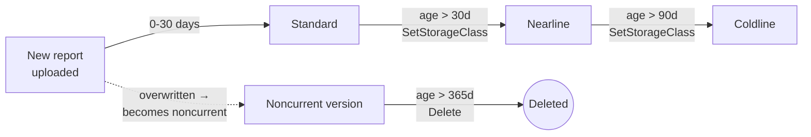

# Step 2 — Versioning & Lifecycle Rules

Now that the access control is defined, create the bucket it protects. Meridian's monthly reports pile
up fast, get referenced rarely after 30 days, and legally need to stick around for a year even though
almost nobody reads them after quarter-end. That's exactly the shape **object versioning** and
**lifecycle rules** are built for: keep history, move cold data to cheaper storage automatically, and
expire it on a schedule — with no cron job or Lambda-equivalent required.

---

## 2.1 Versioning and Lifecycle, Conceptually

| Concept | What it means |
|---------|---------------|
| **Object versioning** | When on, overwriting or deleting an object keeps the prior copy as a **noncurrent version** instead of destroying it |
| **Live vs. noncurrent** | The most recent copy of an object is "live"; every older copy is "noncurrent" and only reachable by generation number |
| **Lifecycle rule** | A `condition` (matcher) + `action`, evaluated roughly once every 24 hours against every object |
| **`SetStorageClass` action** | Moves matching objects to a cheaper storage class without changing their content or metadata |
| **`Delete` action** | Permanently removes matching objects (or, combined with `isLive: false`, only noncurrent versions) |
| **Storage classes here** | Standard (frequent access) → Nearline (~monthly access, 30-day min) → Coldline (~quarterly access, 90-day min) |

Versioning and lifecycle rules work together deliberately: versioning is what generates the
noncurrent copies that pile up over time, and a lifecycle rule with `isLive: false` is what actually
cleans them out — without one, an indefinitely versioned bucket grows (and bills) forever.

---

## 2.2 What You'll Create



| Rule | Matcher | Action |
|------|---------|--------|
| 1 | `age: 30`, `matchesStorageClass: [STANDARD]` | `SetStorageClass: NEARLINE` |
| 2 | `age: 90`, `matchesStorageClass: [NEARLINE]` | `SetStorageClass: COLDLINE` |
| 3 | `age: 365`, `isLive: false` | `Delete` |

---

## 2.3 Console — Create the Reports Bucket

1. **☰ → Cloud Storage → Buckets → Create.**
2. Fill in the bucket:

   | Field | Value |
   |-------|-------|
   | Name | `meridian-reports-<PROJECT_ID>` |
   | Location type | Region → `us-east1` |
   | Storage class | Standard |
   | Access control | Uniform |
   | Protection tools | Leave default for now — you'll revisit in [Step 3](./03-retention-and-cmek-encryption.md) |

3. Click **Create**.

### Enable Versioning

4. Open the bucket → **Protection** tab → **Object versioning** → **Edit** → toggle **On** → **Save**.

---

## 2.4 gcloud CLI (Alternative)

```bash
PROJECT_ID=$(gcloud config get-value project)

# 1. Create the bucket, region-pinned, uniform bucket-level access
gcloud storage buckets create "gs://meridian-reports-$PROJECT_ID" \
  --location=us-east1 \
  --uniform-bucket-level-access \
  --default-storage-class=STANDARD

# 2. Turn on object versioning
gcloud storage buckets update "gs://meridian-reports-$PROJECT_ID" --versioning
```

Verify:

```bash
gcloud storage buckets describe "gs://meridian-reports-$PROJECT_ID" \
  --format='value(name,versioning_enabled,location,storageClass)'
```

---

## 2.5 Write the Lifecycle Configuration

Lifecycle rules are applied from a JSON file, not individual flags — there can be several rules, so
GCP wants them as one document.

```json
{
  "rule": [
    {
      "action": { "type": "SetStorageClass", "storageClass": "NEARLINE" },
      "condition": { "age": 30, "matchesStorageClass": ["STANDARD"] }
    },
    {
      "action": { "type": "SetStorageClass", "storageClass": "COLDLINE" },
      "condition": { "age": 90, "matchesStorageClass": ["NEARLINE"] }
    },
    {
      "action": { "type": "Delete" },
      "condition": { "age": 365, "isLive": false }
    }
  ]
}
```

Save this as `lifecycle.json` (anywhere on your machine — it isn't part of the repo's `src/`, since
this project ships no application code).

- **Rule 1 and 2 chain matchers on `matchesStorageClass`** so an object only transitions one hop per
  evaluation — Standard→Nearline, then (90 days after *that* transition's underlying age condition is
  independently true) Nearline→Coldline. Age is always measured from object creation time, not from
  the last transition.
- **Rule 3 uses `isLive: false`** — it only ever deletes **noncurrent** versions, never the current
  live object. Without object versioning enabled, `isLive` is meaningless because there are no
  noncurrent versions to match.

---

## 2.6 Console — Apply the Lifecycle Rules

1. Open the bucket → **Lifecycle** tab → **Add a rule**.
2. Repeat three times, once per rule above, using the **Select object conditions** / **Choose action**
   wizard (age, storage class, live/noncurrent) — it produces the same JSON you wrote above.

---

## 2.7 gcloud CLI (Alternative)

```bash
gcloud storage buckets update "gs://meridian-reports-$PROJECT_ID" \
  --lifecycle-file=lifecycle.json
```

Verify:

```bash
gcloud storage buckets describe "gs://meridian-reports-$PROJECT_ID" \
  --format='value(lifecycle_config)'
```

> **You won't see a transition happen live in this lab.** Google evaluates lifecycle rules in a
> background scan roughly once every 24 hours — the checkpoint below is about confirming the *rule is
> configured correctly*, not watching an object move storage class in real time.

---

## 2.8 Why This Matters

- **Automatic tiering removes a whole category of ops work.** No cron job, no Lambda-equivalent, no
  one forgetting to archive old reports — the platform does it on a schedule you define once.
- **`isLive: false` is the detail people miss.** A lifecycle rule without it will happily delete the
  current live object once it's old enough — exactly the outage you don't want. Pairing versioning +
  lifecycle correctly means "keep history, but bound how much of it, automatically."
- **Storage-class transitions aren't free** — see [costs.md](../costs.md) for the per-class minimum
  storage duration and early-deletion fees baked into Nearline/Coldline pricing.

---

## Checkpoint

- [ ] `meridian-reports-<PROJECT_ID>` exists in `us-east1` with uniform bucket-level access
- [ ] Object versioning is **enabled** on the bucket
- [ ] The lifecycle config shows all three rules via `buckets describe --format='value(lifecycle_config)'`
- [ ] You can explain why Rule 3 needs `isLive: false`

---

**Next:** [Step 3 — Retention Policies & CMEK Encryption](./03-retention-and-cmek-encryption.md)
