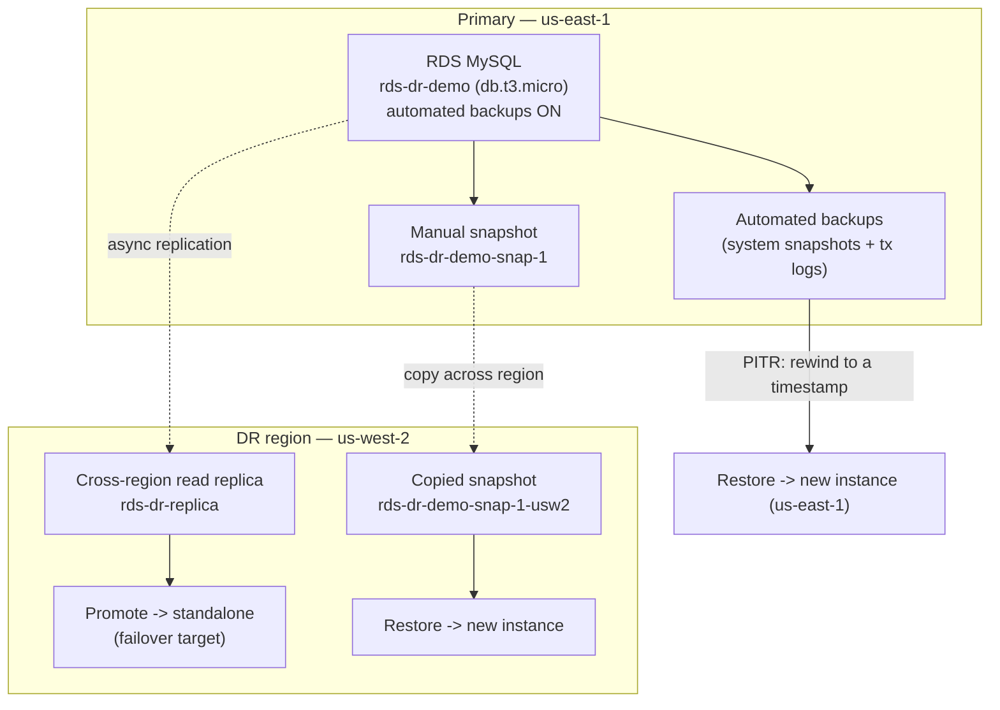

# RDS Disaster Recovery — Snapshots, PITR & Cross-Region Failover

**Optimization & Recovery Series — Project 2 of 3**

## What You'll Build

A single RDS MySQL database, and then **every standard way to recover it** when something goes
wrong — from a fat-fingered `DELETE` to losing an entire AWS region. You'll seed known data,
break things on purpose, and bring the data back four different ways, measuring the trade-offs
each time.

By the end you will understand:

- **RPO vs RTO** — how much data you can lose vs how long recovery takes — and how each technique
  scores on both
- **Automated backups** and **Point-in-Time Recovery (PITR)** — rewind to any second in the
  retention window
- **Manual snapshots** — durable, named restore points you control
- **Cross-region snapshot copy** — surviving a region-wide outage
- **Cross-region read replica + promotion** — the lowest-RTO failover, and its catch
- Why "restore" in RDS **always creates a new instance** with a new endpoint (and what that means
  for your app)

This is the **recovery** half of the series; Project 1 covered **optimization** (EC2
rightsizing) and Project 3 does **both** on Kubernetes.

---

## Architecture



---

## Key Concepts

| Concept | What it means |
|---------|--------------|
| **RPO** (Recovery Point Objective) | Maximum acceptable **data loss**, measured in time |
| **RTO** (Recovery Time Objective) | Maximum acceptable **downtime** to recover |
| **Automated backups** | Daily system snapshot + 5-min transaction logs; enables PITR |
| **PITR** | Restore to *any second* in the retention window — new instance |
| **Manual snapshot** | A named backup you take and keep until you delete it |
| **Cross-region copy** | Replicating a snapshot to a second region for regional resilience |
| **Read replica** | An async copy you can read from — and **promote** to standalone on disaster |
| **Restore = new instance** | RDS never restores in place; you always get a new endpoint |

---

## Recovery Methods at a Glance

| Method | RPO (data loss) | RTO (downtime) | Survives region loss? | Step |
|--------|-----------------|----------------|-----------------------|------|
| Point-in-Time Recovery | seconds (to last 5-min log) | minutes (restore) | ❌ same region | 3 |
| Manual snapshot restore | since the snapshot | minutes (restore) | ❌ unless copied | 4 |
| Cross-region snapshot copy | since the copied snapshot | minutes (restore) | ✅ | 5 |
| Cross-region read replica + promote | seconds (replica lag) | **lowest** (promote) | ✅ | 6 |

---

## Project Structure

```
rds-disaster-recovery/
├── README.md                              ← You are here
├── steps/
│   ├── 01-provision-rds.md                ← Create db.t3.micro + SG + seed access
│   ├── 02-seed-and-baseline.md            ← Load known data, record an RPO marker
│   ├── 03-automated-backups-and-pitr.md   ← Point-in-time restore drill
│   ├── 04-manual-snapshot-and-restore.md  ← Named snapshot, restore, verify
│   ├── 05-cross-region-copy.md            ← Copy a snapshot to us-west-2, restore
│   ├── 06-cross-region-replica-failover.md ← Replica + promote (failover drill)
│   └── 07-cleanup.md                      ← Delete instances & snapshots both regions
├── src/
│   ├── db_seed.py                         ← Create table + rows, print RPO marker
│   └── db_verify.py                       ← Count rows / show newest order
├── costs.md
├── troubleshooting.md
└── challenges.md
```

---

## Prerequisites

| Requirement | Details |
|-------------|---------|
| AWS account | Permissions for RDS, EC2 (VPC/SG), IAM, KMS |
| AWS CLI | `aws --version` returns 2.x |
| Python | 3.9+ locally |
| PyMySQL | `pip install pymysql` |
| A MySQL client | optional; the Python scripts are enough |
| Regions | **Primary us-east-1**, **DR us-west-2** |

> **This project costs real money** if left running (an RDS instance bills per hour even when
> idle, and you'll briefly run several). Budget ~**$1–$3** for a careful single session and
> **delete everything** in [Step 7](steps/07-cleanup.md). See [costs.md](costs.md).

---

## What You'll Learn Step by Step

| Step | File | Goal |
|------|------|------|
| 1 | `01-provision-rds.md` | Launch `rds-dr-demo`, reachable from your laptop |
| 2 | `02-seed-and-baseline.md` | Seed known rows; note an RPO marker timestamp |
| 3 | `03-automated-backups-and-pitr.md` | Delete data, then PITR-restore to before the delete |
| 4 | `04-manual-snapshot-and-restore.md` | Take a named snapshot and restore from it |
| 5 | `05-cross-region-copy.md` | Copy the snapshot to us-west-2 and restore there |
| 6 | `06-cross-region-replica-failover.md` | Build a replica, promote it, fail over |
| 7 | `07-cleanup.md` | Delete every instance and snapshot in both regions |

Start with **Step 1 →** [`steps/01-provision-rds.md`](steps/01-provision-rds.md)

---

## Estimated Time

90 – 120 minutes (RDS create/restore operations each take 5–15 minutes — plan for waiting).

## Estimated Cost

**~$1–$3** for one careful session, **$0** if you're inside the RDS Free Tier for the single
primary and delete extras promptly. The cost driver is **running multiple db.t3.micro instances
at once** during the restore drills. **Delete everything** in [Step 7](steps/07-cleanup.md).

---

## What's Next

- [Kubernetes Optimization & Recovery](../k8s-optimization-and-recovery/README.md) — Project 3:
  apply both halves of this series to a Kubernetes app (resource limits + Velero backup/restore)
- [Serverless Monitored Web App](../serverless-monitored-webapp/README.md) — pair durable RDS
  recovery thinking with DynamoDB point-in-time recovery
