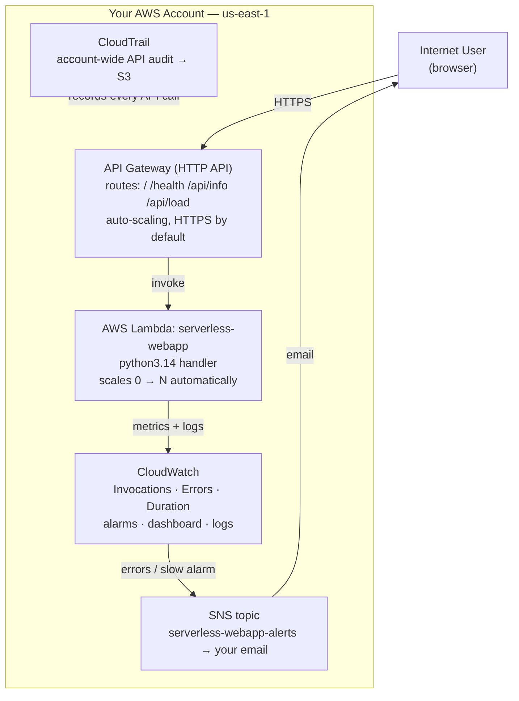

# Serverless Monitored Web App — The Same App, No Servers

## What You'll Build

This is the **serverless twin** of the
[ec2-vpc-monitored-webapp](../ec2-vpc-monitored-webapp/README.md) project. It runs the
**exact same four-endpoint application**, but with **API Gateway + AWS Lambda** instead of
VPC + EC2 + ALB + Auto Scaling. You get the same observability story —
**CloudWatch** metrics/alarms/dashboards, **SNS** email alerts, **CloudTrail** audit — and
the same **GitHub Actions** CI/CD pattern, with a fraction of the moving parts.

Build this one second and compare: what did serverless remove, what did it add, and when
would you pick each?

By the end you will understand:

- How **API Gateway (HTTP API)** replaces the ALB *and* the public/private VPC plumbing
- How a single **Lambda** function replaces the EC2 fleet + Auto Scaling Group
- Why there's **no VPC, no NAT Gateway, no security groups** to manage here
- How serverless metrics differ: **Invocations, Errors, Duration, Throttles** vs CPU/memory
- How to alarm on Lambda **errors** and **p95 duration** and route to **SNS** email
- How **CloudTrail** audits a serverless deployment just the same
- How to deploy with **GitHub Actions → OIDC → `update-function-code`**

---

## Architecture



There is no network to design. API Gateway is the public, HTTPS endpoint; it invokes Lambda
directly. Lambda scales from **zero** to thousands of concurrent executions with no Auto
Scaling Group, no health checks, and no instances to patch. You pay only per request and
per millisecond of execution.

---

## Native vs. Serverless — Side by Side

| Concern | EC2 project | This serverless project |
|---------|-------------|--------------------------|
| Public entry point | Application Load Balancer | API Gateway (HTTP API) |
| Compute | EC2 instances (you patch) | Lambda (fully managed) |
| Scaling | Auto Scaling Group, 1–4 instances | Automatic, 0 → N concurrent |
| Networking | VPC, subnets, IGW, **NAT (~$32/mo)**, SGs | **None to manage** |
| Idle cost | NAT + ALB run 24/7 (~$48/mo) | **~$0 when no traffic** |
| Health checks | ALB polls `/health` | Not needed |
| Key metrics | CPU, memory, request count | Invocations, Errors, Duration, Throttles |
| Deploy | Code → S3 → SSM restart | Zip → `update-function-code` |
| Best when | Long-running, steady load, full OS control | Spiky/low traffic, minimal ops |

> **Same app, same alerts, same audit.** Only the compute and networking change. That's the
> lesson: observability is a constant; the architecture underneath is the variable.

---

## Application

`src/app.py` is a single Lambda handler that routes on the request path — identical
endpoints to the EC2 app:

| Endpoint | Purpose |
|----------|---------|
| `GET /` | Service metadata (now reports `"compute": "AWS Lambda"`) |
| `GET /health` | Health check; reports seconds since cold start |
| `GET /api/info` | Python version, platform, runtime |
| `GET /api/load?seconds=N` | Burns CPU for N seconds (0–10) to drive **Duration** up and trip the alarm |

Validate it on your laptop — no AWS required (the tests simulate API Gateway events):

```bash
cd src
python test_app.py      # 6 checks, no pytest required
```

---

## Project Structure

```
serverless-monitored-webapp/
├── README.md                          ← You are here
├── src/
│   ├── app.py                         ← Lambda handler (4 routes, no framework)
│   └── test_app.py                    ← local validation (simulates API GW events)
├── scripts/
│   └── setup_monitoring.py            ← Boto3: SNS, error + duration alarms, dashboard
├── .github/workflows/
│   └── deploy.yml                     ← Sample CI/CD pipeline (copy to your app repo)
├── steps/
│   ├── 01-iam-role.md                 ← Lambda execution role (least privilege)
│   ├── 02-lambda-function.md          ← Create + test the function
│   ├── 03-api-gateway.md              ← HTTP API, routes, stage, integration
│   ├── 04-cloudwatch-monitoring.md    ← Logs, alarms, dashboard (Console + Boto3)
│   ├── 05-sns-alerts.md               ← SNS topic + email + alarm wiring
│   ├── 06-cloudtrail-audit.md         ← Account trail; audit the serverless deploy
│   ├── 07-github-actions-deploy.md    ← OIDC role + update-function-code pipeline
│   └── 08-cleanup.md                  ← Tear everything down
├── costs.md
├── troubleshooting.md
└── challenges.md
```

---

## Prerequisites

| Requirement | Details |
|-------------|---------|
| AWS account | Console + CLI access with Lambda, API Gateway, IAM, CloudWatch, SNS, CloudTrail |
| AWS CLI | `aws --version` → 2.x, configured for **us-east-1** |
| Python 3.12+ | To run `test_app.py` locally |
| Completed (recommended) | [EC2 + VPC Monitored Web App](../ec2-vpc-monitored-webapp/README.md) — so you can compare |
| Region | All steps use **us-east-1** |

---

## What You'll Learn Step by Step

| Step | File | Goal |
|------|------|------|
| 1 | `01-iam-role.md` | Lambda execution role with CloudWatch Logs permission |
| 2 | `02-lambda-function.md` | Create the `serverless-webapp` function; test in the console |
| 3 | `03-api-gateway.md` | HTTP API with routes for all four endpoints; get the public URL |
| 4 | `04-cloudwatch-monitoring.md` | Logs, error + duration alarms, dashboard (Console + Boto3) |
| 5 | `05-sns-alerts.md` | SNS topic + email; wire alarms to it; trigger an alert |
| 6 | `06-cloudtrail-audit.md` | Account trail; find `UpdateFunctionCode` / `CreateFunction` events |
| 7 | `07-github-actions-deploy.md` | GitHub OIDC role + `update-function-code` pipeline |
| 8 | `08-cleanup.md` | Delete the function, API, alarms, topic, trail |

Start with **Step 1 →** [`steps/01-iam-role.md`](steps/01-iam-role.md)

---

## Estimated Time

1.5 – 2.5 hours — noticeably faster than the EC2 build (no network to wire up).

## Estimated Cost

| Service | Configuration | Cost | Notes |
|---------|--------------|------|-------|
| **AWS Lambda** | A few thousand short invokes | **~$0 (free tier)** | 1M requests + 400k GB-s/month always free |
| **API Gateway (HTTP API)** | A few thousand requests | **~$0 (free tier)** | $1.00 per million after the free 1M/month (12 mo) |
| **CloudWatch** | Alarms + 1 dashboard + logs | **~$0** | Within free tier at workshop scale |
| **SNS** | Email alerts | **Free** | First 1,000 emails/month free |
| **CloudTrail** | First management trail | **Free** | One trail of management events is free |

**Typical session cost: ~$0.00 – $0.05.** **If left running: still ~$0 when idle** — the
headline serverless advantage. The only thing that costs money is *traffic*, and there's
no NAT Gateway or ALB ticking in the background.

> Even so, finish [Step 8 — Cleanup](steps/08-cleanup.md): delete the dashboard (beyond the
> free 3) and the CloudTrail S3 bucket so nothing lingers. See **[costs.md](costs.md)**.

---

## What's Next

- Add a **DynamoDB** table so the app has state, and give the role `dynamodb:*` on just that table
- Put the function **behind a custom domain** with API Gateway + ACM
- Replace the zip deploy with **AWS SAM** or the **CDK** for infrastructure-as-code
- Add **AWS X-Ray** tracing and compare it to the EC2 project's CloudWatch agent
